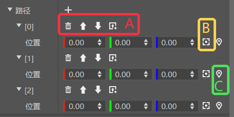
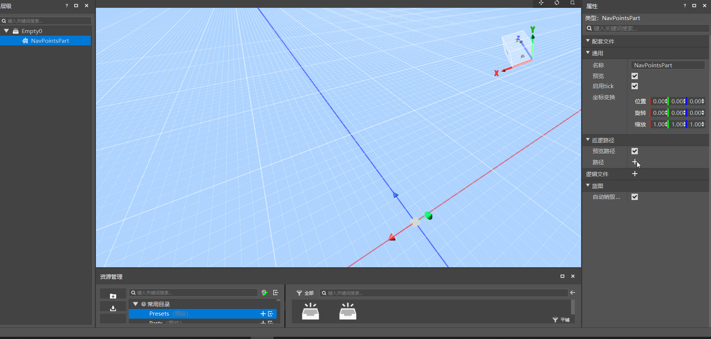

--- 
front: https://nie.res.netease.com/r/pic/20210727/76bfa7be-0be4-4e27-91a3-b5268695f359.png 
hard: Getting Started 
time: 20 minutes 
--- 
# Navigation Path Part 
The Navigation Path Part NavPointsPart is used to create a visual path and add and edit path points visually. Click on the part and we can see that it has the following properties in the property panel: 

 

Here we will focus on the patrol path properties. The essence of the patrol path is a set of ordered position coordinate data. The patrol path has two properties: 

1. Preview path: used to control whether to enable the preview path. The preview path connects all patrol points with line segments and arrows, allowing players to intuitively see the position and order relationship between each point when editing the path. 

2. Path: The information of each patrol point on the patrol path. You can create a new patrol point through the "➕" button on the right. The patrol point contains the location coordinates of the point. 

3. Path operation method: The menu above each patrol point (A frame in the figure below) can perform four quick operations: delete, move up, move down, and create a new patrol point. The recording camera position (B frame in the figure below) and positioning button (C frame in the figure below) on the right can make it easier for you to visually select and move path points. 

 

After being proficient in the above operations, you can quickly build a navigation path, as shown in the figure below: 

 

Here is an example of using navigation path parts: In a tower defense game, we hope that the monster will move and patrol along a certain path after birth, such as starting from the starting point, going to the second patrol point, then to the third patrol point, and so on, to form a patrol path. So how can we quickly perform visual editing of the path? 

To achieve this effect, we can use the navigation path part in the editor, construct the patrol path points in advance, and then use the interface of this part in the script (<a href="../../../../mcdocs/3-PresetAPI/Preset Object/Part/Navigation Path Part NavPointsPart.html" rel="noopenner"> GetNavigationPoints </a>) to quickly obtain the data of all patrol points, and then call the pathfinding interface (<a href="../../../../mcdocs/1-ModAPI/Interface/Entity/Behavior.html" rel="noopenner"> SetMoveSetting </a>) to let the monster move between each point in turn, so as to achieve the effect of monster moving patrol. 

>This is just a simple use case. The navigation path part mainly helps developers to visually edit the path/location data. The specific use requires developers to flexibly use it according to actual needs~ 

For the interface of the navigation path part, please refer to <a href="../../../../mcdocs/3-PresetAPI/Preset Object/Part/Navigation Path Part NavPointsPart.html" rel="noopenner"> Navigation Path Part API Interface Document </a>