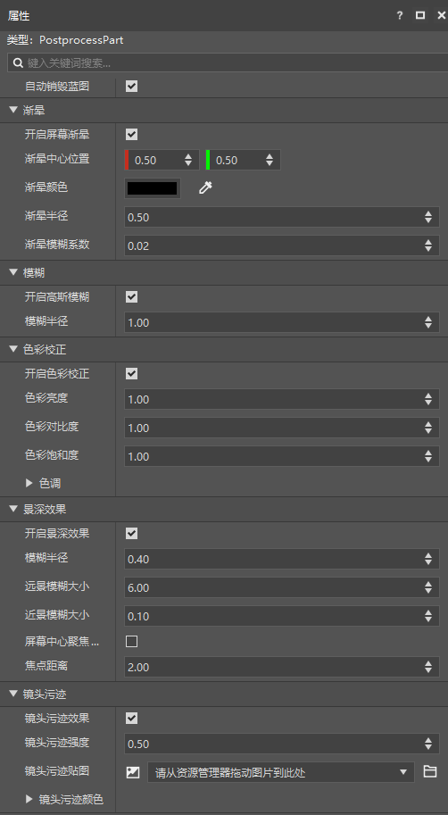
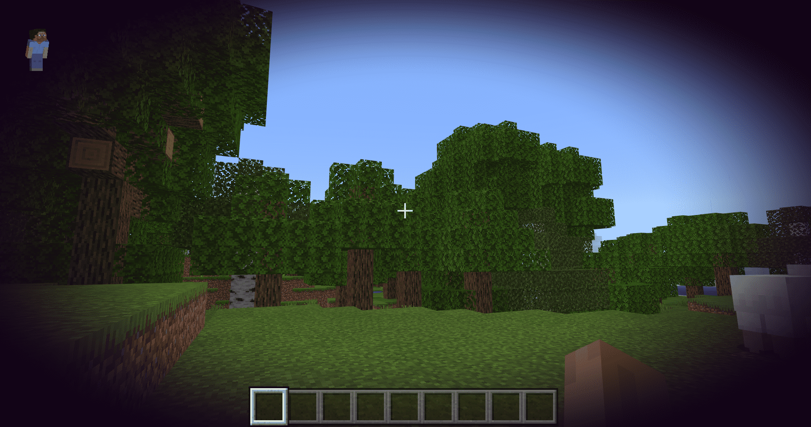
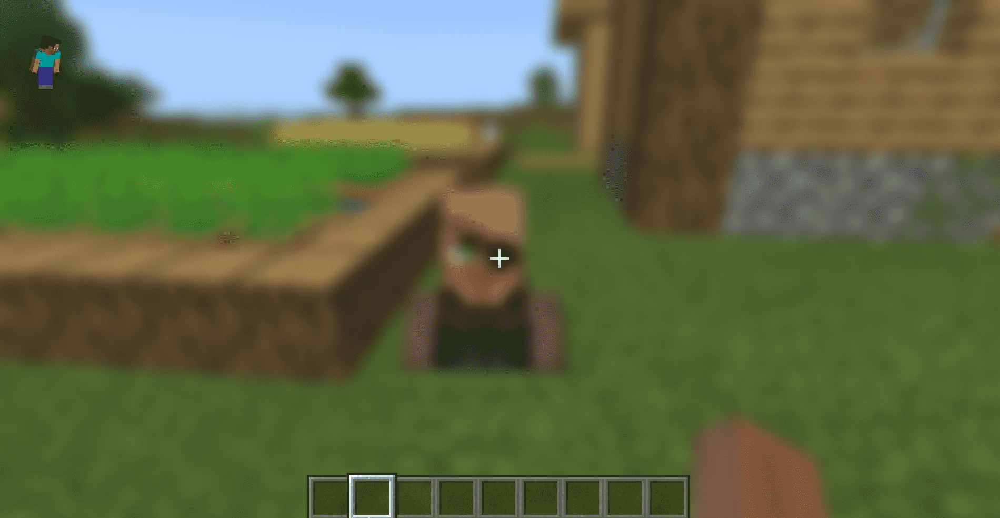
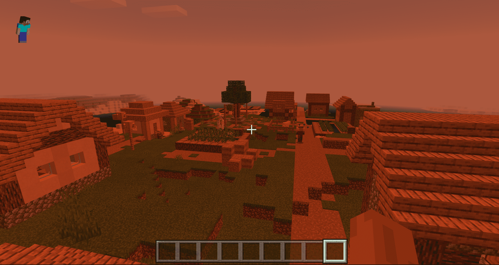
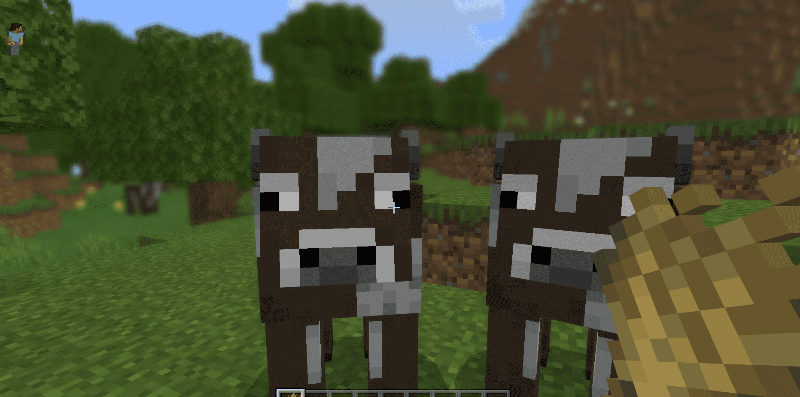
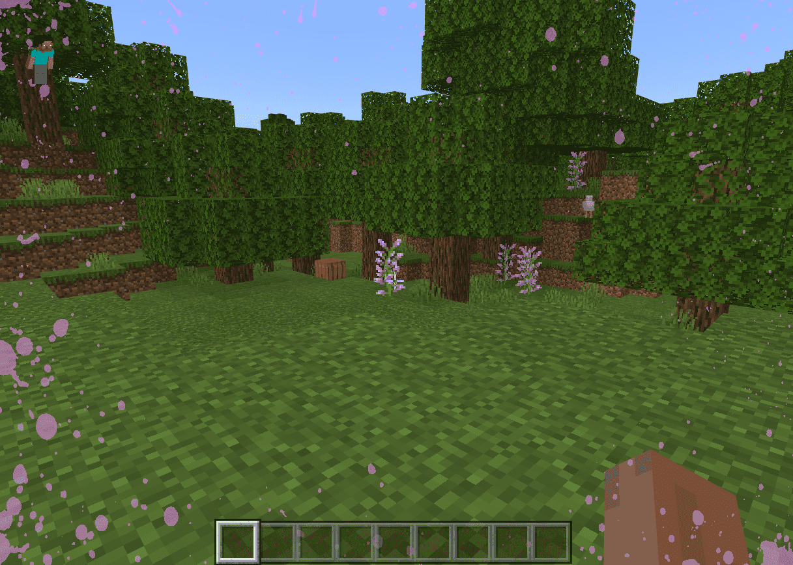

--- 
front: https://nie.res.netease.com/r/pic/20210727/76bfa7be-0be4-4e27-91a3-b5268695f359.png 
hard: Getting Started 
time: 20 minutes 
--- 

# Post-processing Parts 
Post-processing parts PostProcessPart is used to quickly set up and use post-processing effects such as vignetting, lens stains, blur, etc. in the game. 

In the past, if developers wanted to use post-processing effects, they needed to manually call the post-processing related <a href="../../../../mcdocs/1-ModAPI/接口/后处理/指数.html" rel="noopenner">ModAPI</a> interface in the part code. The steps are cumbersome and require understanding Python and SDK frameworks first, which is not friendly enough for new developers. This time, the post-processing effects are encapsulated into a part to help developers who do not know how to code use the post-processing effects and make the components they develop reach higher quality.

> Post-processing parts can only be mounted on empty presets that have been checked for pre-load. 

Click on the part properties, we can see that the post-processing part has the following properties. 

 

Next, we will introduce several effect properties of post-processing parts one by one. 

### Vignette: The effect is as shown below 

 

| Attributes | Description | 
| ------------ | ------------------------------------------------------------ | 
| Enable screen vignetting | Equivalent to calling the <a href="../../../../mcdocs/1-ModAPI/接口/后处理/色彩.html#setenablevignette" rel="noopenner">SetEnableVignette</a> interface under ModAPI to set whether to enable the screen vignetting (Vignette) effect. After enabling, vignetting will appear around the player's screen. | 
| Vignette center position | Equivalent to calling the <a href="../../../../mcdocs/1-ModAPI/接口/后处理/色彩.html#setvignettecenter" rel="noopenner">SetVignetteCenter</a> interface under ModAPI, setting the vignetting center position of the vignetting (Vignette), which can change the vignetting position of the screen. | 
| Vignette color | Equivalent to calling the <a href="../../../../mcdocs/1-ModAPI/接口/后处理/色彩.html#setvignettergb" rel="noopenner">SetVignetteRGB</a> interface under ModAPI, setting the vignetting color of the vignetting (Vignette), which can change the vignetting color of the screen. | 
| Vignette Radius | Equivalent to calling the <a href="../../../../mcdocs/1-ModAPI/接口/后处理/沾晕.html#setvignetteradius" rel="noopenner">SetVignetteRadius</a> interface under ModAPI to set the vignetting radius of the vignetting (Vignette). The larger the radius, the smaller the vignetting and the larger the player's field of view. | 
| Vignette Blur Coefficient | Equivalent to calling the <a href="../../../../mcdocs/1-ModAPI/接口/后处理/沾黄.html#setvignettesmoothness" rel="noopenner">SetVignetteSmoothness</a> interface under ModAPI to set the vignetting blur coefficient of the vignetting (Vignette). The larger the blur coefficient, the blurrier the vignetting edge and the larger the blur range. | 

### Blur: The effect is as shown below 

 

| Attributes | Description | 
| ------------ | ------------------------------------------------------------ | 
| Enable Gaussian blur | Equivalent to calling the <a href="../../../../mcdocs/1-ModAPI/接口/后处理/模糊.html#setenablegaussianblur" rel="noopenner">SetEnableGaussianBlur</a> interface under ModAPI, setting whether to enable the Gaussian blur effect. When enabled, the area around the player's screen is blurred. | 
| Blur radius | Equivalent to calling the <a href="../../../../mcdocs/1-ModAPI/接口/后处理/模糊.html#setgaussianblurradius" rel="noopenner">SetGaussianBlurRadius</a> interface under ModAPI to set the blur radius of the Gaussian blur effect. The larger the radius, the greater the blur, and vice versa. | 

### Color correction: The effect is as shown below 

 
| Attributes | Description | 
| ---------------- | ------------------------------------------------------------ | 
| Enable color correction | Equivalent to calling the <a href="../../../../mcdocs/1-ModAPI/接口/后处理/色彩.html#setenablecoloradjustment" rel="noopenner">SetEnableColorAdjustment</a> interface under ModAPI to set whether to enable the color correction effect. After enabling, the screen color can be adjusted. |

| Color brightness | Equivalent to calling the <a href="../../../../mcdocs/1-ModAPI/接口/后处理/色彩.html#setcoloradjustmentbrightness" rel="noopenner">SetColorAdjustmentBrightness</a> interface under ModAPI to adjust the screen color brightness. The larger the brightness value, the brighter the screen, and vice versa. | 
| Color contrast | Equivalent to calling the <a href="../../../../mcdocs/1-ModAPI/接口/后处理/色彩.html#setcoloradjustmentcontrast" rel="noopenner">SetColorAdjustmentContrast</a> interface under ModAPI to adjust the screen color contrast. The larger the screen contrast value, the more obvious the color difference, and vice versa. | 
| Color saturation | Equivalent to calling the <a href="../../../../mcdocs/1-ModAPI/接口/后处理/色彩.html#setcoloradjustmentsaturation" rel="noopenner">SetColorAdjustmentSaturation</a> interface under ModAPI to adjust the screen color saturation. The larger the screen saturation value, the more obvious the color, and vice versa. | 
| Tint | Equivalent to calling the <a href="../../../../mcdocs/1-ModAPI/接口/后处理/色彩.html#setcoloradjustmenttint" rel="noopenner">SetColorAdjustmentTint</a> interface under ModAPI to adjust the screen color tint. The screen color is adjusted according to the input tint and intensity. When the intensity is greater, the overall screen color is more biased towards the input tint. | 

### Depth of field effect: The effect is as shown below 

 

| Attributes | Description | 
| ---------------- | ------------------------------------------------------------ | 
| Enable depth of field effect | Equivalent to calling the <a href="../../../../mcdocs/1-ModAPI/接口/后处理/镜效果.html#setenabledepthoffield" rel="noopenner">SetEnableDepthOfField</a> interface under ModAPI to set whether to enable the depth of field effect. After enabling it, the depth of field effect will appear on the screen, and the effect of blurring the distant and being clear near or blurring the near and being clear far away will be presented according to the focus distance. | 
| Blur radius | Equivalent to calling the <a href="../../../../mcdocs/1-ModAPI/Interface/Post-Processing/Lens Effect.html#setdepthoffieldblurradius" rel="noopenner">SetDepthOfFieldBlurRadius</a> interface under ModAPI to adjust the blur radius of the depth of field effect. The larger the blur radius, the greater the blur degree, and vice versa. | 
| Far view blur size | Equivalent to calling the <a href="../../../../mcdocs/1-ModAPI/Interface/Post-Processing/Lens Effect.html#setdepthoffieldfarblurscale" rel="noopenner">SetDepthOfFieldFarBlurScale</a> interface under ModAPI to adjust the far view blur size of the depth of field effect. The larger the far view blur size, the greater the far view blur degree, and vice versa. Note that the adjustment of the distance blur depends on the focus distance. If the focus is at a long distance, the distance is clearer and the blur adjustment will not be very obvious. | 
| Near blur size | Equivalent to calling the <a href="../../../../mcdocs/1-ModAPI/接口/后处理/镜效果.html#setdepthoffieldnearblurscale" rel="noopenner">SetDepthOfFieldNearBlurScale</a> interface under ModAPI to adjust the near blur size of the depth of field effect. The larger the near blur size, the greater the near blur, and vice versa. Note that the adjustment of the near blur depends on the focus distance. If the focus is at a short distance, the near blur is clearer and the blur adjustment will not be very obvious. | 
| Screen center focus mode | Equivalent to calling the <a href="../../../../mcdocs/1-ModAPI/接口/后处理/镜效果.html#setdepthoffieldusecenterfocus" rel="noopenner">SetDepthOfFieldUseCenterFocus</a> interface under ModAPI, setting whether the depth of field effect turns on the screen center focus mode. After turning it on, the focus distance will be automatically set to the distance of the object corresponding to the center of the screen. In the first-person perspective, the focus distance will be automatically set to the distance between the object corresponding to the screen crosshair and the camera, that is, the object corresponding to the crosshair will be automatically focused. In the third-person perspective, since the center of the screen always corresponds to the player, the focus distance will be automatically set to the distance between the player and the camera, that is, the player will be automatically focused on himself. | 
| Focus distance | Equivalent to calling the <a href="../../../../mcdocs/1-ModAPI/接口/后处理/镜效果.html#setdepthoffieldfocusdistance" rel="noopenner">SetDepthOfFieldFocusDistance</a> interface under ModAPI to adjust the depth of field effect focus distance. The smaller the distance, the blurrier the distance and the clearer the near. The larger the distance, the clearer the distance and the blurrier the near. This distance is the actual distance, that is, the world coordinate distance starting from the player's camera. | 

### Lens stain: The effect is as shown below 

 

| Attributes | Description | 
| ------------ | ------------------------------------------------------------ | 
| Lens stain effect | Equivalent to calling the <a href="../../../../mcdocs/1-ModAPI/接口/后处理/镜效果.html#setenablelensstain" rel="noopenner">SetEnableLensStain</a> interface under ModAPI to set whether to enable the lens stain effect. After enabling, the lens will have a stain effect, and the stain map and stain color used can be changed. | 
| Lens Stain Intensity | Equivalent to calling the <a href="../../../../mcdocs/1-ModAPI/Interface/Post-Processing/Lens Effect.html#setlensstainintensity" rel="noopenner">SetLensStainIntensity</a> interface under ModAPI to adjust the lens stain intensity. The greater the intensity, the more obvious the stain, and vice versa. | 
| Lens Stain Texture | Equivalent to calling the <a href="../../../../mcdocs/1-ModAPI/Interface/Post-Processing/Lens Effect.html#setlensstaintexture" rel="noopenner">SetLensStainTexture</a> interface under ModAPI. After the lens stain effect is turned on, the stain effect uses the system default texture. This interface can change the texture used for lens stain. Note that it is best to use a transparent background for the texture, otherwise the screen will be covered by the texture. | 
| Lens stain color | Equivalent to calling the <a href="../../../../mcdocs/1-ModAPI/接口/后处理/镜效果.html#setlensstaincolor" rel="noopenner">SetLensStainColor</a> interface under ModAPI to adjust the lens stain color. The stain color is adjusted according to the input color and intensity. When the intensity is greater, the stain color is more biased towards the input color. | 
