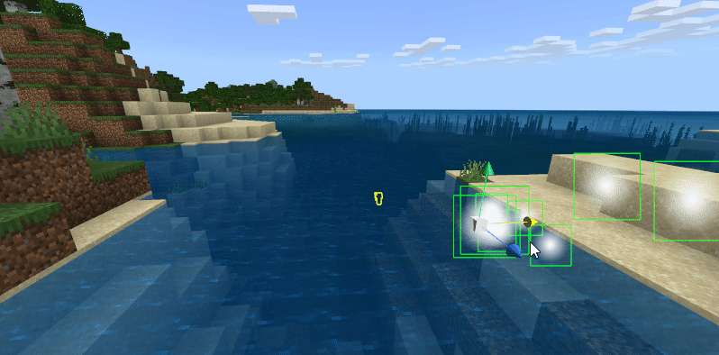

--- 
front: https://mc.res.netease.com/pc/zt/20201109161633/mc-dev/assets/img/level001.3939b19d.png 
hard: Getting Started 
time: 30 minutes 
selection: true 
--- 
# Level Editor 
## Rework Overview 

The level editor is the main editor. Its main functions are 

- Display of the map (scene) 
- Place instances in the scene, that is, instantiate the preset 
- Display of instances and adjustment of coordinate transformation 
- Editing instance properties 

 

## Stage 

> This article focuses only on the placement and management of presets. For creatures, please see [Place and manage creatures](./4-Place and manage creatures.md) 

The stage displays all instances in the current scene, and the stage entries correspond to the instances one by one. 

The parent-child relationship of the instance is displayed through left and right layers and folds, which is the same as the layer panel of the preset editor. 

> Currently, the stage does not support the adjustment of the connection relationship and order. 

Different types of instances use different icons. 

 

You can perform the following operations on the stage: 

- Click an entry to select it in the stage and preview window at the same time, and the property window of the level editor also displays the properties of this entry. 

- Double-click an entry to select it. And the camera in the preview window flies to the vicinity of the instance of the entry. 

- Type a keyword and search to display matching entries. (Including all levels of parent nodes of this entry) 

 

Right-click the preset entry of the stage (currently only supports the first level of entries, not sub-entries), and the following menu will appear: 

- Copy: Copy the instance of this entry 
- Paste: Paste the copied instance in the stage 
- Create a copy: Create a copy of this instance in the stage 
- Rename: Rename this instance

- Delete: Delete this instance 
- Locate in Explorer: Open the preset path corresponding to this instance in Explorer and select the preset 
- Edit the corresponding preset: Open the preset editor and edit the preset corresponding to this instance 

 

## Preview window 

Currently, all four editors include a preview window. The preview window is a special modification of "Minecraft" for the editor. The preview window of the level editor is closest to the final effect. 

In order to distinguish the preset instance from the MC map itself, all instances will display a yellow stroke. 

> In fact, all entities will display a stroke, even if there is no preset bound. 

### Modify the coordinate transformation of the instance 

When an instance is selected, the coordinate transformation handle of this instance will be displayed. Use 123 in the main keyboard area to switch the function of the transformation handle. 

#### 1: Position handle 

The three axes of the position handle are in the same direction as the axis in the upper right corner of the preview window. 

 

Use the mouse to drag an arrow to move the instance in that direction. 

When moving, you can find that the position attribute of this instance is also changing in the property panel. 

 

> For materials, since MC blocks can only be located at integer positions, the position of the material will be automatically rounded when the movement stops. 
> 
> If there is a material attached to an empty preset or a sub-preset of an empty preset, the position of this empty preset will also be rounded. 
> 
> The above rounding rules will take effect whether you drag the coordinate system or enter a value in the property panel. 

 

#### 2: Rotation handle 

Press 2 to switch to the rotation handle. Three fan rings will be displayed. Drag the fan rings to modify the angle. 

 

The material can only be rotated in steps of 90°, as shown below. 

 

#### 3: Zoom handles 

Press 3 to switch to zoom handles, drag the zoom handles to achieve zooming in each axis. (Overall zooming through the handles is not currently supported) 

 

The material is not suitable for zooming in this way. For zooming in the material, you can still use the selection method similar to the map editor. 

> Note: The actual zoom value of the material in the editor will not be less than 0.01 under any circumstances. 

 

## Placing instances in the scene 

Instances will only take effect if they are placed in the scene. 

There are currently two ways to place presets in the scene to generate instances. 

### Resource manager drag 

Find the Presets directory of the commonly used directory in the resource manager. 

Drag the preset you want to instantiate into the scene. 

 

### Preset Library Drag and Drop 

The preset library is a new panel in the new version of the editor. 

All presets you created and presets built into the editor can be seen here. 

You can directly drag the preset to the scene for instantiation as shown in the figure below. 

If the preset library is not displayed in your level editor, you can open this panel through the top menu of the editor-Window-Preset Library. 

The preset library supports the search function just like the stage. 

 

## Ribbon 

The ribbon at the top of the level editor currently supports 6 functions, namely 

- Undo: Remove the effects of the last operation. Currently, unlimited undo is supported. When the editor is switched, the previous operation is no longer recorded. 

- Redo: Redo the last undone operation. 
- Parts hot update: When the part code is modified, the part will be automatically hot updated. This button is only used when the automatic hot update does not take effect for some reason. 
- Save: Save the current map and preset archive. Since it takes a long time to save the map, the map will only be saved when it is necessary.

- Backup: Generate a copy of the current work in the launcher's work library. 
- Run: Save all editor contents and perform development tests. 

> When the editor is saved, the player preset instance will not be saved in the preset archive. If you need to modify it, please modify the player preset directly in the preset editor 

 

## How to continue using components? 

The new version of the editor currently no longer supports component property editing (you can see that there is no component panel in the level editor). 

After upgrading to the new version of the editor, the logic of the components of the work using components is still valid, but the editor no longer supports it. 

We will gradually use preset architectures and configurations to replace the current components. 

### Currently no processing is required and components that can be converted to configurations 

- Mobs 
- Items - Ordinary Items 
- Items - Weapons and Tools 
- Items - Armor 
- Blocks 
- Recipes 

### Components that are recommended to be deleted and replaced with parts 

- World - Basic properties, it is recommended to delete the script_World folder in the behavior pack directory and use the WorldPart part. 
- Player - Basic properties, it is recommended to delete the script_Player folder in the behavior pack directory and use the PlayerBasicPart part. 

Note that this step is best done right after the work is upgraded. 

Currently, when creating a new part, a link to the part file will be generated in the first script_xxx directory. If you want to delete the component folder after this, you can first create a ModMain through the New File Wizard, then move the Parts directory to the newly created script_xxx, and then delete the path to be deleted. 

We will gradually support other components in subsequent updates. 

