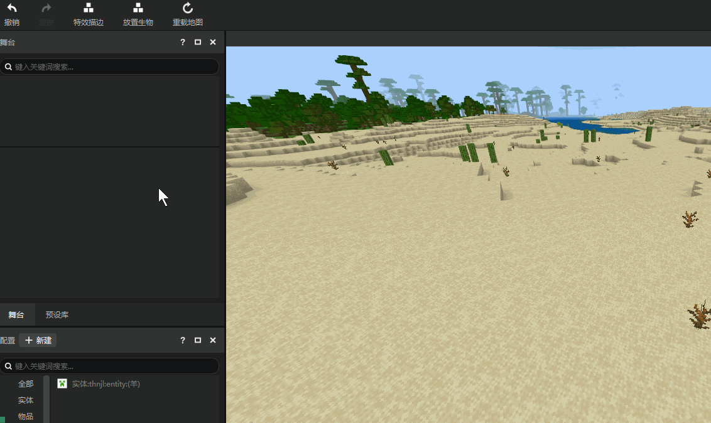
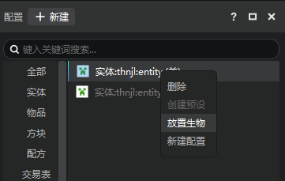
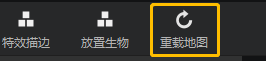
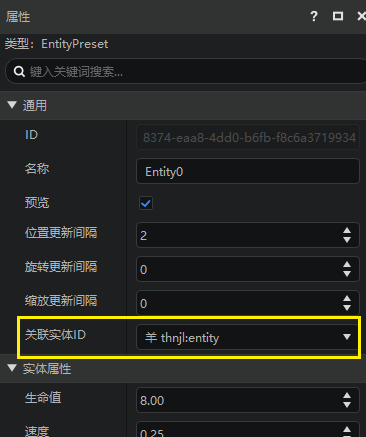
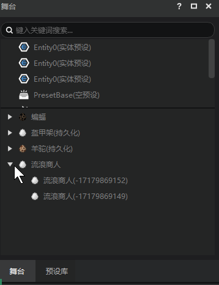
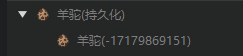
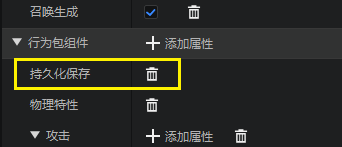
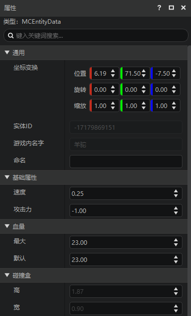
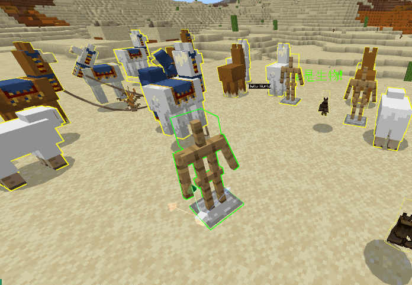

--- 
front: 
hard: Getting Started 
time: 10 minutes 
selection: true 
--- 

# Placing and managing mobs 

## Placing mobs 

The level editor supports placing mobs in the map. 

- For map components, placed creatures will be saved directly in the map archive 
- For AddOn, you can still place creatures, but you can only preview the results of placement in the editor, because AddOn does not include map archives 

How to place creatures 

1. Click the Place Creature button in the function area to turn on the function 
2. After the function is enabled, a new column will be added below the function area, where you can select the type of creature you want to place 
3. Place the mouse in the embedded game, and you can find that a creature preview will be automatically generated 
4. Click the mouse to place a creature 
5. Use the Esc key on the keyboard, or click the Place Creature button again to exit the state of placing creatures 

 

In addition to the Place Creature function in the function area, for custom creatures, you can right-click the creature you want to place in the configuration, and click Place Creature in the menu to place the creature. 

 

> Note: If the newly created custom creature is placed directly in the map, the display may not be normal. You can restart the editor or use the reload map in the ribbon. 
 

Types supported for placing creatures 

- Original creatures 
- Custom creatures (referring to the custom configured creatures of the current work) 

If the type of creature placed has been bound to a preset, the preset of this creature will be directly generated when the creature is placed. 

> As shown in the figure below, the custom creature thnjl:entity is bound to the entity preset Entity0 
 

## Manage creatures through the stage 

### Introduction to the stage 

The stage is divided into two areas, upper and lower, the two areas are: 

- Upper: Preset, here shows all preset instances in the map

- Bottom: Creatures, here are the creatures in the map (only those that have been loaded) 

> For creatures that have been bound to entity presets, they will only be displayed in the preset area 

You can use the mouse to drag the horizontal bar between the two areas up and down to modify the proportion of the two areas. 

 

For the creature partition below, creatures of the same type will be aggregated into a group, and the group can be expanded and collapsed. 

The following information is displayed in the stage, taking the alpaca in the figure below as an example: 

- The name of the creature and group, that is, the alpaca in the figure below 
- The entity ID of the creature (Entity ID), that is, -17179869151 in the figure below 
- If a certain type of creature you placed has a persistent attribute, it will also be displayed in the creature group 

 

> If a type of creature is persistent, then the creature will be saved when the block is unloaded and the game is exited. Custom creatures created using the editor will have persistent attributes added by default. Some native creatures are persistent, such as alpacas. 
 

### Stage Creature Operations 

The creatures on the stage support two operations: view/modify properties and delete. 

1. Click on the creature to view the properties of the creature in the property panel on the right 
 

> Gray properties are not currently supported for modification 

2. Right-click the creature/creature group on the stage, or select them and click the delete key on the keyboard to delete these creatures 

### Adjust Creatures in Embedded Games 

You can adjust the coordinate transformation of the creature in the embedded game in a similar way to adjusting presets. 

> Use 1, 2, 3 on the keypad, or the button in the upper right corner of the preview window to switch the mode of the drag handle. 
Currently, zooming cannot be saved to the map archive and can only be previewed in the editor. If you need to save the scale, you can currently use the entity preset 

