--- 
front: https://mc.res.netease.com/pc/zt/20201109161633/mc-dev/assets/img/level_image001.96d8db0b.png 
hard: Getting Started 
time: 40 minutes 
--- 
# Level Editor (Old Version) Instructions 
## Basic Introduction 

The Level Editor is the center for configuring and managing add-ons. It can customize dimensions, creatures, items, blocks, recipes, etc., and combine these game elements to form your own unique gameplay. 

For different developers, the recommended way to use the Level Editor is also different. 

- Beginner stage: Build gameplay through components and become familiar with various custom game elements. 
- Experienced stage: Understand the file structure of Addon through the resource management of the Level Editor, study the functional implementation principle of components, and try to make some file-level modifications based on components. 
- Expert stage: Use the level editor to quickly build a gameplay prototype, and then make in-depth file modifications. 

It is recommended to follow the video below to learn. 

<iframe src="https://cc.163.com/act/m/daily/iframeplayer/?id=5f3a56335655da63cc2c6c39" height="600" width="800" allow="fullscreen" /> 

The following is a brief introduction to the functions of each module, and detailed introductions can be found in the corresponding chapters later. 
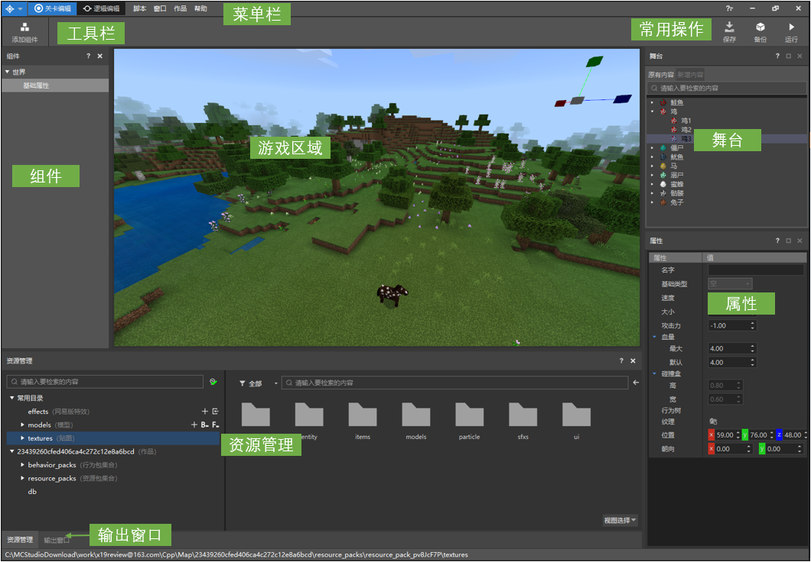 

- Menu bar: In "Works", you can set the namespace of Add-on, in "Scripts", you can install the script prompt library of Mod SDK, and in "Window", you can set the visibility of different sub-item windows. 
- Toolbar: Currently, there is only the "Add Component" button, which is used to add components to the work; 
- Component: Configure custom game elements, such as items, creatures, blocks, etc.; form gameplay through different component combinations. 
- Properties: When you select the content in "Component", the corresponding component properties will be displayed in the property panel. 
- Game Area: The game area runs "Minecraft" and can be used to edit creatures, coordinates, etc. 
- Stage: Displays the creatures in the current game area. 
- Resource Management: Manage files in the work, and the entry for file format conversion is also here. 
- Common operations: Contains buttons such as "Save", "Backup", and "Run". 

## Component 
### Add Component 
Click the "Add Component" button on the toolbar and select a component to add a component, as shown in the figure below. You can also add a component by right-clicking in the component window. 
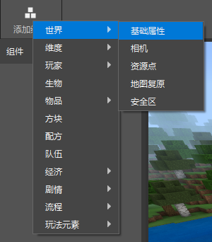 

Right-click on a component to view its introduction and learn about its general functions. 
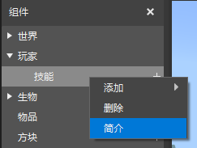 

On the property panel, move the mouse to the configuration box and wait for a while for the description to appear. 
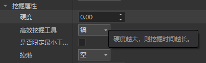 

### Basic component introduction 

Since the introduction will be displayed when the mouse hovers over the configuration item of a component, the properties that are more difficult to understand in the component are mainly introduced here. 

#### World->Basic properties component

In the component list, right-click on "World" and add the "Basic Properties" component. 
Click "Basic Properties" in the component list to see the configurable properties in the property panel. 
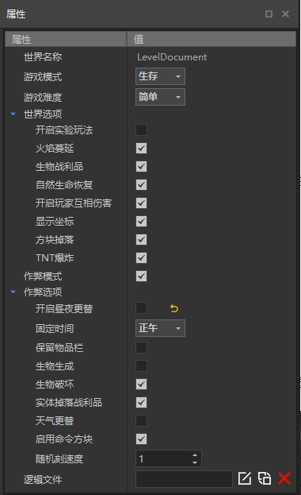 

The configuration items of the world are basically the same as the settings in the game. The following is a description of some configuration items: 

- Game Difficulty: If it is set to "Peaceful", then zombies and other offensive creatures cannot be placed in the game. When you cannot place creatures in the game area, remember to check whether the game difficulty is set to Peaceful first. 
- Random Tick Speed: This value will affect events such as wheat growth and ice and snow melting. For details, please refer to the links: [Minecraft Chinese Wiki-Tick](https://minecraft-zh.gamepedia.com/Tick), [Minecraft English Wiki-Tick](https://minecraft.gamepedia.com/Tick) 
- Logic: If you want to implement some special processes, such as when the player walks to a certain area, the world time becomes night, then you need to use a logic file to implement it. To create a logic file, you need to use the logic editor. For specific instructions, see [Logic Editor Instructions](../12-Visual Programming/50-Instructions for the Old Logic Editor/95-Instructions for the Old Logic Editor.md). In the figure below, the left button indicates creating a new logic file, the middle button indicates selecting a logic file, and the right button clears the logic configuration. Logic files can also be configured for players, items, and creatures, which will not be described later. 
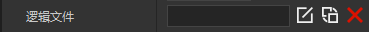 

It should be noted that the settings in the world basic attributes are set after the player enters the game. Therefore, if the basic attributes are set to survival mode, even if the player sets it to adventure mode before entering the save file, it will be changed to survival mode after entering the game. 

#### Player->Basic Attributes Component 

Right-click on "Player" and add the "Basic Attributes" component. Click "Basic Attributes" to see the player's configurable attributes in the attribute panel. 

The following is an explanation of the meaning of some configuration items: 

- Whether to lock the hunger value: If locked, the player's hunger value will not change during the game. 
- Whether the name is transparent: whether the name above the player's head can be seen through obstacles. If you want to design a hide-and-seek game, the player's name should not be transparent. 
- Logic file: You can associate the .ets file created by the logic editor. For details, please refer to [Logic Editor Instructions](../12-Visual Programming/50-Old Logic Editor Instructions/95-Old Logic Editor Instructions.md). 

#### Biological Components 

Click the "+" sign on the right side of the biological component to add a custom biological component. 

Click a biological component in the component list to configure its properties in the property panel. The following is an explanation of the meaning of some configuration items: 

- Name: Configure the biological ID and in-game name, etc. If you check "Whether to overwrite the original biological component", the generated biological configuration will overwrite the original configuration. 
- Model Action: Currently, it supports selecting the original biological model resource as the model of the custom biological component. In the game, the collision of creatures is calculated as a cuboid, which is the collision box. 
- Movement: The properties here determine how the creature moves and finds its way. 
- Combat: Configure the basic combat values of the creature, such as attack and health, as well as the way the creature searches for enemies and attacks. If you want to configure NPCs that do not require combat, such as merchants and dialogue NPCs, you can uncheck "Can fight". 
- Behavior: Currently, only the "Look at Player" and "Random Wandering" behaviors are supported. For more behaviors, see [Bedrock Edition Entity Component Documentation](https://minecraft-zh.gamepedia.com/%E5%9F%BA%E5%B2%A9%E7%89%88%E5%AE%9E%E4%BD%93%E7%BB%84%E4%BB%B6%E6%96%87%E6%A1%A3), and then manually add more behaviors in the file. 
- Economy: Configure the creature's death drop and trading table, which needs to be used in conjunction with the drop component and trading component in the economy. 
- Logic: You can associate the .ets file created by the logic editor. For details, please refer to [Logic Editor Instructions](../12-Visual Programming/50-Old Logic Editor Instructions/95-Old Logic Editor Instructions.md). 

After the custom creature is configured, click the placement icon on the right side of the creature to enter the operation state of placing the creature, as shown below. 
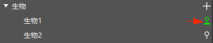 

Then move the mouse to the game area and click the mouse to place the creature at the specified position. Continuously click to place the creature continuously, and press ESC to cancel the operation of placing the creature. 
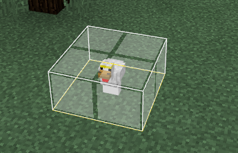 

In the stage, all creatures in the area that has been loaded near the current player will be displayed. "Original content" refers to the creatures that already existed when the editor was opened this time, and "new creatures" refers to the creatures that were newly added after the editor was opened. Click on a creature on the stage, and the corresponding creature in the game area will be displayed as selected. 
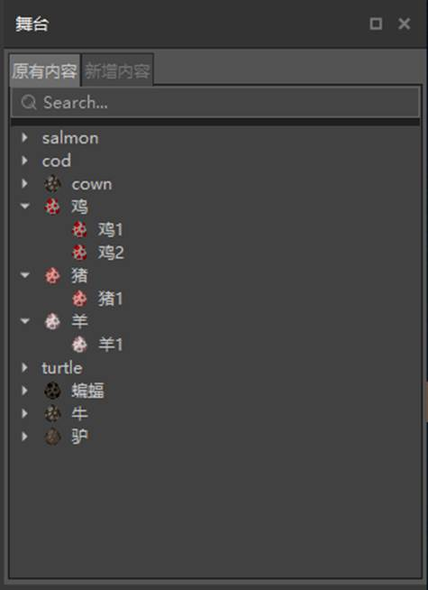 

When you double-click a creature on the stage, it will jump to the coordinates of the creature. 

**Note**: The camera movement method in the level editor is the same as that in the map editor. 

#### Items->Basic Items Components 

Right-click on "Items" and add the "Basic Items" component. Click the "+" sign on the right side of the Basic Items component to add custom items. 

Click on an item in the list to configure the properties in the Properties panel. Here are the meanings of some configuration items: 

- Custom ID: The ID must be a combination of English and numbers. When you use the command to add an item in the game (/give @s item_id), this ID is used. 
- Texture: The icon displayed in the inventory of the item must be a PNG format image. Drag the image under the resource pack/textures/items path in the resource management window to the texture bar to complete the setting. 
- Special Type: Here you can select the special type of the item, such as "Food" or "Creature Egg". If it is food, it can be eaten in the game and restore hunger value, which is consistent with the original food; if it is a creature egg, it can summon creatures in the game, which is consistent with the original creature egg. It is worth noting that when you customize a creature, creature eggs will be automatically generated. If it is not necessary, there is no need to configure creature eggs for custom creatures. 

### Component Combination and Use 

Components are currently divided into the following categories: 
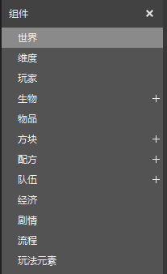 

- World: including components related to camera and terrain changes; 
- Dimension: including dimension-related functions such as biomes, custom features, and creature generation rules; 
- Player: including player-related functions such as skills and leaderboards; 
- Creature: used to add custom creatures; 
- Item: used to add custom items such as food, tools, equipment, and weapons; 
- Block: used to add custom blocks; 
- Recipe: used to add custom recipes; 
- Team: used to add team configuration; 
- Economy: configurable functions related to item circulation such as drops, transactions, and stores; 
- Plot: configurable dialogues and tasks; 
- Process: including components that control the game process such as starting the game and ending the game; 
- Gameplay elements: including components required for specific gameplay such as tower defense and bed wars. 

These components can work together to create a complete gameplay. The following uses the "task chain template" as an example to illustrate how the components work together. 

The task chain template implements a set of tasks, and players can complete all tasks one by one. The general process is as follows: 

1. The player comes to a village, talks to the villagers, and receives a task to find the guard soldier; 
2. The soldier tells the player that the monster has emerged from the ground and asks the player to kill the monster, which will drop equipment; 
3. After completing the task of killing the monster, the soldier asks the player to find the fire priest to find a way to seal the underground rift. 

This is a very simple task chain. Let's see how the components work together to implement such a task chain: 
 

- The dialogue NPCs and monsters involved in the task are all custom creatures, configured by the creature component; 
- The dialogue function is configured by the dialogue component; 
- The task function is configured by the task component; 
- Killing monsters will drop loot, which is configured by the drop component, and the corresponding drops are associated in the custom creature; 
- The template is an adventure mode, which is controlled by the basic attribute component of the world. 

In addition to the "task chain template", the "battle gameplay template" and "tower defense template" are also assembled from components, which can be used for reference. 

### The essence of components 

Each component will generate corresponding files in the work. Editing the properties of the component is actually modifying these files. The level editor packages this modification process in the form of components to make the modification visual. 

When you are very familiar with the components, you may have more in-depth needs, such as wanting the interface of the "Start Process" component to be cooler, or wanting to add more properties to the custom creatures. At this time, you can directly modify the corresponding files without sticking to the properties provided by the component in the property panel. 

**It should be noted that the current editor components are not yet compatible with manual modifications, and some manually modified content will be overwritten after saving in the editor. ** 

## Other functions 

### Common operations 

Common operations include save, backup, and run. 
 

- Save: Save all configurations in the current level editor. 
- Backup: Map-type works can be backed up as Addon or map. If backed up as Addon, the map data will be removed; Addon-type works can only be backed up as Addon. The backed-up works will be displayed in the work list of the launcher. When preparing to make major changes to the level, it is recommended to back up first. 
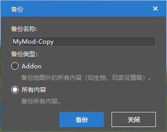 

- Run: When running the game, all current configurations will take effect, which is used to comprehensively test the game effect. Running will pull up an independent game client (Mod PC development kit). **When running the game, you can press F11 to switch the operation mode so that the mouse can move freely**. 

### Output window 

The output window will display the real-time information of the editor running, which is our helper to understand the running status of the editor. The output information of each window is different: 

- MC window: In debug mode, the information in the "Print Information" node in the logic editor will be output to assist in debugging logic. 
- All window: All information about the editor running will be displayed here. 
- Warning window: some warning messages will be displayed here. 
- Error window: error messages are displayed here. If there is a problem with the editor, there will generally be an error message here. 

## How to improve development capabilities 

Most developers are deep players of Minecraft, which lays a good foundation for developing Minecraft Addons. However, there are still several challenges when changing from a player to a developer: 
- How to quickly make a playable work, give yourself continuous positive motivation, and avoid losing enthusiasm in a long learning cycle; 
- How to make common game elements such as items and recipes in the game behind the scenes, you need to understand a lot of new concepts; 
- I hope to learn code, how to find ready-made examples to assist learning, instead of relying on yourself to explore a little bit; 
- There are so many Mod SDK interfaces, how do you know which interfaces to use to implement your own design. 

Components are an important way to solve the above problems. 

By modifying the existing templates, you can quickly generate specific gameplay. Components are basically visual configurations, combined with attribute annotations, you can understand the basic attributes of game elements. 

As mentioned earlier, modifying a component is actually modifying the files in the work. By studying the changes in the component files, we can know the functions of different files in Addon. 
For example, we change the name of the custom creature to "Demo Creature", as shown below: 
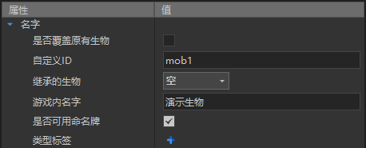 

Search for "Demo Creature" in the work folder (you can search after opening the work folder through VS Code), and you will find that this configuration is actually changed to the zh_CN.lang file, as shown below: 
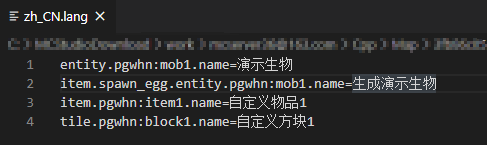 

In this way, we know that zh_CN.lang is a language file, and the name of the creature is defined in the form of entity.Creature ID.name.

Other configurations can also be familiarized in a similar way. When you have a deeper understanding of the file structure of the work, you can learn more about Addon through [Minecraft Chinese Wiki-Add-on Package](https://minecraft-zh.gamepedia.com/%E9%99%84%E5%8A%A0%E5%8C%85). With the previous foundation, it will not be too difficult to look at the wiki. 

In addition to the configurations already supported by the original Addon, the Chinese version of Minecraft also provides a way to write Mod logic in Python code (that is, [Mod SDK](../13-Module SDK Programming/2-Python Script Development/0-Script Development Introduction.md)). Through Python code, many rich gameplays can be achieved. 

Through components, we can learn how common functions in the game are implemented with code. Take the camera component as an example. After adding the camera component, a script_Sight folder will be added to the work folder. 
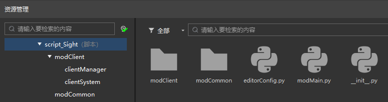 

This script folder implements the function of adjusting the camera's viewing angle. The editorConfig in it corresponds to the configuration in the property panel. The "VIEW_MODE" in the file corresponds to the mode in the property window. 
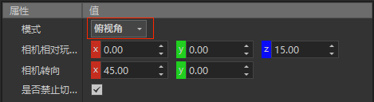 
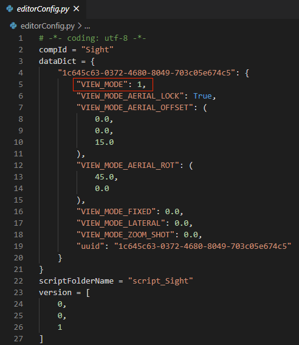 

By searching for "VIEW_MODE", we can locate the core implementation code of this component. By studying this part of the code, we can understand which interfaces are used to implement the function. 
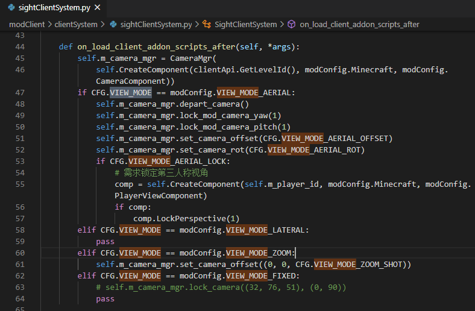 

In general, we can use components to see the effect first, then study the principle, and after understanding the principle, use these principles to create better works, thereby improving development capabilities.