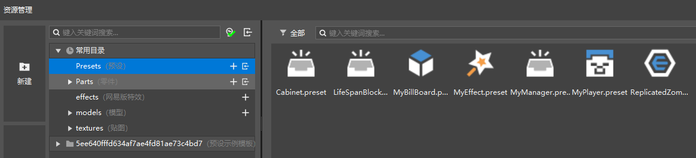
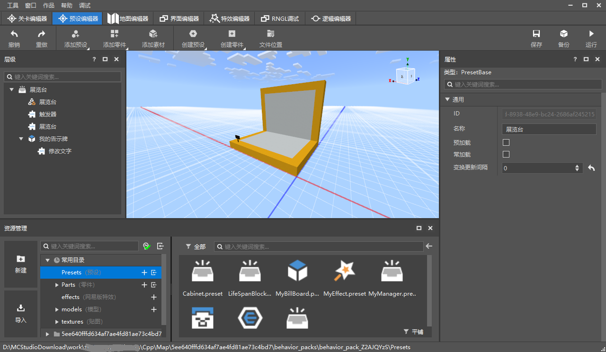
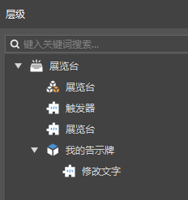
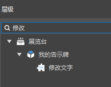
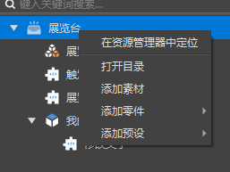
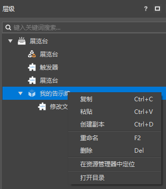
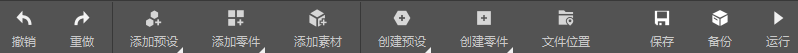
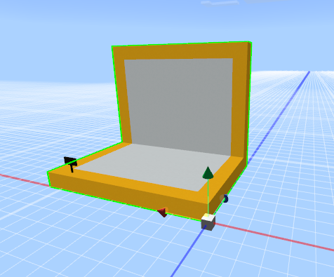

--- 
front: https://mc.res.netease.com/pc/zt/20201109161633/mc-dev/assets/img/preset002.1e5e0e6f.png 
hard: Getting Started 
time: 30 minutes 
--- 
# Preset Editor 

## What is a preset? 

Preset means pre-setting. That is, developers can assemble blocks, materials, entities, special effects and gameplay logic into a preset. 

Presets are saved as files in the Preset directory of the behavior pack. As shown in the figure below, you can find the Preset folder in the common directory of the resource manager. 

 

When used, a preset is placed in the game as a whole. The preset placed in the game is called an instance. 

The suffix of a preset is .preset. If you are interested in what a preset is, you can use a text editor to open the preset file and view its structure. 

For the use of preset architecture, please refer to [First Preset Mod](../14-Preset Gameplay Programming/0-First Preset Mod/0-Create a New Version of Works.md). 

## Basic Introduction 

There are two ways to open the preset editor: 

- Switch through the editor switch tab at the top 
- Double-click the preset file (xxx.preset) in the resource manager 

The preset editor is mainly used for assembling, previewing and editing properties of presets. As shown in the figure below: 

- Hierarchy panel: used to display the structure of the preset. 
- The preview window in the middle: used for previewing the preset and dragging and adjusting the coordinate transformation of each object. 
- Property panel: used to display the properties of the currently selected hierarchy item and modify it. 

 

Note that the preset editor is an edit of a certain preset, and multiple presets cannot be edited at the same time. 

## Hierarchy and preset assembly 

The hierarchy panel of the preset editor is used to display the hierarchy structure of the preset currently being edited, and displays their parent-child relationship in a tree diagram. 

 

The hierarchy panel supports search, as shown below. Like the stage of the level editor, the search results will also display the tree structure related to it.

 

In the hierarchy panel, right-click on the root node, and the following menu pops up: 

- Locate in Explorer: The path to open this preset in Explorer 
- Open Directory: Open the folder corresponding to this preset in Windows Explorer 
- Add Materials: Add materials to the preset 
- Add Parts: Add parts to the preset, and the second-level menu is the parts that can be added 
- Add Preset: Add a sub-preset to the preset, and the second-level menu is the preset that can be added 

> The hierarchy of the sub-preset cannot be changed at present 

 

Right-click on an entry other than the root node, and the following menu pops up: 

- Copy: Copy this entry 
- Paste: Paste this entry in the hierarchy 
- Create a copy: Create a copy of this entry in the hierarchy 
- Rename: Rename this entry 
- Delete: Delete this entry 
- Locate in Explorer: Open the path corresponding to this entry in Explorer and select the preset 
- Open Directory: Open the folder corresponding to this entry in Windows Explorer 

 

The ribbon buttons of the preset editor, which are related to preset assembly, are as follows: 

- Add preset: Add a sub-preset to the preset, and the pop-up menu is the preset that can be added 
- Add part: Add a part to the preset, and the pop-up menu is the part that can be added 
- Add material: Add material to the preset 

 

## Preview window 

In the preview window of the preset editor, only the preset currently being edited will be rendered except for the sky. 

You can operate the coordinate transformation of the preset entry in the preview window. Refer to the preview window of the [level editor](./3-level editor.md). The coordinate transformation operations of the preview windows of the two editors are basically the same. 

> When you enter the preview window, you will actually be teleported to the birth point of the current work. The preview window is still Minecraft, and there is also a height limit of 256, which means that you cannot control the camera to reach a position that is too high or too low. 

 

## Other function area buttons

- Undo: Remove the effects of the last operation. Currently, unlimited undo is supported. When the editor is switched, the previous operation is no longer recorded. 
- Redo: Redo the last undone operation. 
- Create preset: Same function as the "+" button in the common directory - Presets in the resource manager. Refer to [New version file structure and resource management](../../15-Resource management/2-File structure.md). 
- Create part: Same function as the "+" button in the common directory - Parts in the resource manager. Refer to [New version file structure and resource management](../../15-Resource management/2-File structure.md). 
- File location: The resource manager opens the path corresponding to this entry and selects the preset currently being edited. 
- Save: Save the current preset file. 
- Backup: Generate a copy of the current work in the launcher's work library. 
- Run: Save the contents of all editors and perform development tests. 

