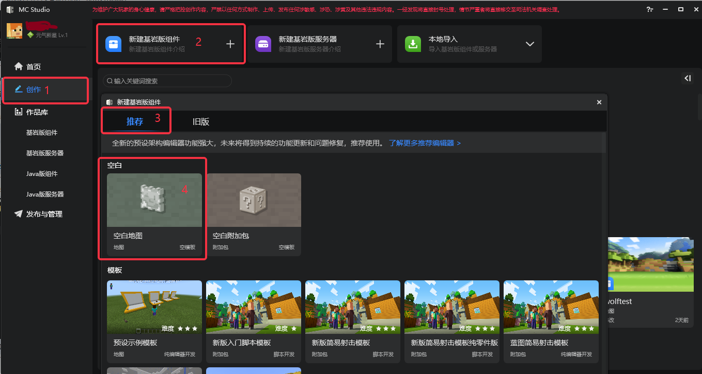
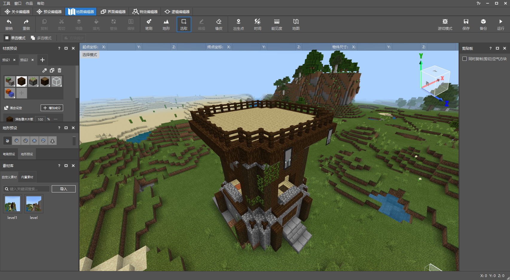

# Preparation 

## Production Goal 

This series of documents will take you step by step from 0 to learn how to use the new version of the logic editor to make your first blueprint mod. 

Our goal for this mod is to make an animal that doubles its movement speed every time it receives actual damage (we will use a pig as a template first), and its speed will no longer increase when it reaches the upper limit. 

This is a very simple logic, but it can help beginners understand some basic concepts and how to use the new version of the logic editor. 

## New Work 

We need to create a work through the new version of the editor so that we can use the new version of the logic editor. 

If you don't know how to create a new version of the work, please refer to [this article](../../14-Preset Gameplay Programming/0-First Preset Mod/0-Create a New Version of the Work.md). 

 

## Prepare the Map 

We will need a fixed venue for testing. Because our experimental subject (the cute pig) may have an outrageous speed in the end, we need a relatively closed venue to limit its range of activities. Here you can use a 2-block high wall to enclose it. Of course, a simpler way is to use a small flat area surrounded by a fence in the map editor (such as the top of the tower in the picture below). 

> **First time using the map editor? ** 
> 
> You can check "[Map Editor Instructions](../../../14-地图制作/2-地图编辑使用说明.md)" to learn about its basic operation methods. 

 

## Prepare entity presets (experimental subjects) 

Next, we need to prepare a pig as an experimental subject. Here we need to use the entity presets of the new version of the editor to make it. 

First, we click the [New] button in the resource manager interface below, select [Entity Preset] under the [Preset] menu, and click [Next]. Then we can find "pig" by keyword search in the entity list, and name it "Pig" in the file naming below. Finally, click the green [Create] button to open our newly created Pig entity preset through the preset editor. 

 

Next, we can drag the newly created Pig preset into the scene in the [Level Editor] and place it in the area just circled with a fence, so that it will not run around when exported. 

After placing it, be sure to click the [Save] button in the upper right corner. Saving frequently is a good habit. 

 

**In the next document, we will use the blueprint part to attach the blueprint script to this pig. ** 

