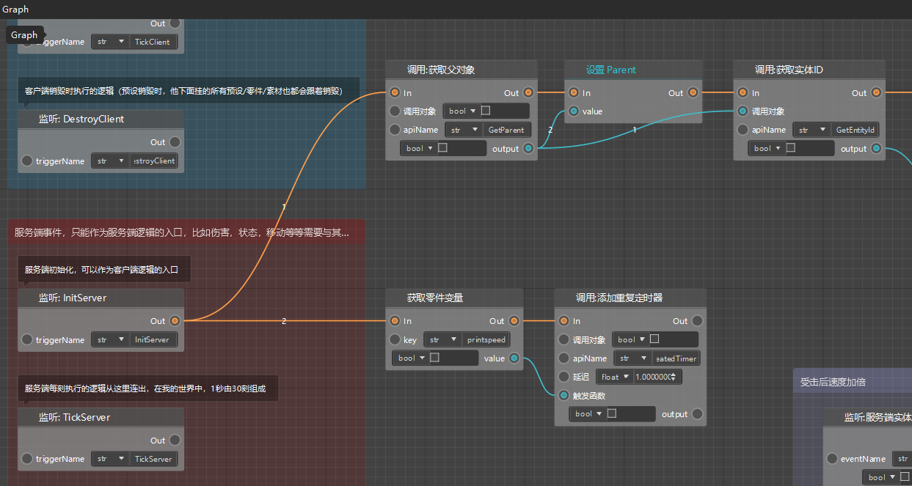
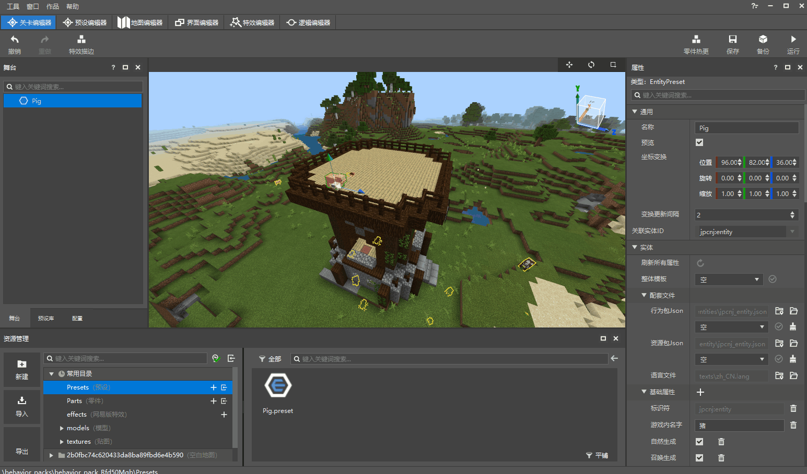

# Create and attach blueprint parts 

In the new version of the logic editor, we use node-based programming to write logic, and these graphs that carry nodes and connections are called **blueprint**. 

 

As we introduced in the previous document, a part is a gameplay logic object that can be attached to a preset under the preset architecture. As the name suggests, a blueprint part is a special part that uses blueprints to write part logic and needs to be edited with the new version of the logic editor. 

## Create blueprint parts 

We can use the New File Wizard to create blueprint parts. For example, if you are currently in the level editor interface, you can click the [New] button in the resource manager in the lower left corner to open the New File Wizard, select [Blueprint Part]-[Empty Blueprint Part], and then click [Next]. Then you can name this blueprint part. For example, if we need this blueprint part to adjust the speed, we will first name it "SpeedChange". 

> The naming of parts, presets, etc. is relatively free, but a clear name can help you improve the search speed. 

 

## Attach blueprint parts to entity presets 

Parts need to be attached to presets to take effect. Here we first double-click Pig.preset in the resource manager, open this entity preset in the preset editor, and then directly drag the white SpeedChange.part file and drag it to Pig in the [Hierarchy] panel on the left. Here we can also modify the display name of the SpeedChange part under the Pig preset (for example, we can also change it to SpeedChange). 

After saving and returning to the level editor, we can see that in the left stage window, there is also a SpeedChange part under the instance of the Pig preset. 

 

