# Blueprint logic writing: necessary preparations 

Recall that our goal is to double the speed of the pig every time it is actually hurt. Before that, we need to do a series of preparations: 

1. Get the entity preset object: we need to specify who to adjust the health and set the speed later; 
2. Increase the health of the pig: the purpose is to prevent the pig from dying after a few hits in our test. Here we need to adjust the upper limit and current health of the two attributes; 
3. Set the speed and maximum speed of the pig: in order to make the demonstration effect more exaggerated, we set the current speed of the pig to 0.05 (one-fifth of the normal speed) and its maximum speed to 32. At the same time, we need to use two variables to store these two speed values for subsequent calculations and assignments. 

## Get the entity preset object 

We need to get the entity preset object when the client is initialized and save it as an independent variable Parent so that it can be used at any time in subsequent logic. We can drag a yellow execution lead from the output execution pin (Out) of the server-side initialization node, and the node menu will pop up after releasing the mouse. 

Here we need to get the parent preset of the current blueprint node (the pig entity preset), so we need to use the [Get Parent Object] interface. We can 

1. Directly search for this node in the node list (usually do this when you don’t know the node name) 
2. Enter Chinese keywords for search, such as "Parent Object" 
3. Enter the English name of the interface, such as "GetParent" 

These three methods can find the nodes we need. You can choose which method to use in subsequent editing according to the actual situation. 

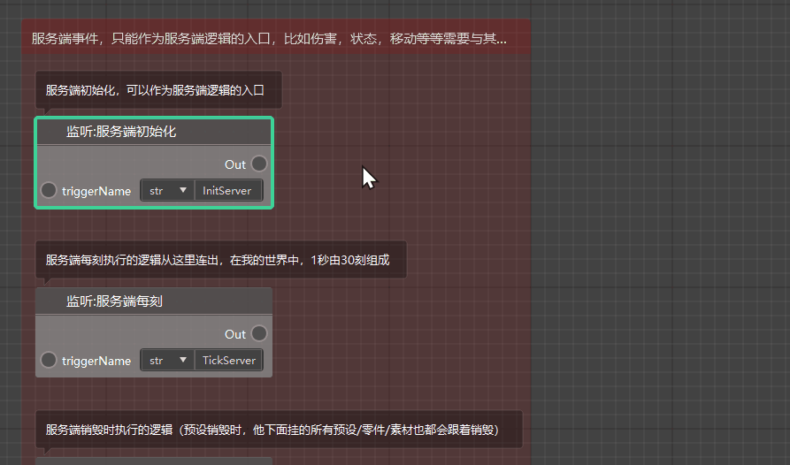 

We can see that there are actually 2 [Call: Get Parent Object] nodes to choose from, one is [Call Part Interface], and the other is [Call Preset Object Interface]. In fact, there is no difference in using these two nodes in our current situation, but if we are getting the parent preset of the preset when the preset is nested in multiple layers, then we cannot use the Get Parent Object node of the Part Interface. 

After successfully obtaining the parent preset object, we can develop a good habit to store it in the form of a variable so that it can be called later in other locations in the chart or in the interface chart of the custom interface. 

First, click the "+" sign in the upper right corner of the variable menu in the script element window on the left to create a variable and name it [Parent]. Since the parent object is an Object type and does not belong to the custom variable data type provided by the current editor, we can use the default Any type without changing the variable type. 

After creating the [Parent] variable, drag it from the variable menu on the left to the blank space of the chart, release the left button and select [Set Parent] to create a setting node for the variable to modify the value of the variable. We connect the [Mobilize: Get Parent Object] node and the [Get Parent] node through the yellow execution lead, and then pass the result of getting the parent object to the parameter Value of setting Parent through the data lead, and then pass the object to the Parent variable for storage. 

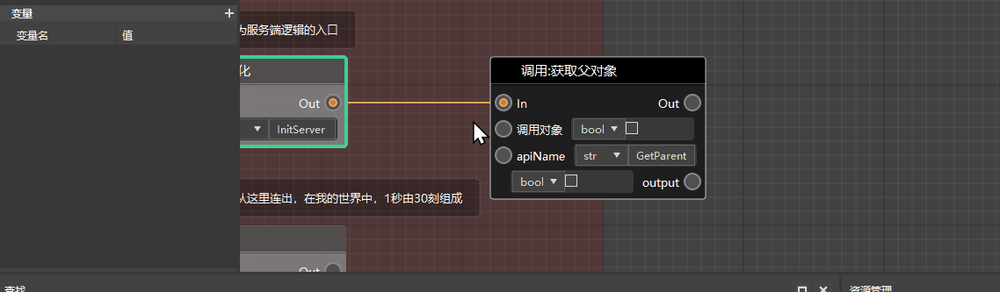 

## Increase the health of the entity 

In order to prevent the pig from dying due to insufficient health during our test, we need to increase its maximum health and current health at the same time. The interfaces needed are [Call: Set the maximum value of the attribute] and [Call: Set the attribute value]. (Note that the [Call preset object interface] class needs to be selected here) 

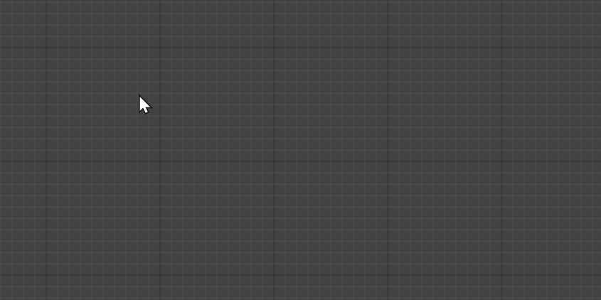 

Both nodes need to pass in the entity object to confirm which object is being set. Here, since we have already saved the parent object as a variable, we can directly get the value of the Parent variable and then pass it to the [Call object] parameter of the two setting interfaces. 

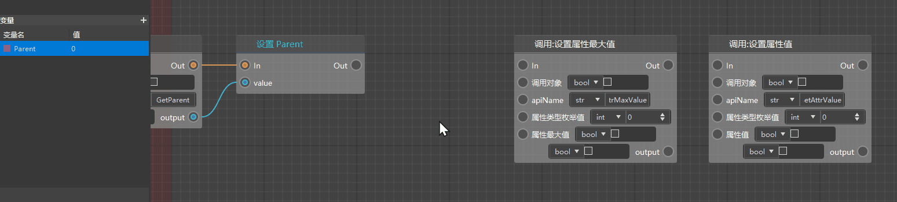 

Next, we need to determine which attribute of the entity is being set for the operation of setting the maximum value of the attribute and setting the attribute value. To determine the attribute type, we need to refer to the enumeration value of the corresponding attribute type and pass it to the two setting interfaces. 

More generally, when we don't know what a node's parameters or return values represent, we can directly check the corresponding interface information in the API documentation on the developer's official website. For example, here, we searched and found the [SetAttrValue] interface. In the parameter information, we can see that attrType needs to be filled in with the AttrType enumeration value. We click the link to jump to the attribute type enumeration value page and see that the attribute type corresponding to health is 0, which is exactly the default value, so we don't need to change the value of this parameter here. 

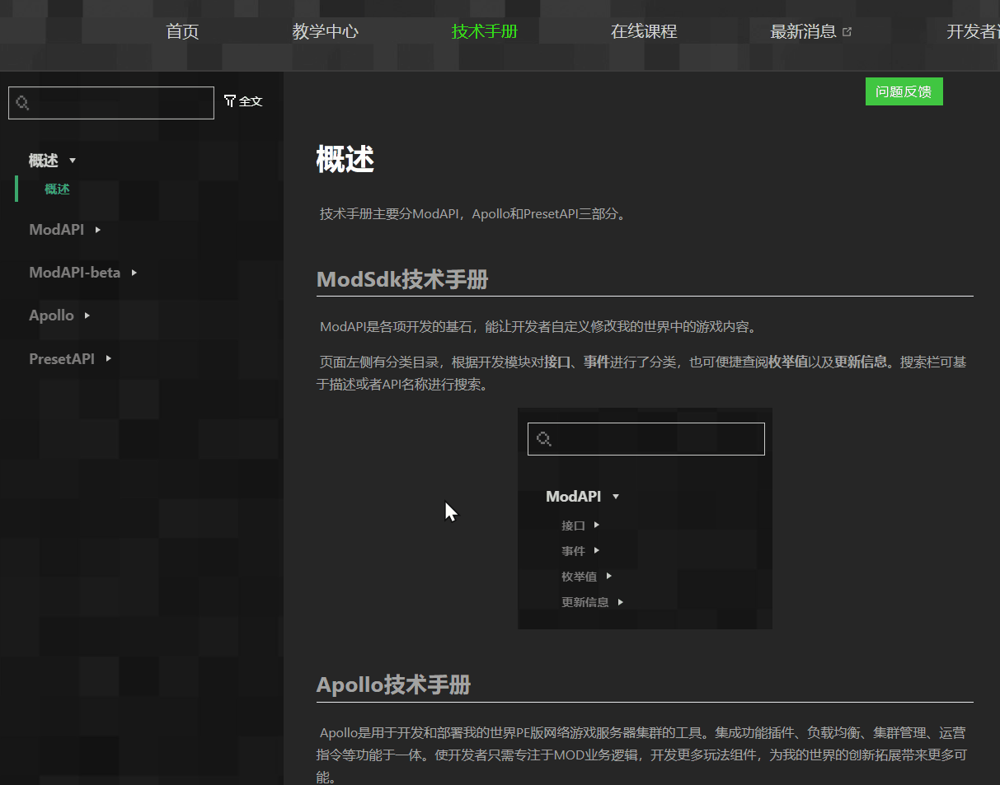 

Then, we set the maximum health and current health of this pig to 80, and we can complete the steps of increasing the health. Here, we directly change the [attribute maximum value] and [attribute value] parameters of the two nodes to floating point numbers (float), and then change the values to 80. 

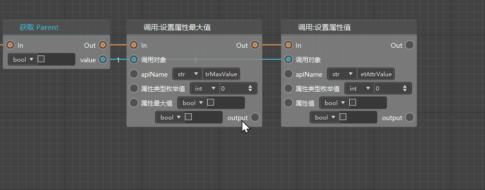 

## Set and store the upper limit and initial speed of the entity 

Under normal circumstances, the default movement speed of the pig in the game is 0.25. In order to make the demonstration effect more exaggerated, we adjust its initial speed to 0.05 and set its maximum speed to 32. At the same time, in order to facilitate subsequent calculations, we need to store the current speed of the pig as the variable Speed (floating point type) and the maximum speed of the pig as the variable MaxSpeed (floating point type). 

For the setting and obtaining nodes of the maximum speed, we can directly use the preset API interface: [Set Maximum Speed], [Get Maximum Speed]; 

For the setting and obtaining nodes of the speed, we can directly use the preset API interface: [Set Speed], [Get Speed]. 

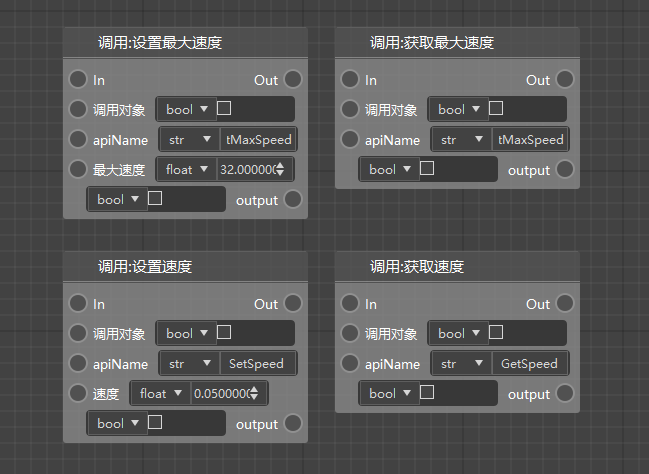 

We can directly drag another execution line from the output execution pin of Get Parent and connect it to Set Maximum Speed. The logic represented by this is to first execute the execution line [Set Attribute Maximum] → [Set Attribute Value], and then execute the logic [Set Maximum Speed]. At the same time, we fill in the upper speed limit 32 we need in the maximum speed parameter. 

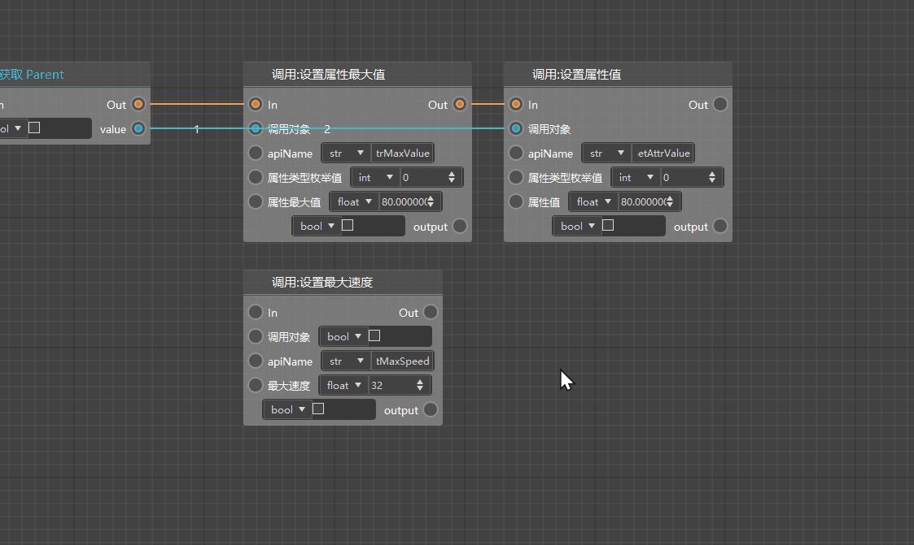 

After setting the maximum speed, we need to save the maximum speed as the variable MaxSpeed. Here we first use the [Get Maximum Speed] node to get the maximum speed value of the current entity (which is equal to the 32 we just set), and then create a floating point variable named MaxSpeed and set its value to the maximum speed value we just got. 

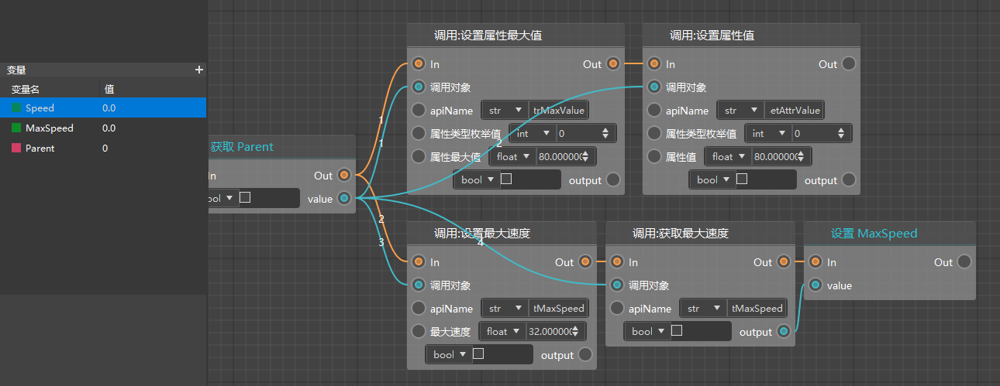 

Similarly, we also need to get the current entity speed value and pass it to the newly created variable Speed. 

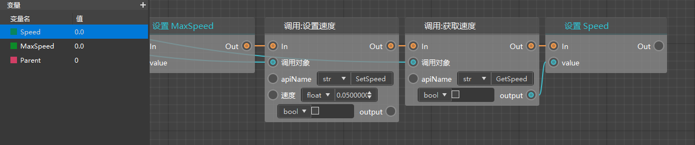 

In this way, we have completed the work of setting and storing the upper limit and initial speed of the entity. 

## Tips: Manage nodes through grouping and annotation tools 

If there are too many nodes in the graph, we usually feel confused and don’t know where to start when looking for a certain logic. At this time, we can use grouping and annotation tools to identify and manage the nodes. 

We right-click on the blank space in the upper left corner of the node to be selected, and select [Create Group] from the menu. You can see that a group box of default size is generated in the graph. The nodes in the box will be recognized as the content of the group by default, and will be moved uniformly when dragging the group. We can change the name of the group, adjust the size of the group box to include other nodes we need, and change the color of the group to make it more eye-catching. 

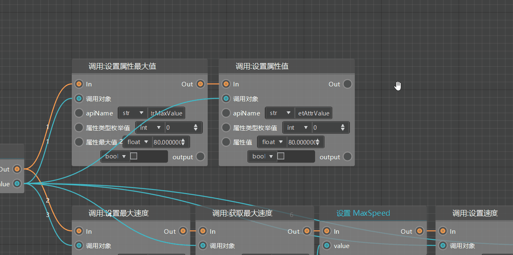 

Similarly, we can also create groups for nodes for speed setting and storage. 

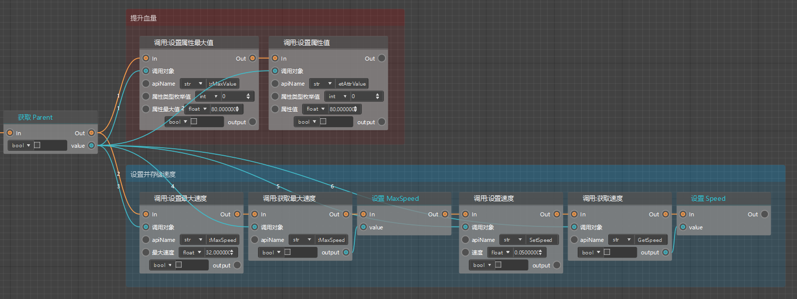 

If you need to add a comment to a node, you can right-click the node and select [Edit Comment], which can easily provide more information about the node. 

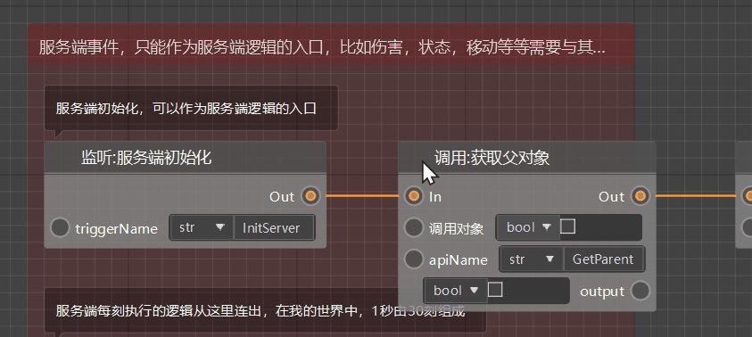 

