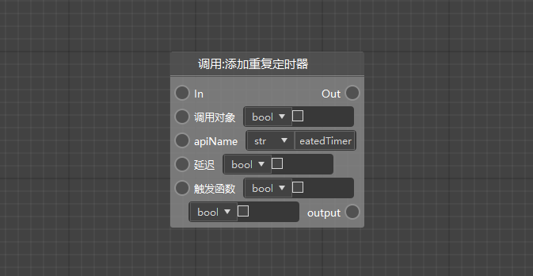
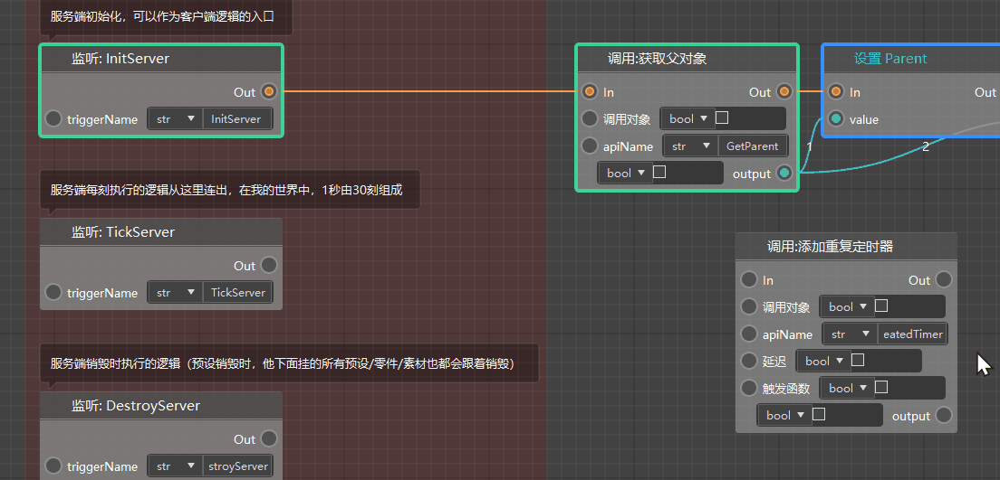
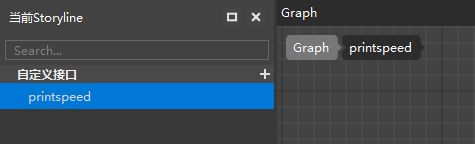
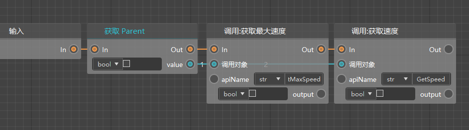
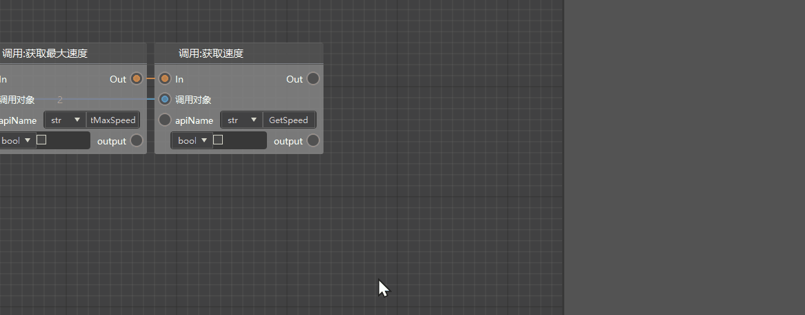
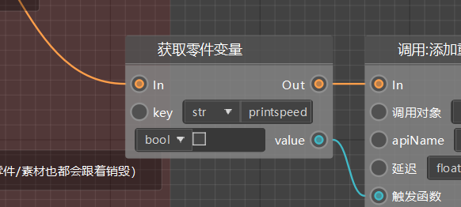
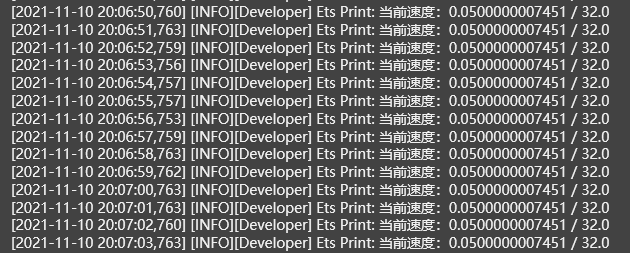

# Blueprint logic writing: custom interface and timer logic 

Our goal is to modify the pig's movement speed, but we cannot see whether the logic we wrote has achieved our expected effect through the actual running state of the pig in the game. At this time, we need to return the real-time movement speed of the pig through log printing to accurately determine whether the pig's movement speed doubles after each actual damage. 

## Use repeating timer 

If we use the server to listen to events every tick (TickServer) to call print events, we will receive too much print information. In fact, we hope to print the real-time speed every certain period of time (for example, 1 second). Here we need to use a special node, that is, [Add repeating timer]. The difference between repeating timer and ordinary timer is that ordinary timer is used for logic executed after a period of time, and repeating timer is used for repeating logic that is executed every certain period of time. 

 

First, we need to change the type of [delay] parameter to float, and then we need to pass in a trigger function, which means that this function will be executed every 1 second. We need to pass this function in the form of a part variable. Here we call the [Get Part Variable] interface, connect [Server Initialization (InitServer) → Get Part Variable → Add Repeat Timer] with an execution line, and then pass the obtained part variable to the [Trigger Function] pin. 

> The [Server Initialization (InitServer)] time is used here because we want to create this timer immediately after the server is initialized and start executing the printing logic once a second. Do not use [Server TickServer] to create a timer here, otherwise it will be created once every Tick, resulting in a surge in log volume. 

 

Next, we need to create a custom interface, write the printing logic, and pass it to the trigger function as a part variable. 

## Create and edit a custom interface 

First, click the "+" button in the custom interface menu in the script element window on the left to create a new custom interface and name it printspeed. 

 

When creating a custom interface, the logic editor will automatically open the interface diagram of the custom interface for us. We need to write the logic of this interface in the diagram and form a node network of [input node → interface logic node → output node] so that we can call the logic of this custom interface in the root diagram. 

> Here we do not need this printspeed interface to have parameters or return values, so there is no need to add them. 
> 
> If you need to add parameters and return values to the custom interface in the future editing process, you can select the custom interface in the script element window on the left and add parameters/return values to it in the property window on the right. 
> 
> ** It should be noted that the properties of the custom interface cannot be edited by selecting the call node of the custom interface in the diagram. 

Then, we can edit the logic of the print speed we need in the interface diagram of the custom interface. 

We need to obtain the real maximum speed and current speed of the entity, so first obtain the Parent, and then pass it to the call object parameters of [Get Maximum Speed] and [Get Speed].

 

In order to make the log printing more readable, we need to use the [Connect String] node to define the format of the printed information: [Current speed: (Current entity speed)/(Entity maximum speed)] 

 

After completing the internal logic of the custom interface, we fill its name into the key of the root chart [Get Part Variable], so that the printspeed interface logic can be executed once a second. 

 

At this point, the custom interface logic that the timer needs to execute every second has been edited, and we can simply test it. 

## Test timer logic 

After saving, we click the run button on the toolbar to start testing the timer logic. 

 

From the log window, we can see that there is a pig speed and maximum speed print every second, indicating that our timer logic is correct. 

 
