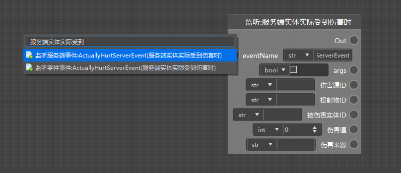
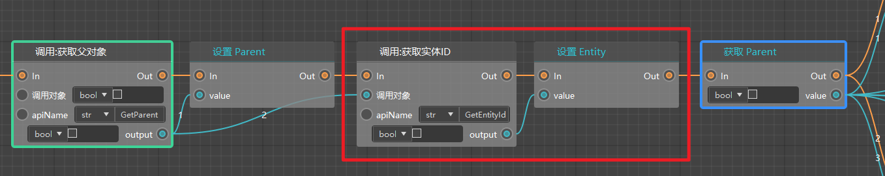
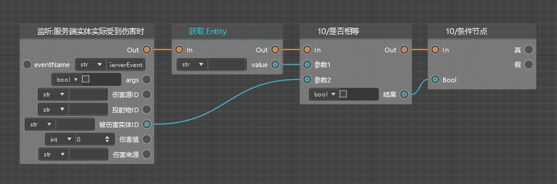
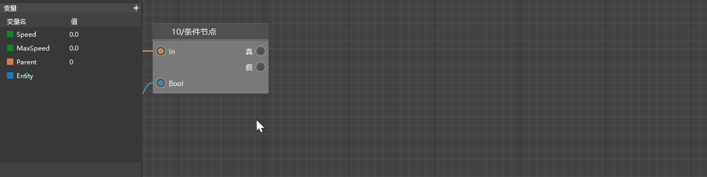
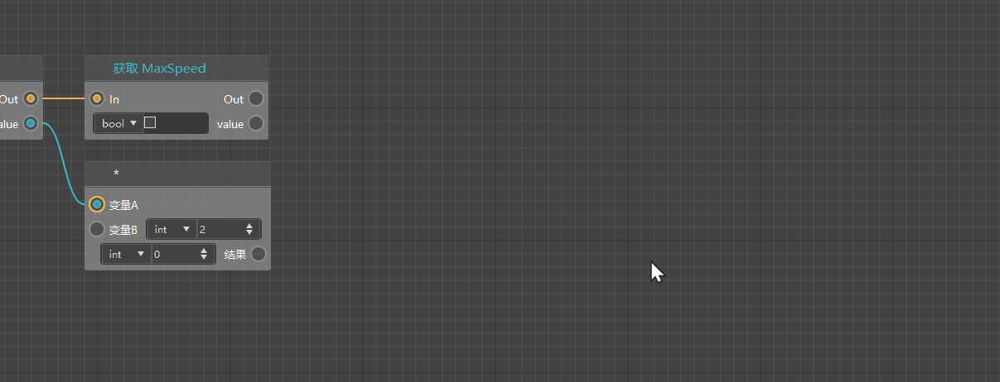
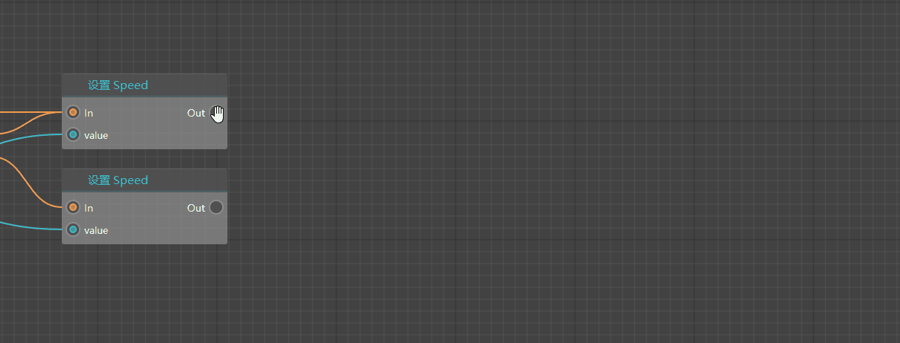
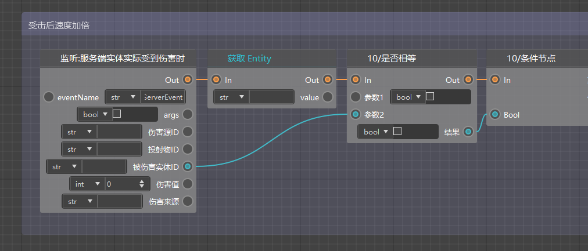

# Blueprint logic writing: hit acceleration logic 

After completing the writing of the timed printing logic, the next step is our highlight: hit acceleration logic. This part mainly includes 2 steps: 

1. Determine whether the injured entity is our entity preset 
2. Calculate the speed of the pig after being hit and pass it to the pig 

## Entity ID judgment 

For the monitoring of the actual damage to the pig, the node we use is: [Monitor: When the server entity is actually damaged]. Here we can choose the first [Monitor server event] class, which is an sdk event monitoring node. 

 

This node can pass the ID of the injured entity for us. Here we need to compare it with the entity ID preset by our creature. If they are completely equal, it is determined that the actual damage is our pig, and then continue to execute the subsequent speed change logic. Now we need to supplement the logic of obtaining the pig's entity ID. 

First, we need to get the entity ID corresponding to the parent object through the [Call: Get Entity ID] node, then create a variable Entity of type string (Str) and store the obtained entity ID in Entity. We need to insert this logic after getting the parent object and storing it in Parent. 

 

Then, we need to determine whether this entity ID is the same as the damaged entity ID. Here we need to use the [Is Equal] node, which passes in two values to determine whether the two are equal and returns a Boolean value. If the two parameter values are equal, it returns True; if they are not equal, it returns False. 

Next, we pass this Boolean value into the [Conditional Node], which has two output execution leads. When the Boolean value is true, it follows the "True" lead; when the Boolean value is false, it follows the "False" logic. 

 

So far, we have completed the logic of entity ID judgment. 

## Calculate the speed of the entity after being hit 

The idea of calculating the speed of the pig after being hit is as follows: 

Get Speed, multiply Speed by 2 to get **2Speed**, and then compare it with **MaxSpeed**: 

1. If 2Speed is less than or equal to MaxSpeed, reassign 2Speed to the Speed variable and set the value of Speed to the current speed of the entity; 
2. If 2Speed is greater than MaxSpeed, assign MaxSpeed to the Speed variable and set the value of Speed to the current speed of the entity. 

First, we get Speed and multiply it by 2 through the [*] multiplication node; then get MaxSpeed. 

 

Then we compare the size of 2Speed and MaxSpeed through the [Digital Comparison] node, and assign the corresponding value to Speed according to the above logic. 

 

Finally, we retrieve the latest Speed and set its value as the entity speed. 

 

So far, we have completed the logic of doubling the entity speed after being hit. Use the purple group box to group this part together. Next, we can test whether the logic we wrote is correct. 

