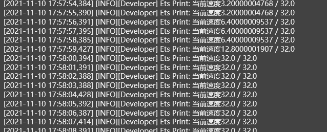
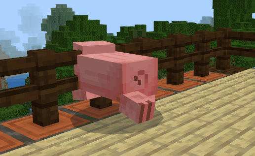

# Final test 

After saving, we click the run button on the toolbar to start the final test. 

 

After running, we use the wooden sword (less attack power) to attack the pig. You can see that its speed doubles every time it is hit, which is in line with expectations. 

 

As we continue to attack the pig, its speed gets faster and faster until it exceeds 32 and is limited to the maximum value of 32. 

 

 

So far, our "First Blueprint Mod" series of tutorials has ended. I hope that everyone can learn from this tutorial step by step and have a preliminary understanding of using the new version of the logic editor to develop modules. Welcome everyone to try more features of the new version of the logic editor. If you encounter any problems, please feel free to [feedback to us](https://mcdev.webapp.163.com/#/feedbackModal?target=browser)! 

**End! End! Spread! Flowers! ** 

