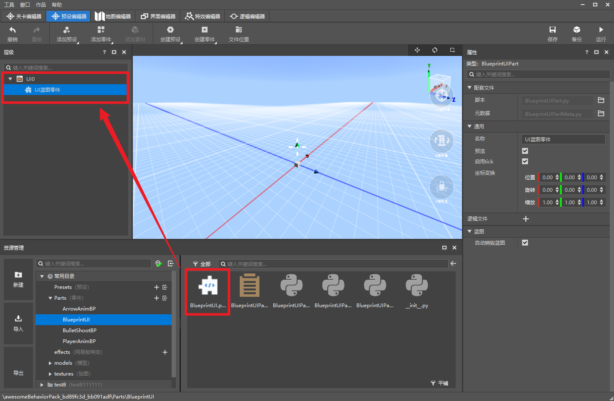
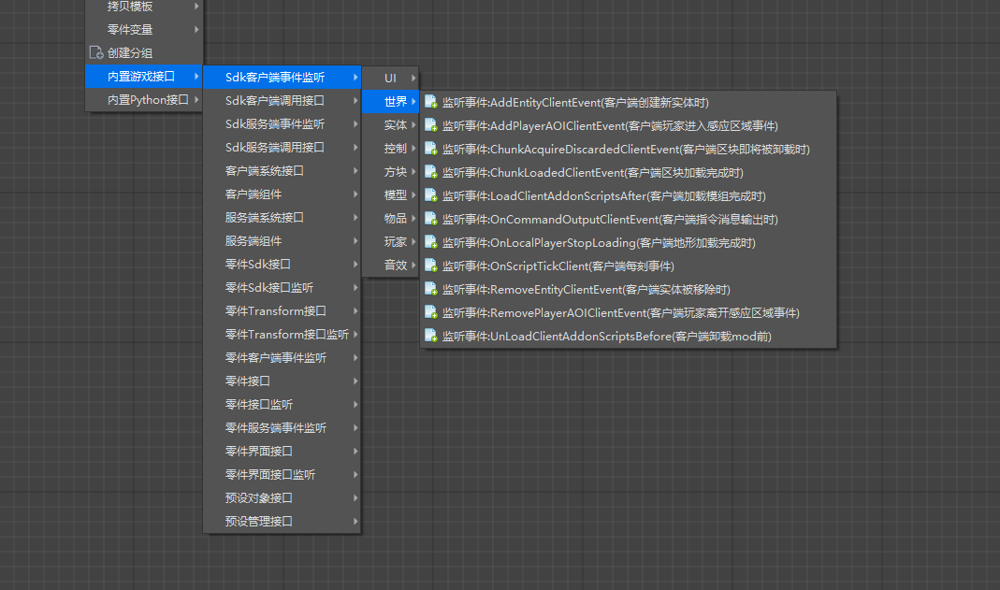
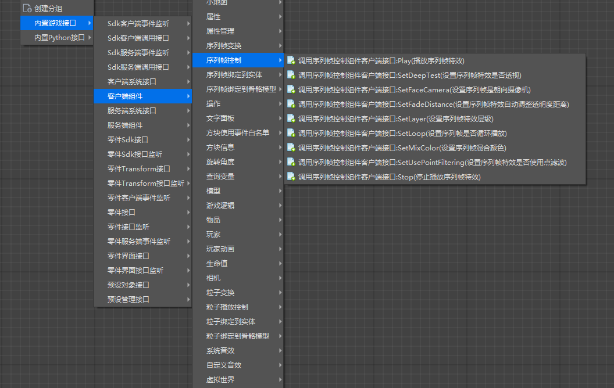
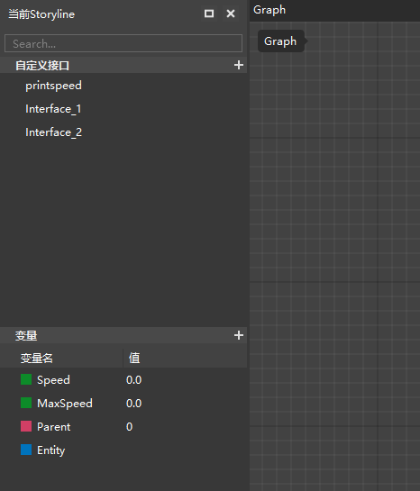
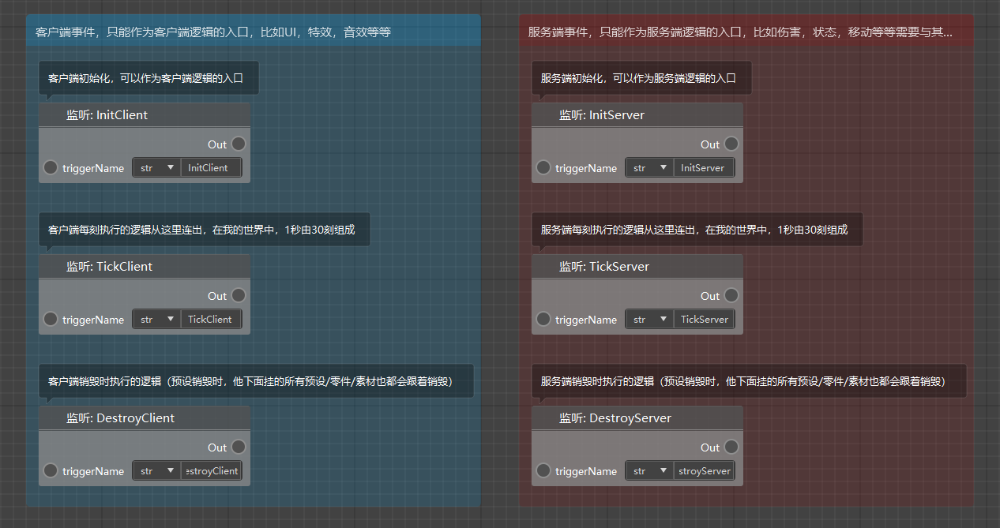
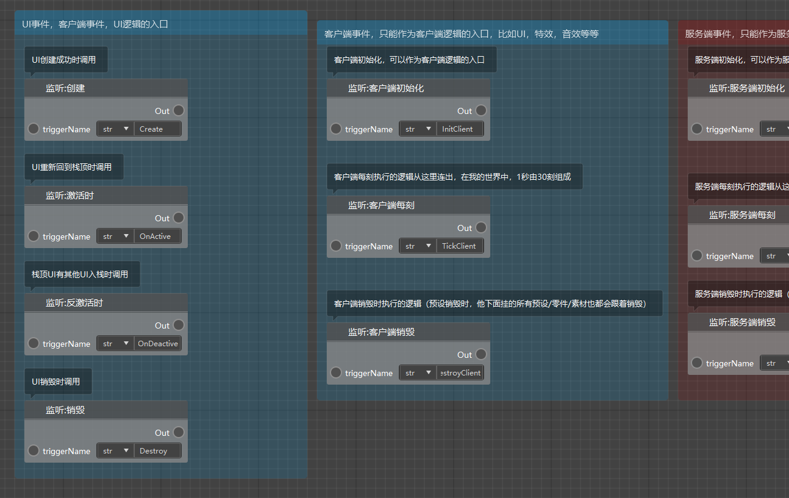
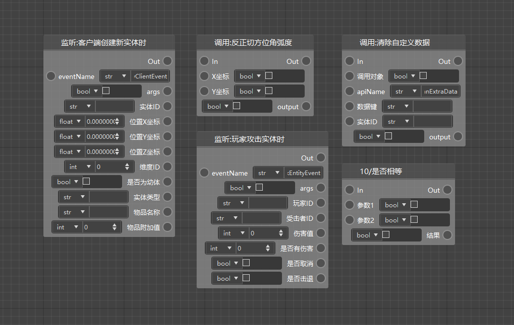

# Get to know the new version of the logic editor 

In this update, we launched the new version of the logic editor. Compared with the old version of the logic editor, we have made some major improvements, mainly including: 

1) The organization of icons is updated to node style 

 

2) The logic file is now renamed as blueprint script. Each blueprint script is fixedly bound to a blueprint part. Attaching the blueprint part to the preset can make the logic in it effective 

 

3) All interfaces of the module SDK are provided, and the support for p is greatly expanded. Support for Python native interfaces 

 

4) Support for writing client logic (special effects, sound effects, models, animations, etc.) 

 

5) Independent variable and custom interface management 

 

6) More start events, complete event system support 

 

7) Support for loop logic 

8) Support writing UI blueprints 

 

9) We have added Chinese translations to most nodes, trying to reduce the inconvenience caused by language barriers to module development 

 

