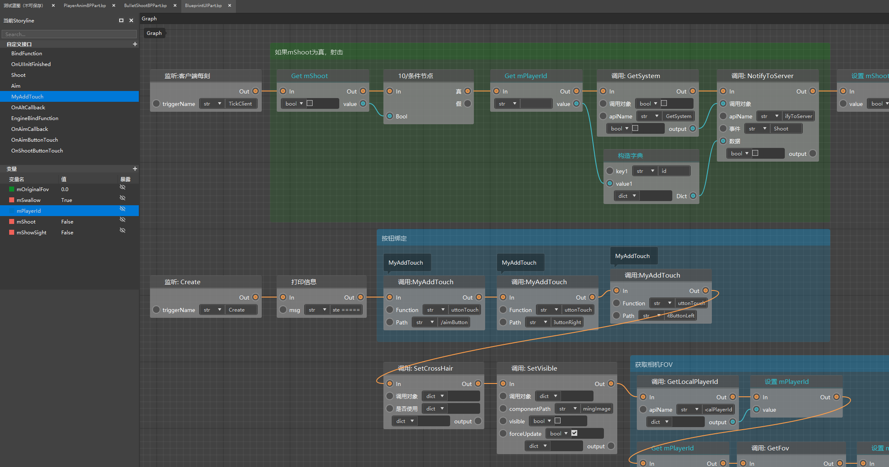

# Basic concepts to know 

## Presets and instances 

Preset means pre-setting. That is, developers can assemble blocks, materials, entities, special effects and gameplay logic into a preset. When in use, a preset is placed in the game as a whole, and the preset placed in the game is called an instance. 

For more information about presets and instances, please visit [this document](../../14-Preset gameplay programming/0-First preset Mod/1-Create a new preset and add materials.md). 

## Parts 

Parts are a kind of gameplay logic object that can be attached to a preset under the preset architecture. When we write the logic into the part code and then attach the part to an effective preset, the logic of the part will also take effect. 

For more information about parts, please visit [this document](../../14-Preset gameplay programming/0-First preset Mod/4-Create and attach parts.md). 

## Blueprint 

In the new version of the logic editor, we use node-based programming to connect different nodes through execution lines and data lines to form a node network, thereby writing a complete set of logic. These graphs that carry nodes and lines are called **Blueprint**. Blueprints need to be edited with the new version of the logic editor. 

 

## Blueprint Parts 

Blueprint Parts (BlueprintPart), as the name suggests, are special parts that use blueprints to write part logic. Compared with ordinary parts, blueprint files have an additional .bp file in the folder of the resource manager, that is, the blueprint script file. Double-click the .bp file in the resource manager to open the blueprint graph of the blueprint part in the resource manager for editing. 

 

## Events 

Events are a core component of the module SDK architecture and a common programming technique. For the event system of the module SDK, please refer to this document: [Event Introduction](../../../20-Gameplay Development/13-Module SDK Programming/2-Python Script Development/9-Event Introduction.md). 

Simply put, the event system is used to write clearly what logic should be executed when a certain situation is triggered. For example, "When the player clicks the sneak key, play the character's crouching animation", then "When the player clicks the sneak key" is an event. When this event is monitored, the system will execute the logic of "playing the character's crouching animation". 

In the blueprint, the event listening node is the starting point of the blueprint logic network execution. A series of interfaces are connected through the execution lead connected to the event node. When the system monitors this event, the subsequent series of node logic will be executed in sequence. 

 

## Interface 

An interface is a type of node graph in a blueprint, and its internal logic can be called from other blueprint graphs. 

We have made all SDK interfaces and a large number of python interfaces into built-in interfaces, and put them in the right-click menu for developers to call directly (developers cannot directly modify the logic of these interfaces); at the same time, we also allow developers to create custom interfaces and write their own node logic. 

**For example: ** We have written the logic of the custom interface Interface_1 in the following custom interface graph: 

 

Then call Interface_1 in the graph, and you can directly reuse its internal logic for calculation. 

 

## Variable 

Variables are used to store values or object properties. You can call variable values by getting variable nodes, or set new values for the variable by setting variable nodes. 

 

