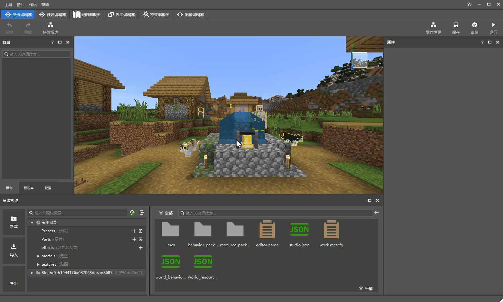
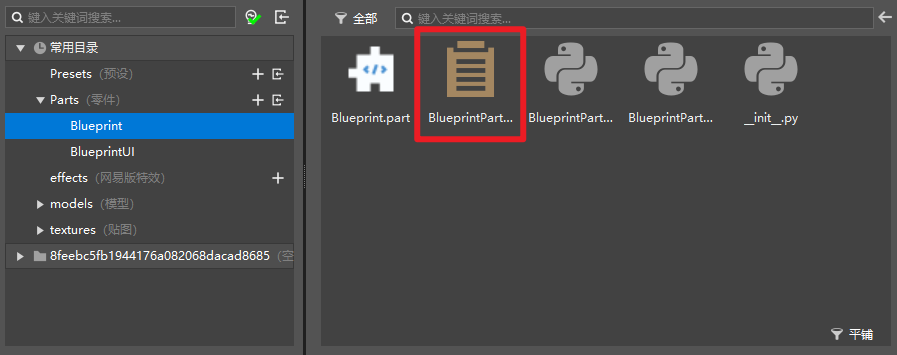

# Create a blueprint part 

## Create a blueprint part 

 

Like ordinary parts, blueprint parts can also be created through the New File Wizard. Click the [New] button on the left side of the resource manager to open the New File Wizard, select Blueprint Part, and create an empty blueprint part. You can customize the name of the blueprint file (note that only pure English and numeric names are currently supported). After creating a new blueprint part, the resource manager below will automatically jump to the newly created part directory. 

## Two types of blueprint parts 

As shown in the Blueprint Parts page of the New File Wizard, there are currently two types of blueprint parts: 

1) Blueprint Parts: ordinary parts with logic written in blueprint scripts; 

2) UI Blueprint Parts: Blueprint parts written specifically for UI control, which contain some events and interfaces dedicated to UI control. 

### Blueprint parts 

 

The following 5 files will be automatically created in the directory of blueprint parts (taking the default name Blueprint as an example): 

1) Blueprint.part 

2) BlueprintPart.bp 

3) BlueprintPart.py 

4) BlueprintPartMeta.py 

5) \_init_.py 

Compared with ordinary parts, a new BlueprintPart.bp is added here. The .bp file here is our **blueprint script** file. Double-click it to open the corresponding blueprint script in the new version of the logic editor and perform logic editing through visual node-based programming. 

### UI blueprint parts 

The following 6 files will be automatically created in the directory of UI blueprint parts (taking the default name BlueprintUI as an example): 

1) BlueprintUI.part 

2) BlueprintUIPart.bp 

3) BlueprintUIPart.py 

4) BlueprintUIPartMeta.py 

5) BlueprintUIPartUI.py 

6) \_init_.py 

Similar to the blueprint parts, what we can edit in this directory is BlueprintUIPart.bp. Double-click it to open the corresponding UI blueprint script in the new version of the logic editor for editing. 

