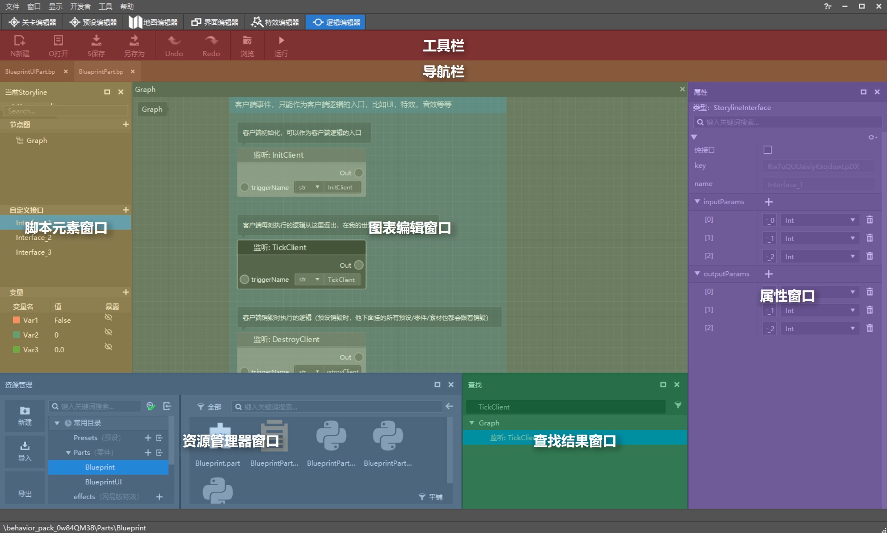
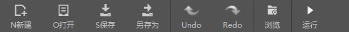
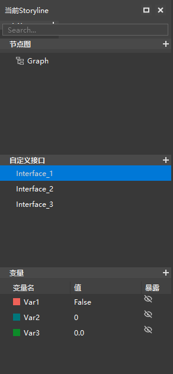
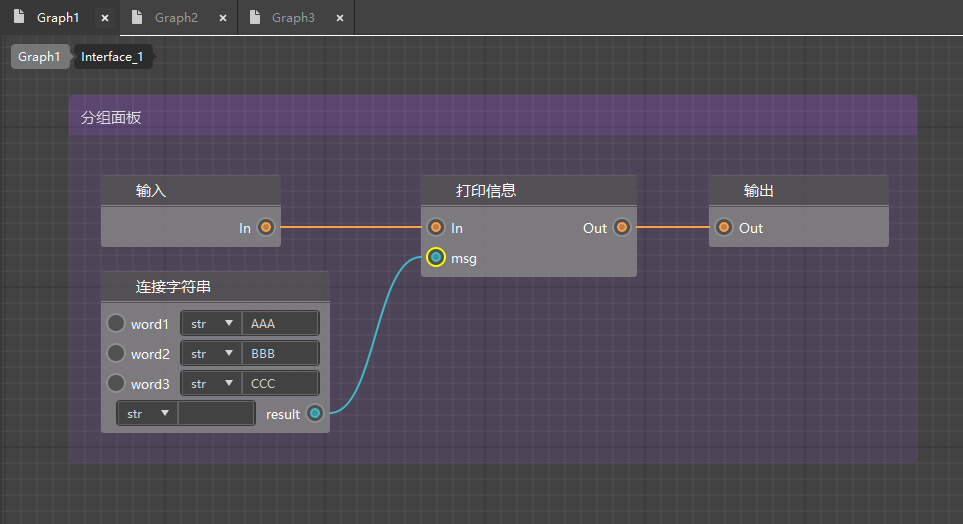
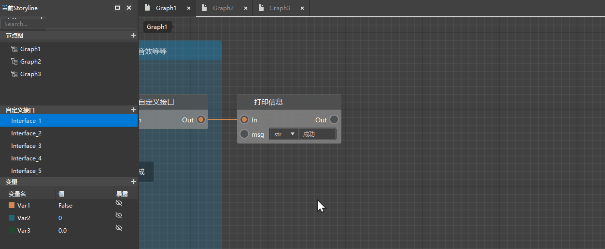
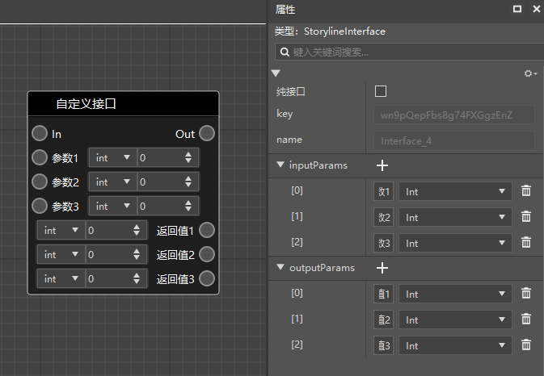
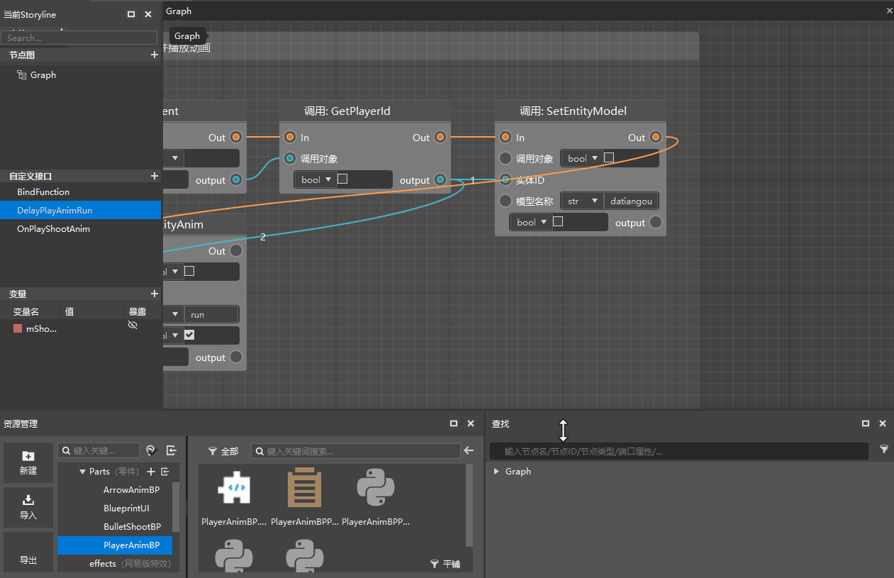

# New Logic Editor Interface 

Open the new Logic Editor interface, and you will find that the interface has changed a lot compared to the old version. The new interface mainly includes the following parts: 

 

## Toolbar 

 

The toolbar is fixed at the top of the Logic Editor and is used to access commonly used command buttons. Two of them need to be explained briefly: 

1) Browse: Relocate the location of the current blueprint part script in the resource manager; 

2) Run: Use the ModPC development kit to run the current work to test whether the blueprint logic is running normally. 

## Navigation bar 

 

The navigation bar is used to display different blueprint script files. When you open different blueprint script files at the same time, they will be displayed here in the form of tabs. Click to quickly switch between different blueprint scripts. 

## Script Element Window 

 

The Script Element Window is docked on the far left of the screen by default. It is used to display or create custom element contents such as graphs, custom interfaces, and variables in the blueprint, so that users can more conveniently view existing elements in the blueprint or create new elements. The Script Element Window mainly includes three areas: node graph, custom interface, and variable. Users can click the "+" button in the upper right corner of each module to add corresponding elements, or right-click existing elements to rename, delete, and other operations. Double-click the node graph or custom interface to open the corresponding graph/sub-graph for internal logic editing. 

## Graph Editing Window 

 

The graph editing window is the core window of the new version of the logic editor. You can create nodes such as events and interfaces here, and connect them with execution or data leads to write the script logic of the parts. 

If you create a custom interface in the blueprint script, you will need an interface graph to edit the internal logic of this custom interface. Double-click the custom interface in the script element window to open its interface diagram (usually contains an input interface and an output interface). At this time, the breadcrumb navigation will be displayed in the upper left corner of the diagram editing area (the example in this screenshot shows that the interface diagram of Interface_1 is opened in the Graph1 diagram. Click Graph1 on the breadcrumb navigation to return to the Graph1 diagram). 

 

## Property window 

 

The property window is mainly used to edit the properties of the selected item. Select an object in the script element window or the graph editing window, and its various property information will be displayed in the property window on the right, and the developer can modify it as needed. 

_Note: Some custom node properties may not be fully obtained by directly selecting them in the graph. Please select them in the script element window on the left, and then modify them in the property window. _ 

## Search result window 

 

The search result window allows developers to enter the node name, pin name or keyword of the query, display the search results that meet the conditions, and double-click the result to go to the corresponding node. 

If you close the search result window, you can call it up again with the shortcut key ctrl+F. 

