# Script elements 

In the new version of the logic editor, our "script elements" usually refer to the following categories: 

| Script elements | Description | 
| :------- | ------------------------------------------------------------ | 
| Event | The event node is the logical starting point of the node network. When an event is triggered, all node logic connected to the event node will be executed.  The current version of the logic editor only supports the creation of editor-provided events through the right-click menu, and does not support developer-defined events for the time being | 
| Interface | An interface is a type of node graph, and its internal logic can be called from other blueprint graphs | 
| Variable | Used to store values or object properties. You can call the variable value by getting the variable node, or set a new value for the variable by setting the variable node | 

## Event 

The event is the starting point of the module logic code, so any blueprint execution logic must start with an event listening node, so that the entire execution line connected in series can be executed. 

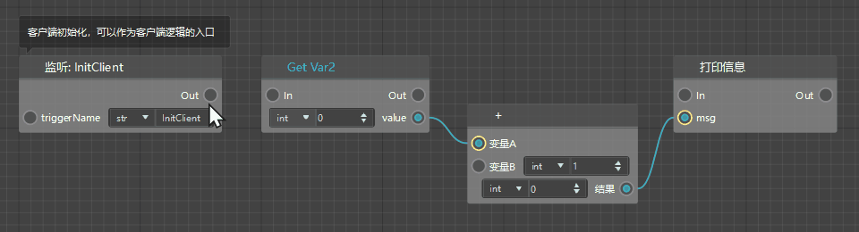 

### Default start event 

Take the blueprint part as an example. When it is newly created, it will come with 6 default start event listening nodes, which are: 

**1. Client default start event** 

| Event name | Event English name | Description | 
| :----------- | ------------- | ------------------------------------------------------------ | 
| Client initialization | InitClient | Client initialization, can be used as the entry point for client logic | 
| Client every tick | TickClient | The logic executed by the client every tick is connected from here. In my world, 1 second consists of 30 ticks | 
| Client destruction | DestroyClient | The logic executed when the client is destroyed (when the preset is destroyed, all presets/parts/materials attached to it will also be destroyed) | 

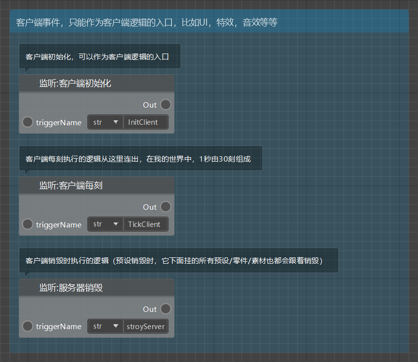 

**2. Server default start event** 

| Event name | Event English name | Description | 
| :----------- | ------------- | ------------------------------------------------------------ | 
| Server initialization | InitServer | Server initialization, can be used as the entry point for client logic | 
| Server tick | TickServer | The logic executed by the server every tick is connected from here. In my world, 1 second consists of 30 ticks | 
| Server destruction | DestroyServer | The logic executed when the server is destroyed (when the preset is destroyed, all presets/parts/materials attached to it will also be destroyed) | 

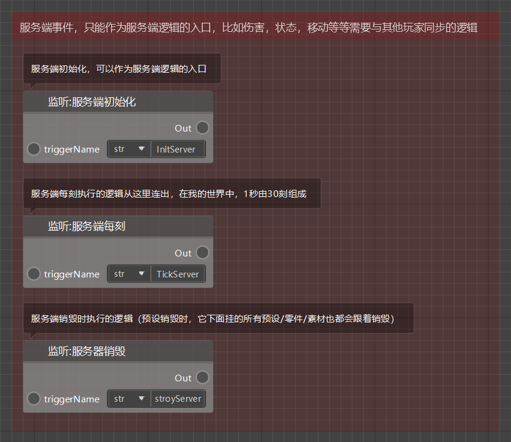 

### Create event listener nodes 

In addition to the default initial event listener nodes generated when creating a blueprint, the logic editor also has a rich event library for developers to choose from. You can right-click in a blank area of the chart to open the node list and directly select the time listener node you want to add in the list; if you know the Chinese/English name of the event, you can also find the event listener node by entering keywords. 

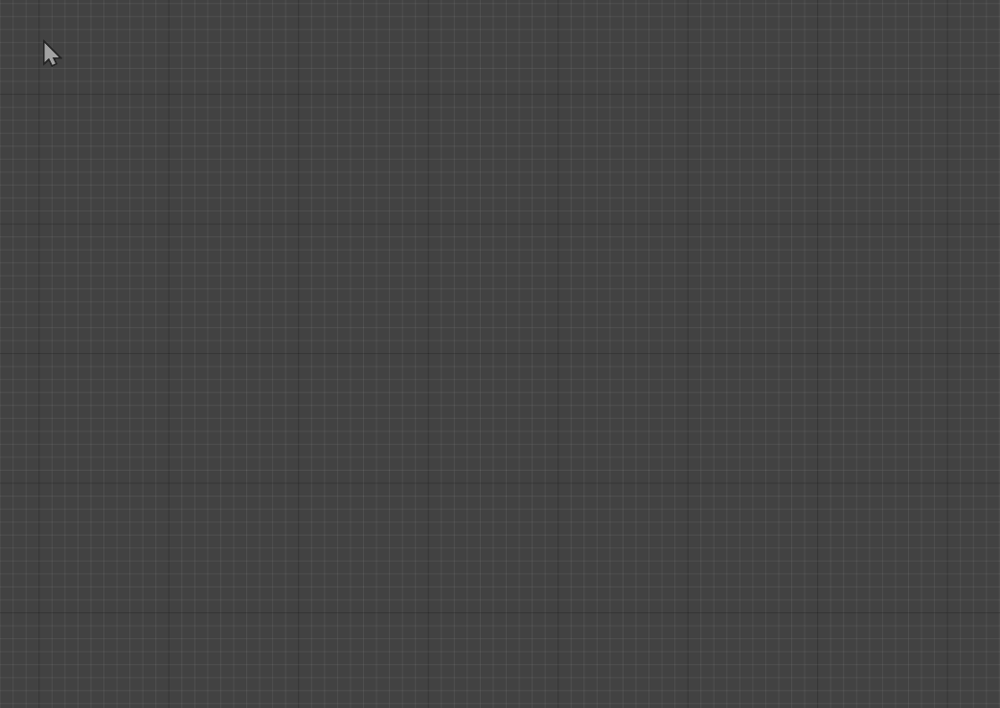 

## Interfaces 

The new version of the logic editor provides developers with a wealth of interfaces to realize your creativity. These interfaces include all interfaces in the existing Chinese version module SDK, as well as some Python built-in interfaces and logic editor built-in interfaces. 

### Built-in interfaces 

Built-in interfaces refer to the built-in game interfaces, Python interfaces, and some basic interfaces for auxiliary logic completion that come with the editor. As described in the "Events" section, you can create a new interface listener/call node by right-clicking in a blank area of the graph; in addition, you can also release the left mouse button after dragging out an execution or data connection, and select/search the interface listener/call node you need from the node menu that pops up automatically. 

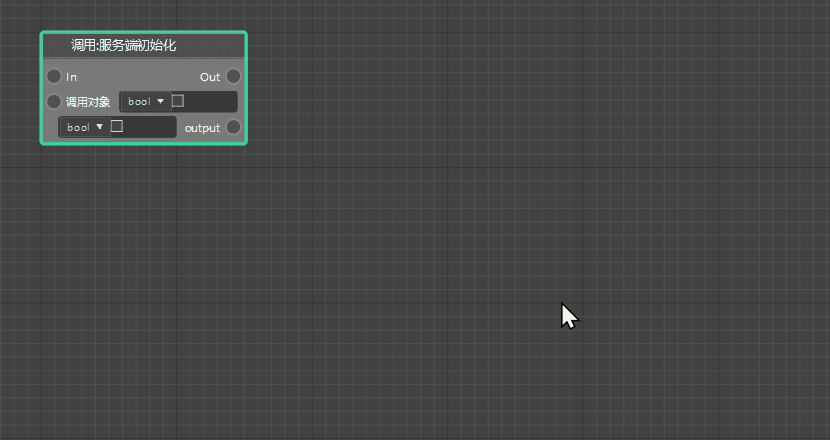 

### Custom Interface 

In addition to these editor built-in interfaces in the right-click menu, the new version of the logic editor also supports developers to create custom interfaces. Find the [Interface] tab in the script element window on the left, click the "+" sign in its upper right corner, and you can create a new custom interface. 

> You can rename the custom interface when creating it, and only English, numbers, and underscores are supported (the interface name can only start with an English letter). 

Like other interfaces, the custom interface has a call node, which will execute the blueprint logic in the interface when triggered. 

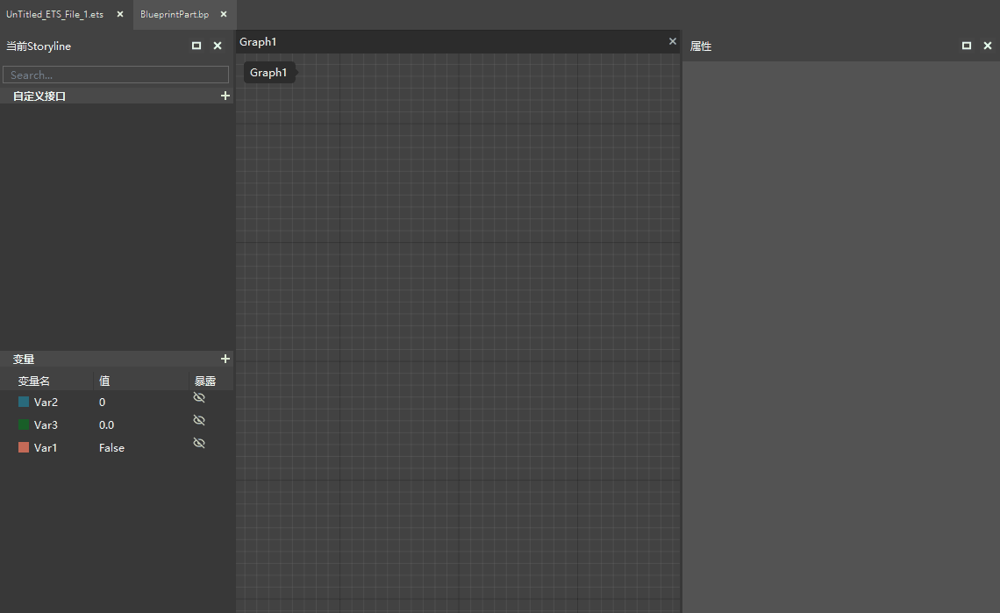 

After selecting a custom interface in the script element window on the left, you can modify the properties of the custom interface in the property window on the right: 

- Pure interface: optional. After checking, the custom interface will be converted to a pure interface (no execution input and output pins) 

- Parameters (inputParams): Click "+" to add parameters to the custom interface, support editing parameter names and parameter data types; click the trash can button to clear the added parameters 

- Return value (outputParams): Click "+" to add return values to the custom interface, support editing return value names and return value data types; click the trash can button to clear the added return values 

After the custom interface is created, double-click the custom interface in the script element window on the left (or directly double-click the call node of the interface in the diagram) to open the **Interface Diagram** of the custom interface. The interface diagram is used to write the internal logic of the interface. Each interface graph comes with an input and an output node. The output node is the logical starting point of the interface and is used to pass parameters into the internal logic of the interface. The output node is the end point of the interface logic and is used to pass the calculated data out of the interface in the form of return values. 

Just like using nodes to write logic in ordinary blueprint graphs, you can use various nodes in the interface graph and use execution lines to form a complete logic network. However, the internal logic of the entire interface must be able to smoothly go from the input node through other internal nodes to the output node through execution lines. 

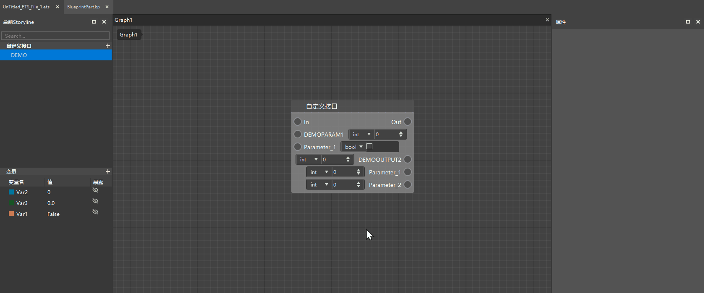 

## Variables 

**Variables** are **blueprint part variables**, which are used to store values or object properties. Variables can be created through the "+" button in the upper right corner of the [Blueprint Part Variables] tab in the script element window on the left. Variables can be renamed after creation. 

> 【**Note**】 
> 1. All changes made to blueprint part variables must be saved before the blueprint takes effect. 
> 2. The name of a blueprint part variable can only contain **English**, **numbers**, **underscore**, cannot exceed 20 characters, **and can only start with 'v_'**. 

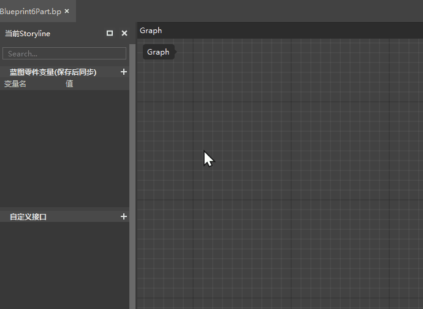 

After the blueprint part variable is created, **if the developer presses the [Save] button**, the variable will be synchronously displayed in the property panel of the **.part** file of the blueprint part, so that the developer can directly modify the default value of the blueprint part variable in other editors without opening the blueprint file. **Note that the blueprint must be closed before the value of the blueprint part variable can be modified in other editors, otherwise a conflict error will occur. ** 

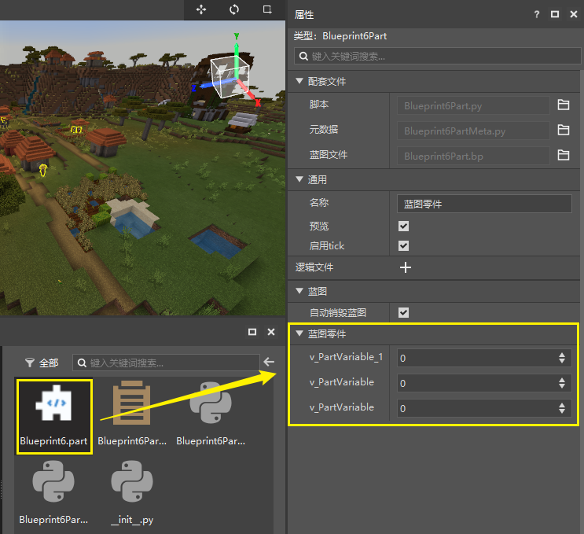 

> 【**Note**】 
>In addition to the [Blueprint Part Variable] tab, the early blueprint also has a [Variable] tab, which will be gradually eliminated in subsequent versions. 
>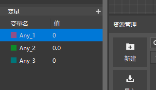 

### Variable properties 

Click to select the variable in the script element window on the left, and you can browse all the properties of the variable in the property window on the right, and you can modify some of them. Mainly include: 

- **Variable name**: string, support English, numbers, and underscores. The variable name does not support direct modification in the property panel on the right. You can select the variable to be modified in the [Blueprint Part Variable] window on the left, right-click and select [Rename] or directly press F2 to modify the variable name. 

- **Variable display text**: that is, the name displayed by the variable in the blueprint part .part file property panel, which can support Chinese, English, numbers, and symbols. Note that the modification of the display text will take effect after saving! 

- **Variable Group**: Defines the group in which the variable is located in the property panel of the blueprint part .part file. The default group name is [Blueprint Part], which can be modified by the developer at will. Note that all changes need to be saved to take effect! 
If you change to a group name that does not exist in the current property window, a group with the same name will be created in the property window and the variable will be placed in it; 
If you change to a group name that already exists in the current property window, the variable will be placed in the group directly. 

- **Variable Type**: You can select the data type of the variable through the drop-down box. Variable data types mainly include: 

1) Boolean value (false: 0, true: 1) 

2) Floating point type (signed: 1.234, -3.14) 

3) Integer type (signed: 1, 2, 3, 0, -1, -2, -3) 

4) String (a string of characters consisting of numbers, letters, and underscores: "abc", "123", "abc_123") 

- **Default value**: Edit the default value of the variable 

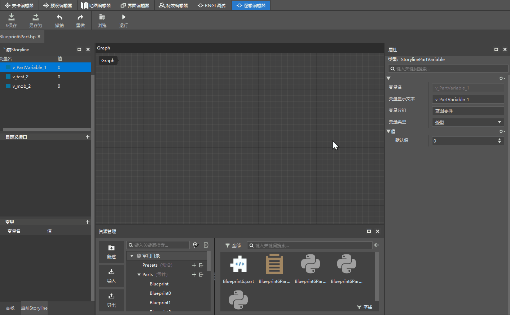 

### Get variable 

There are two ways to get the value stored in a variable in the blueprint: 

1. Drag out the right-click node menu directly, and enter the variable name keyword of the variable to search for its [Get] node (you can also find it in the [Part Variable] subdirectory in the right-click menu; 
> 
2. Drag the variable from the script element window on the left to the graph, release it and select Get Node from the drop-down list that pops up. 

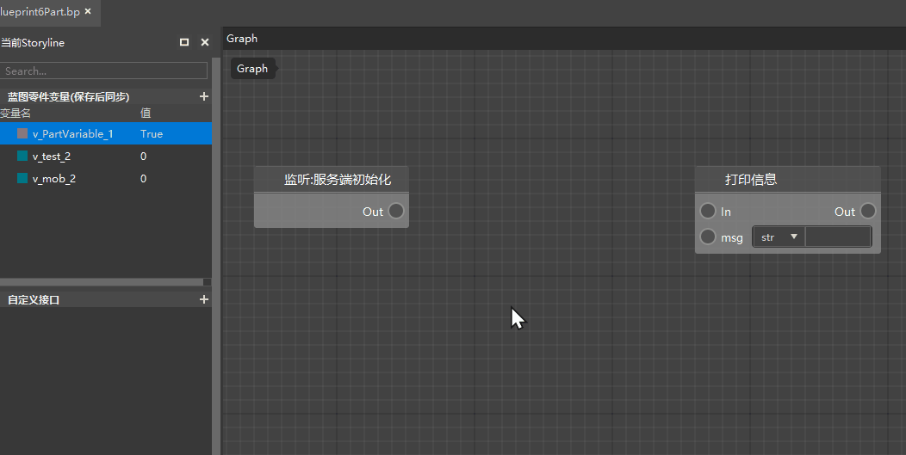 

### Set variable value 

If you want to set a new value for an existing variable, there are two ways to do it: 

1. Search for the variable name directly in the right-click, create a [Set] node for the variable, and then pass a new value to this setting node; 
2. Drag the variable from the script element window on the left to the graph, release it, select the setting node from the pop-up drop-down list, and then pass a new value to this setting node. 

There are also two ways to pass a new value to a variable: 

1. Connect to the parameter pin of the setting node through a data line 
2. Enter directly in the parameter input box of the setting node 

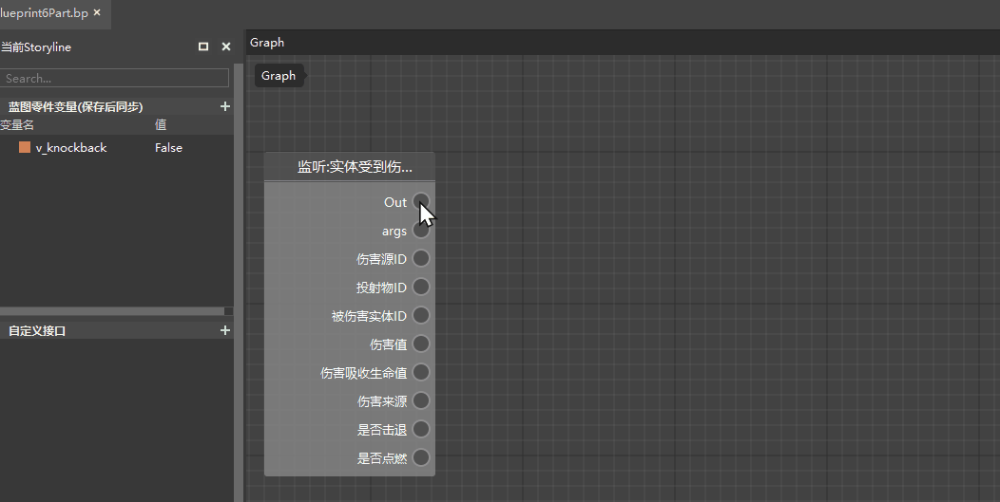 
