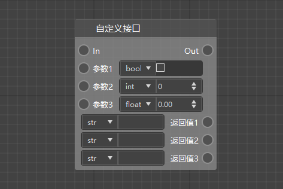
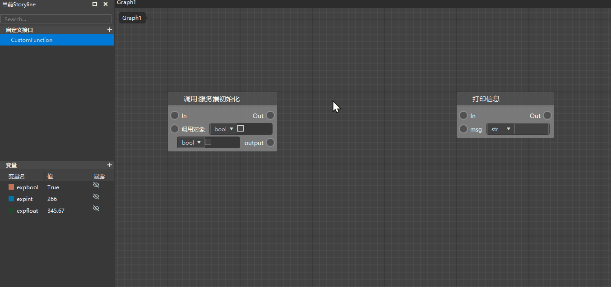
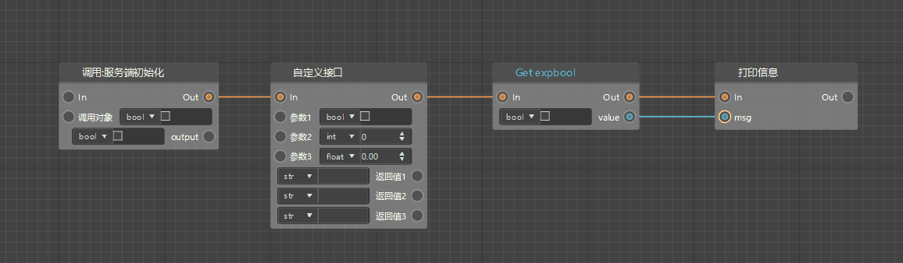
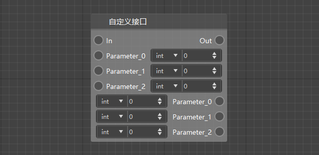
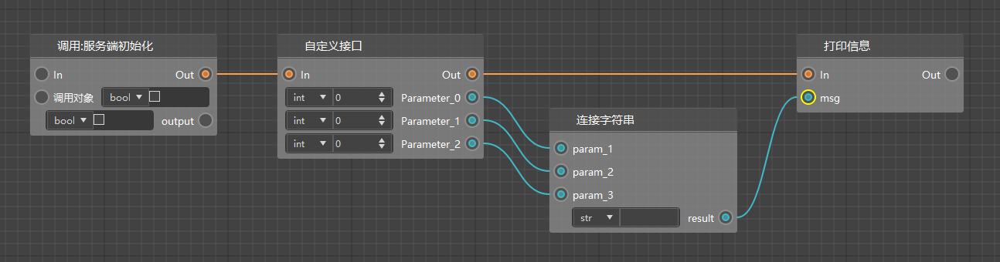
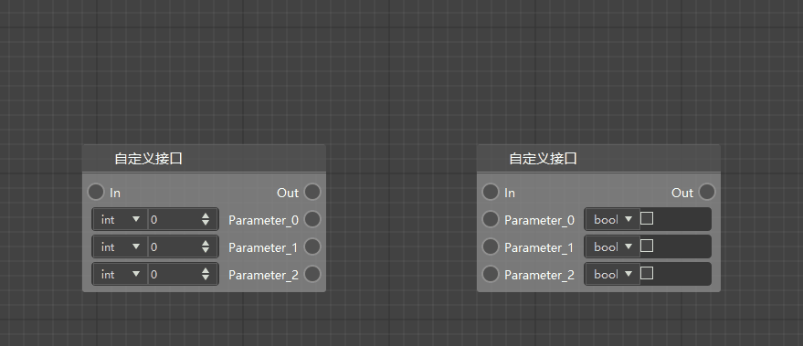
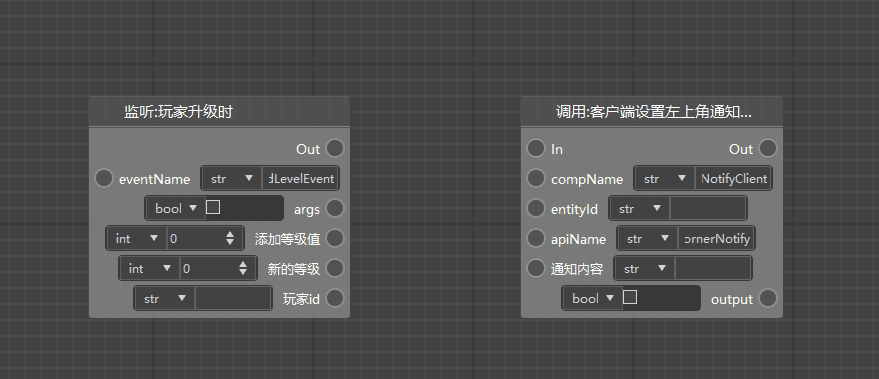
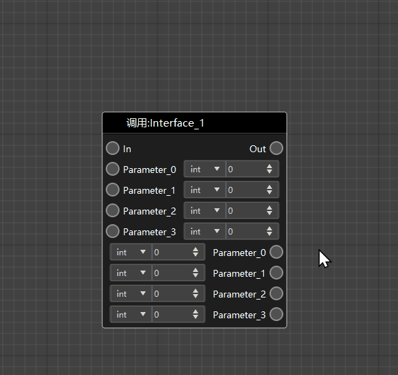
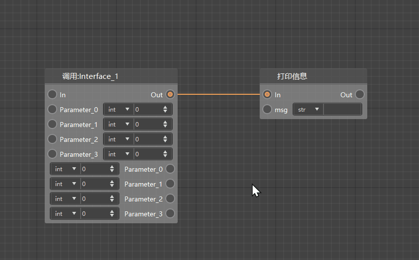

# Node connection 

A node is one of the basic components of a blueprint graph. By connecting the nodes of the blueprint to form a complete logic network, we can make the logic of these nodes execute in sequence/conditions, so as to write logic that meets the needs of game design. Each script element has one or more corresponding nodes. Let's take a brief look at how to use these nodes. 

> ​ For more information about script elements, please [click here to view](./40-script-element.md) . 

## Node components 

A common node usually includes the following parts: 

1. Node name: used to distinguish between nodes 
2. Execution pin: includes input execution pin and output execution pin, which are described in detail below 
3. Data pin: includes parameter input pin and return value output pin, which are described in detail below 

> There are many types of nodes, and different functions determine different node styles. Some nodes do not contain all of the above three components, such as variable setting nodes without return values, pure interfaces without execution pins, etc. 

 

## Create nodes 

Although there are many types of nodes, they can basically be created in the following two ways: 

1. Right-click on a blank area of ​​the chart, a node menu will pop up, select the node you need from it, or directly enter the node name keyword search 

2. Press and hold the left button to drag out from the pin of other nodes, release the left button and select or search for the node you need from the pop-up node menu 

> ​ For script elements such as custom interfaces and variables displayed in the left window, you can directly drag them from the left window to the chart. After releasing the mouse, the related nodes can be generated 

 

## Node selection and movement 

1. Single node: A single node can be directly selected by clicking. The background color of the node will change after selection. Press and hold the left mouse button to drag and change the position of the node in the chart. 

 

2. Multiple nodes: You can select multiple nodes by dragging the mouse in the chart or by holding down ctrl and clicking continuously. After selecting, hold down the left mouse button and drag to change the position of all selected nodes at the same time. 

 

## Node pins 

There are two types of pins in a node: execution pins and data pins. 

 

-- to do Image Replacement-Custom Interface 

### 1. Execution pins 

Execution pins are used to control the execution order of logic, and are divided into input execution pins and output execution pins. 

- The input execution pin is in the upper left corner of the node. When the input execution pin is connected to other nodes through a yellow execution line, it will be activated and the logic of the node will begin to execute. 

- The output execution pin is in the upper right corner of the node. When the node logic is executed, the output execution pin will be activated. When this pin is connected to other nodes through execution lines, the subsequent process will continue to execute. 

A node does not necessarily have a pair of input execution pins and output execution pins. For example: a pure interface call node has neither input execution pins nor output execution pins; a conditional node has 1 input execution pin and 2 output execution pins; a sequential traversal node has 2 input execution pins and 2 output execution pins. Which execution pin is executed is determined by the connection and the specific node logic. 

> Multiple execution leads can be connected to the same execution pin. Similarly, the same output execution pin can also send multiple execution leads. 
> 
> 

### 2. Data pins 

The data pins of the node are mainly used for data input and output, and are divided into parameter input pins and return value output pins. 

- The parameter input pin is on the left side of the node and needs to be connected to the green data line. By connecting the data line to the parameter input pin, data can be passed into the node and assigned to this parameter. 
- The return value output pin is on the right side of the node and needs to be connected to the green data line. By connecting the data line to the return value output pin, data can be passed from the node in the form of a return value. 

There is no limit to the number of data pins for a node, and there can be no parameter input pin or return value output pin (that is, the node has no parameters or no return value). 

> The same return value output pin can send multiple data lines to transmit the same data to different nodes, but the same parameter input node can only have one data line to pass data in, otherwise it will cause confusion. 

It should be noted that the data pin corresponds one-to-one to the data type of the parameter or return value of the node, so two data pins with different (or incompatible) data types cannot be directly transferred through data lines. For example, the return value type of node A is Int and the parameter type of node B is Bool, then the two data pins cannot be directly connected; but if the parameter type of node B is Any, that is, there is no restriction on the type of incoming data, then the two can be directly connected. 

## Node connection

There are two types of connections for nodes: execution connection and data connection. 

 

-- to do Image Replacement-Custom Interface 

### 1. Execution Connection 

The execution connection is yellow and is used to connect the execution pins of each node to form a complete node network, so as to correctly execute the logic of the entire blueprint. 

> Note: In non-special circumstances, do not use the execution connection to connect the input execution pin and the output execution pin of the same node. 

### 2. Data Connection 

The data connection is green and is used to connect the data pins of each node to ensure the correct transmission of data between each node. 

> Note: In non-special circumstances, do not use the data connection to connect the parameter input pin and the return value output pin of the same node. 

## Some rules for node connection 

Although the connection of blueprint nodes is relatively free, there are still some rules that need to be followed: 

### 1. Data pin data type restrictions 

Data pins correspond to the data types of the parameters or return values of the node one by one, so two data pins with different (or incompatible) data types cannot be directly transferred through data lines. For example, if the return value type of node A is Int and the parameter type of node B is Bool, then these two data pins cannot be directly connected; but if the parameter type of node B is Any, that is, there is no restriction on the type of incoming data, then the two can be directly connected. 

 

### 2. Two nodes with conflicting support ends cannot be directly connected 

Depending on the function, the support end of each node is different. It is divided into the following three categories: 

1) Dual-end support: This node can be used for both server-side logic and client-side logic. 

2) Client-side support only: This node can only be used for client logic and cannot be connected to nodes that are only supported by the server.

3) Server-side support only: This node can only be used for server-side logic and cannot be connected to nodes that are only supported by the client. 

For example, "Listen: When the player upgrades" is a server-side support node, and "Call: Client sets the notification content in the upper left corner" is a client-side support node. The two cannot be directly connected. 

 

### 3. Pins on the same side cannot be directly connected 

The input pin of a node cannot be connected to the input pin of another node (whether it is an execution or data pin); 
The output pin of a node cannot be connected to the output pin of another node (whether it is an execution or data pin). 

 

### 4. The data input pin cannot have multiple data lines passed in 

The execution input pin of a node can have multiple execution lines passed in, but the data pin cannot have multiple data lines passed in. 

 
