# Event monitoring and broadcasting 

## Event introduction and engine events 

Events are the core component of the module SDK architecture and are also a common programming technology. The event system of the module SDK can refer to this document: [Event Introduction] (../../../20-Gameplay Development/13-Module SDK Programming/2-Python Script Development/9-Event Introduction.md). 

During the Chinese version of Minecraft, the module SDK will broadcast some events at various times, such as when the game starts, when the player joins, etc. We listen to these events, and then execute the corresponding logic when these events are triggered, which can affect the game. 

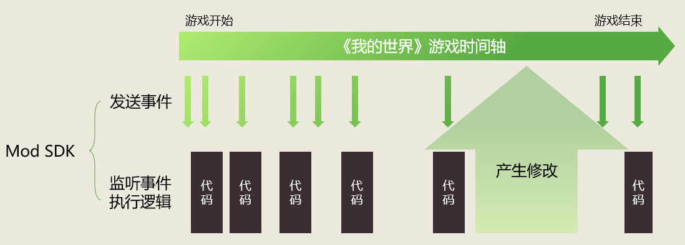 

There are a lot of events built into Minecraft in the mod SDK. They are called engine events. You can refer to this document in the technical manual: <a href="../../../../mcdocs/1-ModAPI/Event/World.html" rel="noopenner"> World </a>. 

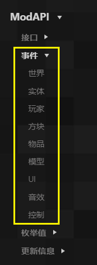 

If you use Python programming, you need to manually listen to engine events, but this is not necessary for blueprints. 

When you want to listen to an engine event, you only need to add a corresponding node, such as if you want to execute some logic when a player sends a chat message. 

As shown in the figure below (you can find it in the new command template), when the player sends a chat message, it will go to this node and execute the following print information node to print out the message content. 

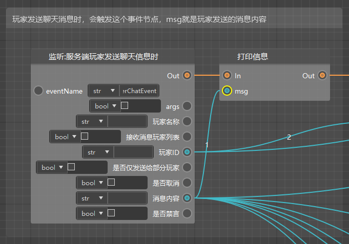 

## Module SDK Events and Part Events 

Part events are event systems with preset architectures, which have made some improvements based on module SDK events. You can refer to this document: [Part Events](../../../20-Gameplay Development/14-Preset Gameplay Programming/2-In-depth Understanding of Parts/0-Part Development.md#Part Events). 

Let's take <a href="../../../../mcdocs/1-ModAPI/事件/对象.html#actorhurtserverevent" rel="noopenner"> Server-side creature injury event </a> as an example. Its documentation in the technical manual is as follows: 

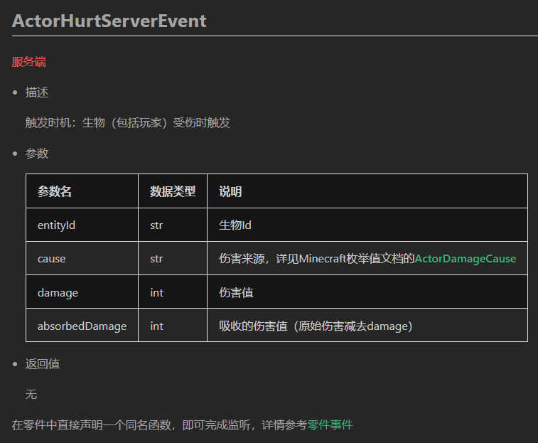 

When you use this node in the logic editor, you will find two versions: 

- Listening to events...: This is the event node of the module SDK 

- Listening to part events...: This is the node of part events 

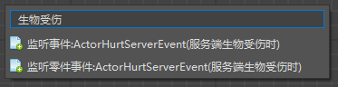 

There is no difference between these two nodes at present. You can only select them and view them in the property panel.

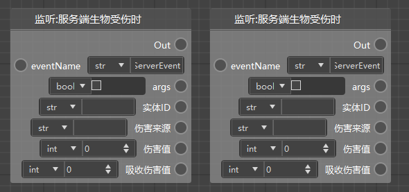 

As shown in the figure below, the type of module SDK events (nodes starting with "Listen for events:") is SdkEventNode, and the type of part events (nodes starting with "Listen for part events:") is PartEventNode. 

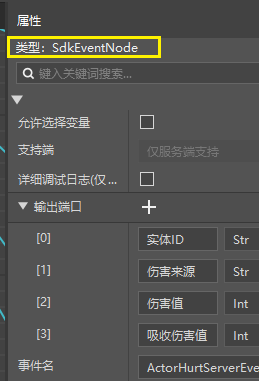 

For creature injuries, if you want any creature in the current scene to execute some logic starting from the listener node when it is injured, then you should use the module SDK event (node starting with "Listen for events:"). Of course, you can later determine who triggered the event based on the source of the damage and the entity ID. 

Part events are only used in preset architectures. If you use an entity preset/player preset and attach your blueprint parts to this preset, then if you use part events, only the creatures (players) that are actually injured/causing damage will listen to this event and execute subsequent logic. In some cases, you can skip the step of determining the ID. That is, if you want only the party to whom the part is attached to trigger this event, it is recommended to use part events. 

Using part events usually results in better performance, especially if you attach the part to a preset that generates a large number of instances, such as overwriting the original zombie preset.

## Listening and broadcasting custom events 

In addition to the built-in engine events, you can also use this event system yourself. The main purpose of the event system is to achieve logical decoupling. 

Compared with the old version of the logic editor, the new version of the logic editor based on the preset architecture often has more bp files than the old version of the ets files. If you have good coding habits, your logic should be properly decoupled and written into different parts and attached to the appropriate presets. 

For example, the UI related to the HUD is written into the interface blueprint part and attached to the interface preset; the logic related to the player is written into another part and attached to the player preset. 

Under this premise, you need to use the event system to communicate (communicate) between different parts (instances). 

Let's take the parkour template as an example. 

As shown in the figure below, this is the node for event monitoring on the server side. Node 4 is the "Monitor preset system events" node. Generally, this node can be used for monitoring. This event has 3 parameters to be filled in 

- Event name: It is recommended to give it a clear name, which supports Chinese 
- Target object: When this event is triggered, who (object instance) do you want to react? Here, we want ourselves to react, so we use node 2 to get ourselves and pass the value in 
- Callback function: When this event is triggered, which function do you want to execute? Here, we want to execute our own Place function (custom interface), so we use node 3 to get our own Place interface and pass the value in 

The final effect we hope to achieve is to place a piece of redstone at the location of the part when receiving the "place redstone" message (precise meaning, haha). This is a server-side operation, so we need to listen when the server is initialized, that is, listen when node 1 is executed. 

Before the monitoring is completed, no message will be received, so generally the monitoring is at the beginning. If you need to execute the server logic, listen on the server, otherwise on the client. 

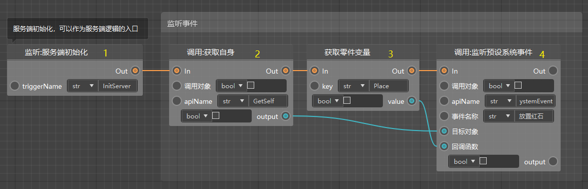 

In addition to monitoring, we also need to send events at the right time. To send events, use the following node. Pay attention to two parameters: 

- Event name: the name we set 
- Event data: If you do not need to pass data, leave this parameter blank. If you need to pass data, you generally need to pass a dictionary (since our parameter type does not support dictionary dict, you can choose any instead). Then get the passed parameters by getting the attributes in the function executed by the event receiver. 

After calling the send event, if our parts can receive the event, we can execute the corresponding logic smoothly. 

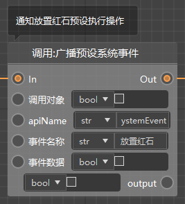 

The sending event that needs to pass parameters and the function corresponding to the execution of the receiving event are shown in the figure below (the notification used here is similar to broadcasting, refer to [Network Communication (Server Client)](./48-Network Communication (Server Client).md)). 

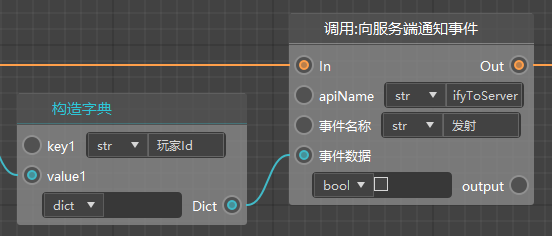 

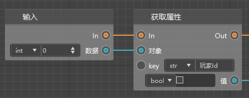 

## Listening and broadcasting part events 

The preset system events in the previous section are more applicable when no specific parts are involved. If you want to only listen to events from specific parts (instances), or only notify certain specific parts (instances), you need to use the "Listen to Part Events" interface. 

This interface has 4 parameters to pay attention to: 

- Part ID, that is, the message from which part is listened. Only the message sent by this part will be listened. This is the main difference from the "Preset System Events" in the previous section. 

- Event name, target, function, the same meaning as in the previous section. 

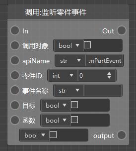