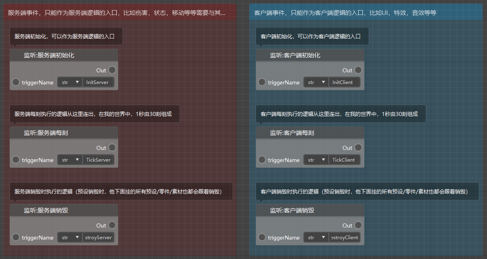
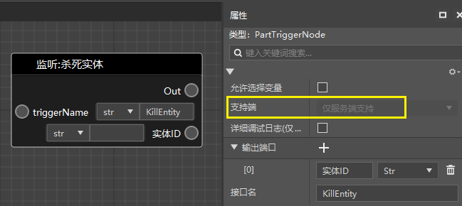
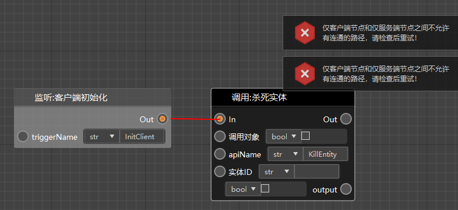
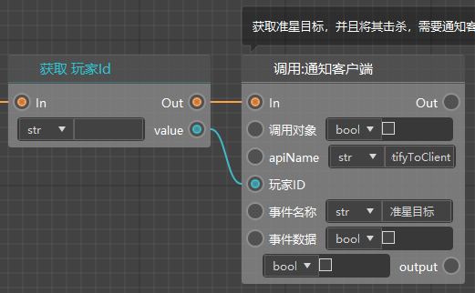
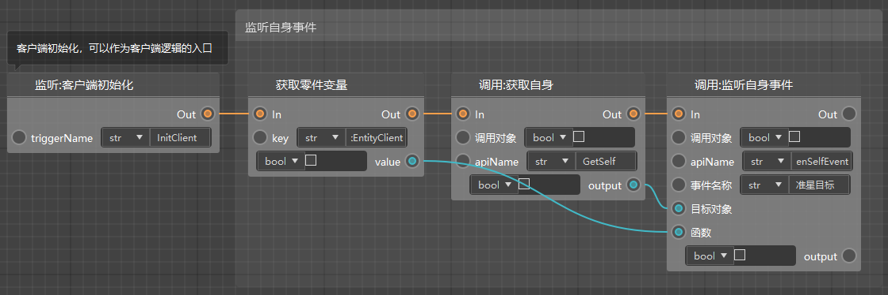
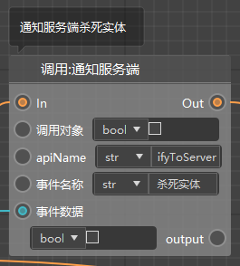
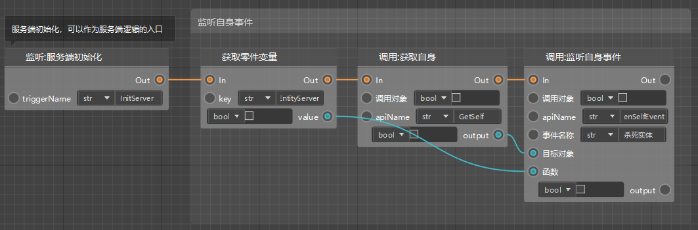
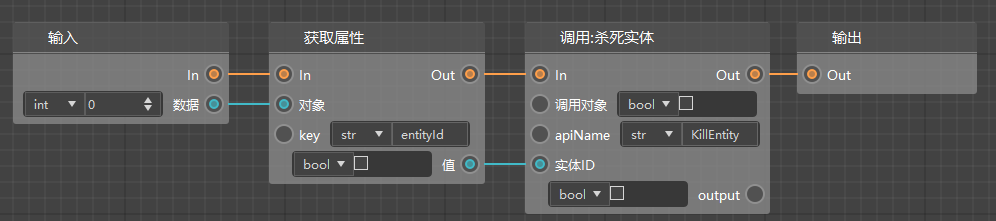
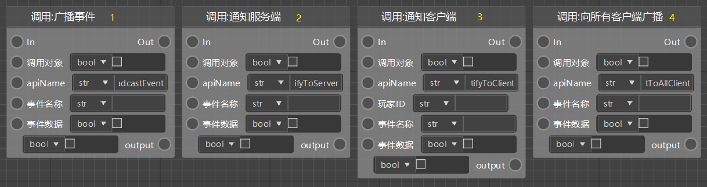
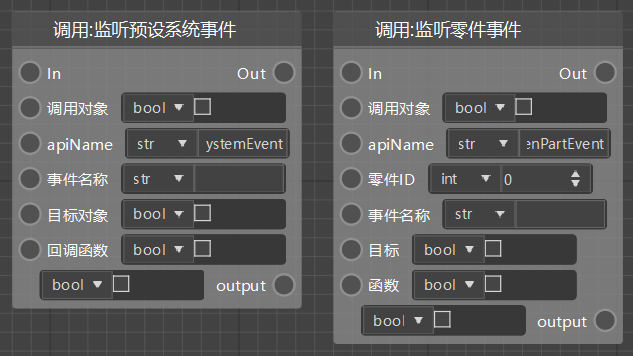

# Network communication (server-client) 

## What is server and client? 

When you run Minecraft, part of the logic runs on the server, and the other part runs on the client, with a strict boundary between the two. 

If data synchronization logic is involved, it generally needs to be run on the server, so that when you play multiplayer games, each player can see the behavior of other players. 

For example, the movement/position, attack, health calculation of entities (or) creatures, generation of entities/blocks, etc. 

If data synchronization is not required, or it is just the logic of the presentation layer, it can generally be run on the client. 

For example, using custom models, animations, special effects, sound effects, etc., as well as interfaces, buttons and other interactive content. 

The client runs locally, that is, the computer or mobile phone you are currently using to play Minecraft, and the server logic depends on the situation. If you are playing a single-player game, the server also runs on the local device. If you are playing an online game, the server logic of all players runs on the host's device. If you are playing a server (such as a rental service or an online game), the server logic runs on the server. 

Note that since the client and server are relatively separated, you cannot call the logic of the other end at any time! 

## Server node, client node 

All nodes are divided into 3 categories: 

- Server-only nodes, they can only run on the server 
- Client-only nodes, they can only run on the client 
- Dual-end nodes, can run on both the server and the client, and will change logic according to the current execution environment 

The following figure shows the nodes written to the blueprint by default when creating a blueprint part. You can see that it contains 3 server nodes and 3 client nodes. You need to judge from which end node you need to connect the subsequent logic according to the above standards.

 

As shown below, you can click on a node and check which end it supports in its property panel. 

All custom interfaces you create are supported by both ends (this property cannot be modified, even if you do not support both ends). 

 

As shown below, we have currently added the following rule to the node connection rules: In an interconnected graph, client-only and server-only logic cannot exist at the same time. 

 

## Network communication 

As mentioned in the previous section, we cannot directly call the other end from one end. If we need this kind of logic, we can implement it through event monitoring and network communication. 

Let's take the command system of the blueprint as an example. There is a requirement that when the player enters "@kill", we need to get the target pointed by the crosshair and then kill it (if it is an entity). If we break down the requirements, we will find that: 

- Judging the chat information is the server logic 
- Getting the target pointed by the crosshair is the client logic 
- Killing the entity is the server logic 

These three logics cannot be called directly, so we need to take the following approach. 

First, after determining that the message entered by the player is "@kill", send an event called "crosshair target" to the client (call the "notify client" interface). Note that because we only want the player who entered this chat message to get his crosshair target, we need to set the player id to that player here (in the previous logic, it is not shown here). 

 

Then when the client is initialized, listen to the "crosshair target" event, and when receiving the event, execute the custom "PickEntityClient" interface (as shown in the second node in the figure below). 

 

In the "PickEntityClient" interface, after we get the entity at the crosshairs, we send the data to the server through the "Notify Server" interface, and the event name is "Kill Entity". 

 

Similarly, we need to listen to the "Kill Entity" event when the server is initialized, and execute the custom interface "KillEntityServer" when the event is received. 

 

In this interface, we finally get the entity id data passed in and kill the entity with this id. 

 

## Summary of events and network communication 

Combined with [Event Monitoring and Broadcasting](./47-Event Monitoring and Broadcasting.md), we can summarize the usage of this type of node. 

If you need to notify other parts, or execute some logic yourself, and it is not convenient to call the interface directly, you need to use the following nodes: 

- Broadcast event: Applicable to the same end, such as server broadcast to server, client broadcast to client 
- Notify server: Applicable to the client, notify the server to execute certain logic 
- Notify client: Applicable to the server, notify a certain (player's) client to execute certain logic 
- Broadcast to all clients: Applicable to logic that needs to be executed by all (player's) clients 

 

Then the receiver of the event needs to listen when the server is initialized or the client is initialized (usually at this time, if necessary, it can be listened at any time). 

- Listen to preset system events: Common listening methods 
- Listen to part events: Only want to listen to events from a certain part 

 
