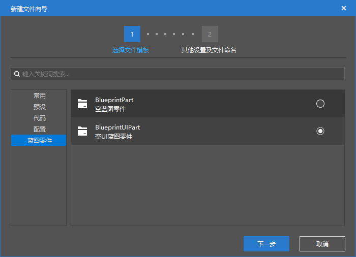
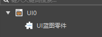
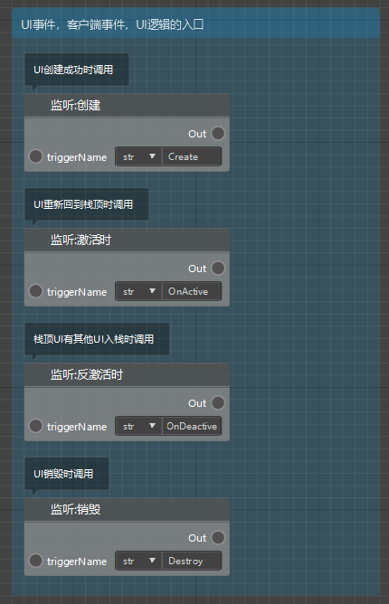
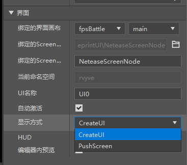
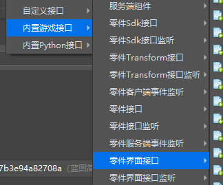
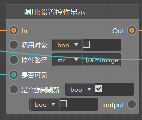
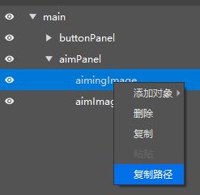

# Interface blueprint 

This part is difficult, and it is recommended to watch the following videos 

- [Change model and add interface](../30-New version sample tutorial (video)/07-Make simple shooting add-on package (video)/01.md) 

- [Switch sight](../30-New version sample tutorial (video)/07-Make simple shooting add-on package (video)/02.md) 

## Create blueprint and assemble presets 

The blueprint simple shooting template we provide has the use of interface blueprint, you can refer to its writing method to learn. 

The new version of the logic editor supports making interfaces. Before making them, you may need to understand [Interface presets](../../11-Assembly simple gameplay/10-Presets/5-Interface presets.md). 

After creating the UI preset, you can create a UI blueprint through the New File Wizard. 

 

Note that if you want the UI blueprint part to take effect, you must directly attach it to the corresponding UI blueprint, similar to the following figure. 

 

## Start Event 

Open the UI blueprint part. In addition to the 6 events that come with the blueprint part, you will find that it has 4 additional UI-related events, as shown in the figure below, which are 

- Create: When the UI is created successfully, the UI logic is usually initialized here 
- Activate, deactivate: When your UI is activated or deactivated 
- Destroy: When your UI is destroyed 

 

You can check your UI presets. If you choose CreateUI, then you mainly use the "Create" node mentioned above. Otherwise (choose PushScreen), you mainly use the "Activate" and "Deactivate" nodes.

 

## Calling the interface 

The interface-related interfaces are mainly distributed in the menu in the figure below. 

 

Let's take setting the control display as an example. The node below is the node we need to use 

- Control path: which control do you want to call 
- Visible: Do you want the control to be displayed or hidden 
- Force refresh: Whether to refresh the display status of this control immediately after calling the interface 

 

For the control path, we can get it in the interface editor, such as right-clicking to copy the path of the control below and pasting it into the node in the figure above.

