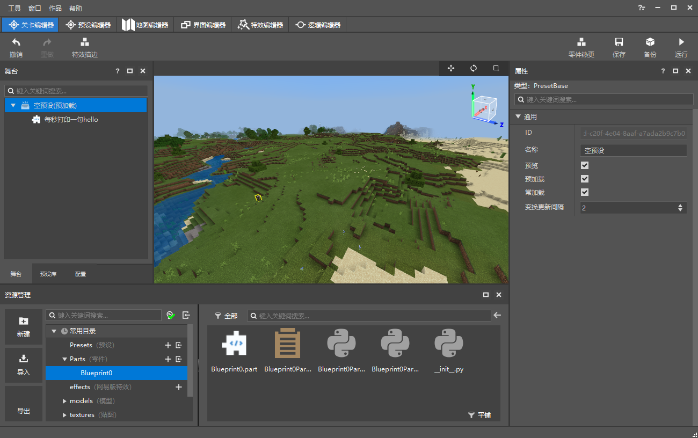
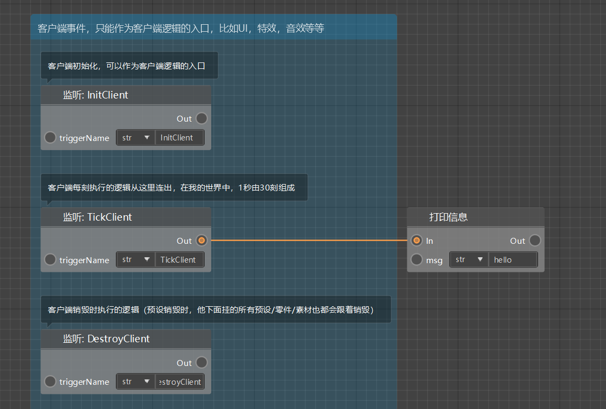
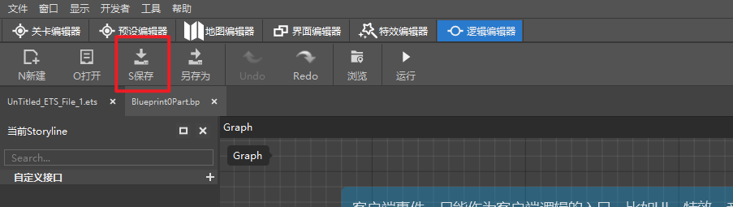
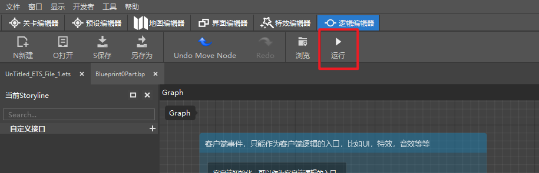
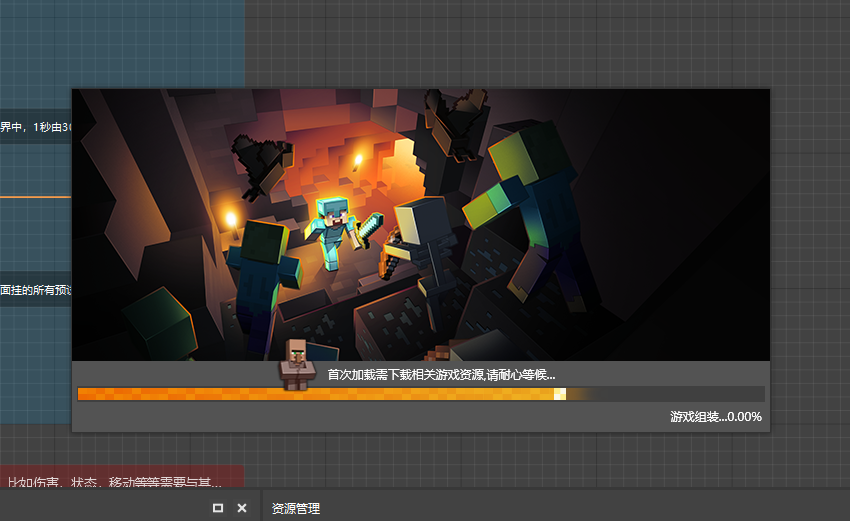
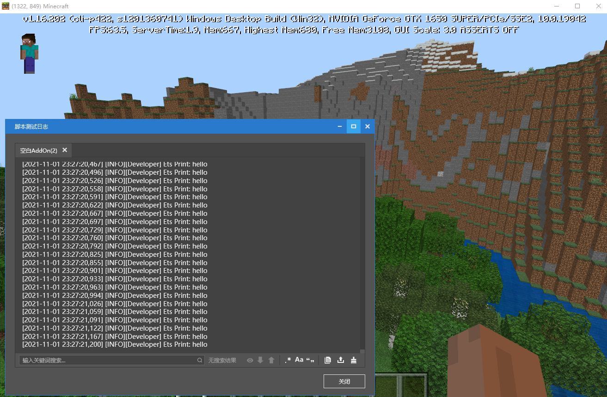

# Blueprint test 

Below we will demonstrate the test of the blueprint: 

Let's take a blueprint part hanging under the preloaded empty preset as an example. The logic of this blueprint is to print a sentence of hello in the log window every frame. 

 

 

After editing the logic of the blueprint in the .bp file, you first need to click the Save button to save the blueprint. 

 

After saving the blueprint, we click the Run button to test our blueprint logic in the development kit: 

 

When you first enter, you may need to wait for a long time to complete the loading. 

 

After entering the game, we open the log window and see that a hello sentence is printed in each frame, proving that the logic of the blueprint part has taken effect in the game. 

