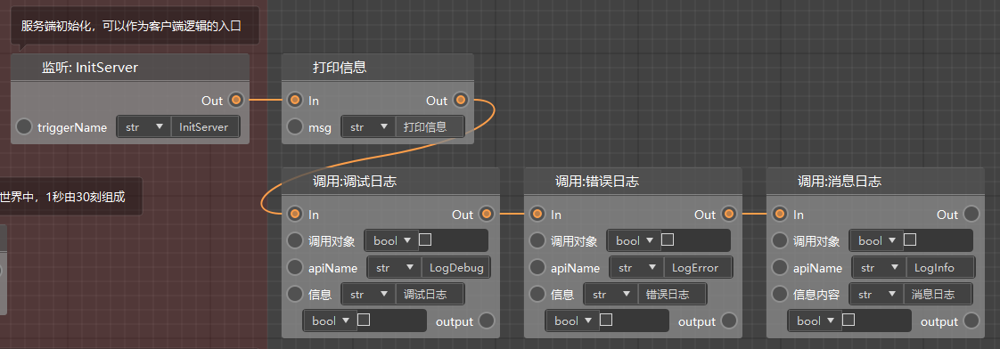
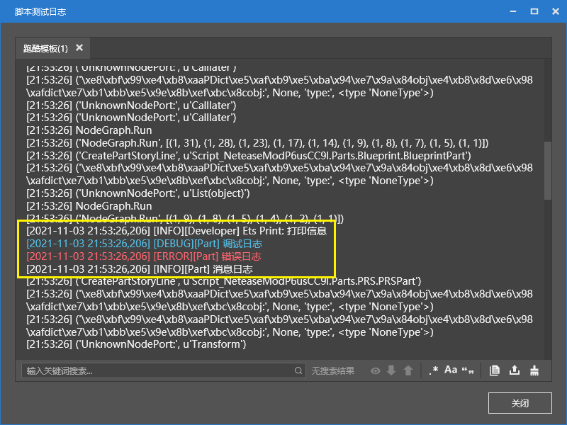
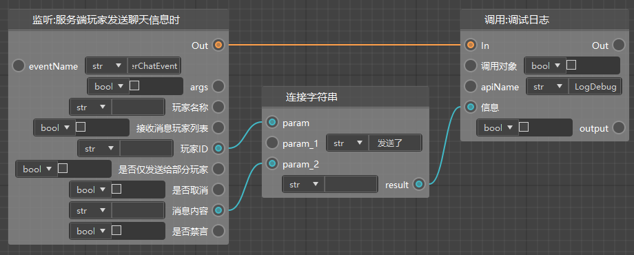
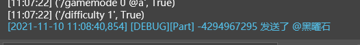
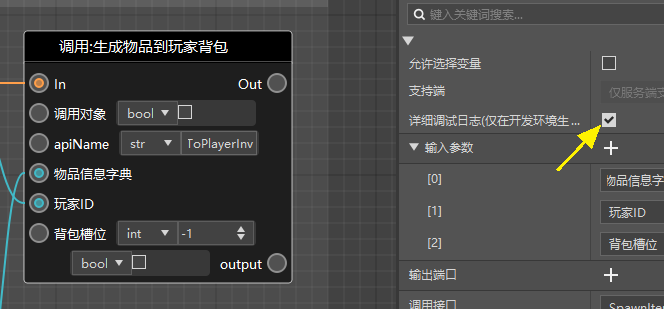
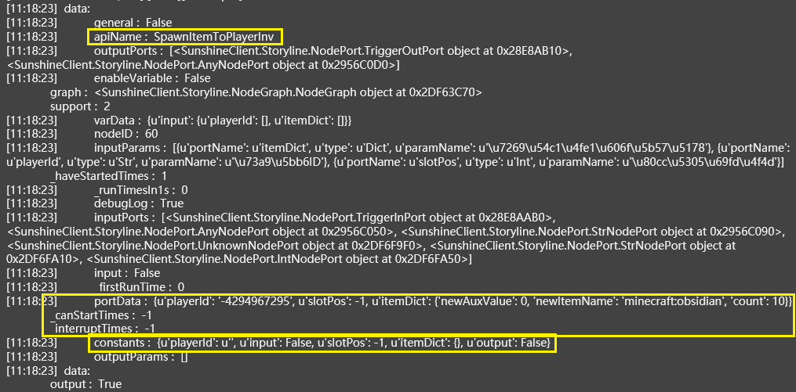

# Error resolution 

In general, due to the many connection restrictions we have made for blueprints, syntax errors rarely occur when using blueprints, but some logical errors may still occur. When errors (bugs) occur, you need to use some simple techniques to troubleshoot and solve these errors. 

Similar to the code programming of the module SDK, we do not provide the function of single-step debugging. You can only solve bugs by observing the log. 

## Print information 

Printing (print), in most cases, is your best friend. If there is any puzzling problem, you can print to see the current situation. 

Currently we support a simple printing: printing information, and three complex printing methods: debugging, error and message log. Connect these nodes as shown below, fill in the corresponding information, and then click Run. 

 

After running, you can see the following information in the script test log. Connect the values you think are problematic to the information of the print node to print them out. 

 

As shown below, we can print out the information sent by the player and the player ID at the same time. 

 

The following figure shows the print result after inputting obsidian. 

 

Most variables in Python can be printed, including numbers, dictionaries, and even parts and preset objects. You can directly print the return node of "Get Self" to try. 

## Detailed Debug Log 

Sometimes, if you are too lazy to print, or there is no special printing requirement, you can directly click on the node that you think has a problem and check the detailed debug log. If the node is run correctly, the detailed information of the node execution will be displayed in the log. 

 

The following figure is the detailed information of this node. We only need to pay attention to the basic information in the yellow box: 

- apiName: which interface, corresponding to the English name of this node, can be found in the node's property panel 

- portData: dictionary, showing all the parameters you passed in 

- constants: also a parameter, but only the parameters you directly entered in the node are displayed 

 

