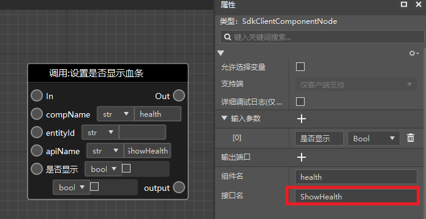
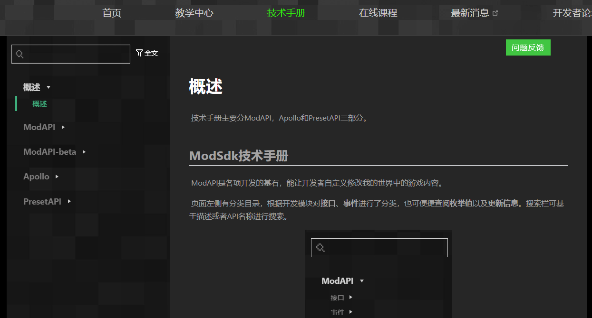
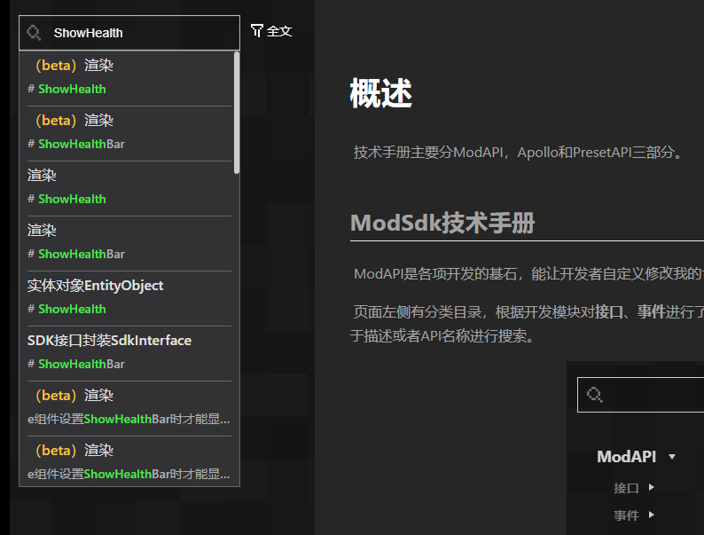
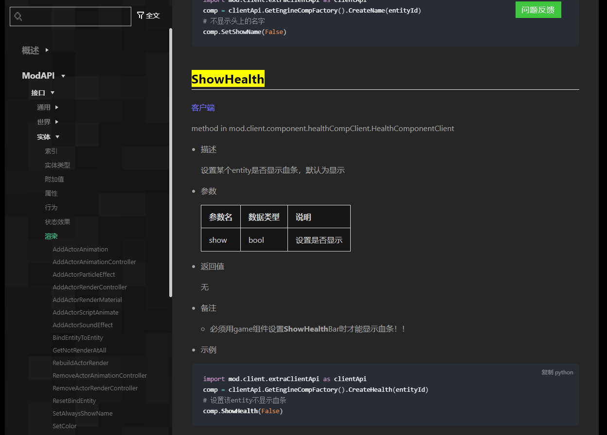

# Check the built-in game interface in the document 

The new version of the editor has a large number of **built-in game interfaces**. When using it, it may be difficult for developers to understand how the node is used through the node style itself. In this case, developers can use the node's interface name to check the description of the corresponding interface in the official API document. 

Step 1: Select the node, find the interface name of the built-in game interface in the property window on the right, and copy it by ctrl+c. 

 

Step 2: Open the [API document](https://mc.163.com/dev/mcmanual/mc-dev/mcdocs/0-%E6%A6%82%E8%BF%B0/0-%E6%A6%82%E8%BF%B0.html) of the developer's official website. 

 

Step 3: Paste the copied interface name into the page search box, and then find the corresponding interface according to the interface category in the pop-up search results.

 

Step 4: After clicking, it will automatically jump to the description document of the corresponding interface. 

