# Node Basics 

The blueprints provided by the new version of the logic editor are relatively consistent with Python code in use. There are different rules for using different types of nodes. 

## Make the blueprint effective 

Note that in order to run the node graph you wrote, you need to attach the blueprint parts to an empty preset with preload checked (please refer to [Create a new preset and add materials](../../14-Preset Gameplay Programming/0-First Preset Mod/1-Create a new preset and add materials.md)), or attach it to the preset and place it in the scene through the level editor. 

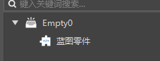 

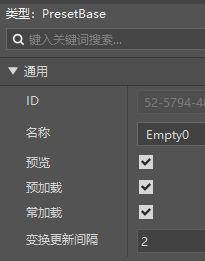 

## Listening and calling 

By right-clicking in the blank space of the graph to browse the nodes, you will find that the same nodes have different prefixes, namely "listening" and "calling". 

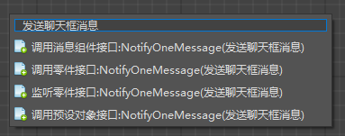 

Call means to execute the operation of this interface, such as "send a chat box message to a certain player". As shown in the figure below, you can see that the call type node has both "In" and "Out". There is an execution pin, which can be connected to the node graph for execution logic. 

Monitoring means: when the "Send Chat Box Message" interface is called. You can see that the listener type node has no "In", only "Out", because it indicates a time, at which time it takes effect and starts to execute the nodes connected to "Out" in sequence. 

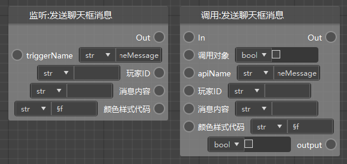 

## Calling objects and static methods 

This part requires you to have a basic concept of object-oriented programming, which is a programming concept. If you don’t know, you can watch this video: [What is procedural programming, object-oriented programming](https://www.bilibili.com/video/BV1pV411d7sL?from=search&seid=7248194267465509786&spm_id_from=333.337.0.0), the UP host gave a simple and in-depth explanation of this. 

Let’s take the following two nodes as an example. The first node is a static method and can be called without an object. 

The second node is a part node, which can only be called through the object (instance) of the part. You can find that the parameters of such nodes all contain a "calling object". 

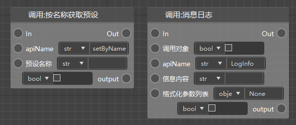 

If you want to call this interface by yourself (this part itself executes this interface), you need to call it through yourself (self), as shown below. But there are too many such cases, so we have simplified it, that is, if the calling object does not pass in data, then the default calling object is itself (self). 

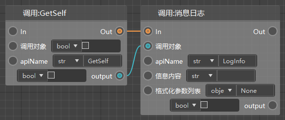 

Now let's take another example. For example, if you want to destroy your parent object, then obviously you need to let the "parent object" call the destroy interface, as shown below (because the preset object is to be destroyed, you need to use the preset object's destruction interface). 

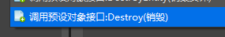 

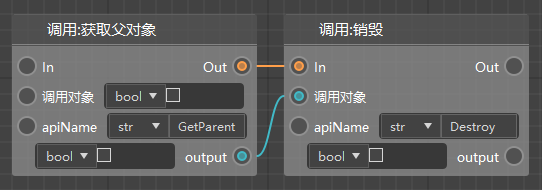 

## Get/Set Variables 

We provide an independent variable management function. After creating a new variable, you can directly drag the variable out and select two function nodes: Get and Set: 

- Get: In the Get value output node, you can get the value of this variable 

- Set: In the Set value node, you can pass in or directly edit the value you want to set


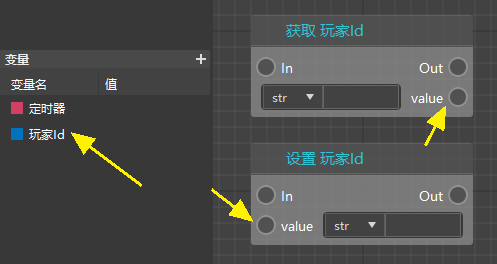 

## Get/set custom interface 

In addition to variables, in Python, functions (custom interfaces) can also be used as variables, but we currently do not provide a method to drag and drop custom interfaces to get or set them. 

You need to use these two nodes to get and set custom interfaces: 

- Get part variables: Enter the interface name in the key, and you can get the interface from the value node 

- Set part variables: Enter the interface name in the key, and you can set this interface as the node passed in by the value node 

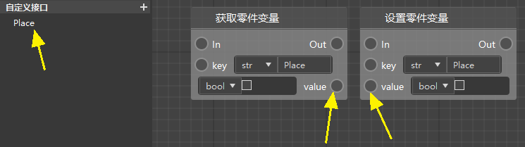 

## Part preset interface and SDK component interface 

Take the teleport player as an example, and you can see 3 different call interfaces: 

- Dimension component server interface: the interface belonging to the module SDK 
- Part interface: the interface belonging to the preset architecture 
- Preset object interface: basically the same as the part interface 

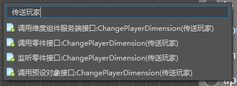 

The left side of the figure below is the dimension component server interface, and the right side is the part interface. We can refer to their API documents for explanation. 

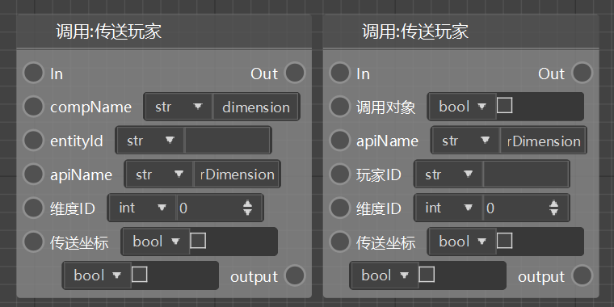 

The figure below is the interface of the dimension component server calling the teleport player. We focus on his example. 

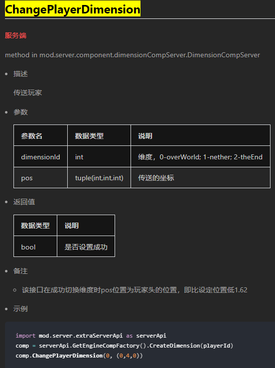 

As you can see, a Dimension component is created for the player first, and then the component is called to execute the subsequent transmission logic. 

```python 
import mod.server.extraServerApi as serverApi 
comp = serverApi.GetEngineCompFactory().CreateDimension(playerId) 
comp.ChangePlayerDimension(0, (0,4,0)) 
``` 

So the entityId of this node should be the player we want to teleport. 

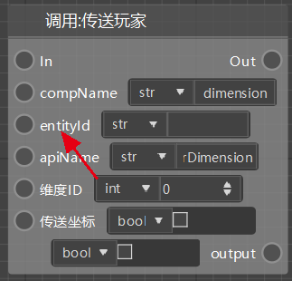 

The translation is clearer in the version of the component interface shown below. 

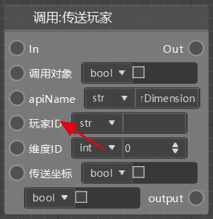 

It is recommended to directly select the part interface when there are interfaces with the same name like this. 
