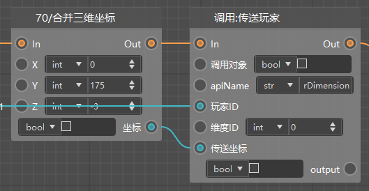
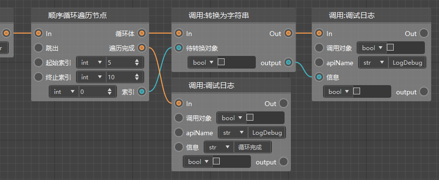
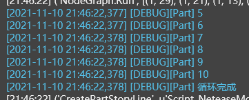

# Common nodes 

## Parameter node 

Parameter nodes can be created directly through the right-click menu and are used to construct and pass parameters of the corresponding type. There are three types: 

#### 1) List construction (ListParameterNode) 

Used to construct a list and pass it to the next node. The list length can be modified through the [Length] property in the right property window. List elements can select data types and fill in values directly. At the same time, values can also be passed into the list through data lines to assign values to list elements. 

 

#### 2) List construction (ListParameterNode) 

Used to construct a dictionary and pass it to the next node. The number of dictionary key-value pairs can be modified through the [Length] property in the right property window. The key (key) and value (value) of the dictionary can select data types separately, but generally the key will be a string (Str). Both the key and value can be filled in directly, or the value can be passed in through a data line. 

 

#### 3) Other parameter nodes 

There are 5 types of remaining parameter nodes, namely: Any type parameter (Any), Boolean parameter (Bool), integer parameter (Int), floating point parameter (Float), and string parameter (Str). These types can be used to pass in fixed values, and to pass the same value into multiple nodes at the same time (for easy unified modification). 

 

 

## Timer 

A timer is a node used to delay the execution of a custom interface. We provide: 

- Add timer: execute a function after a delay time 

- Add repeat timer: repeat the function after a delay time, and the repeat time is the same as the delay time 

The function is obtained using the method of obtaining the custom interface. For example, in the figure below, we hope to execute the Ticking function every 1 second. 

 

The output node of the added timer is the timer instance. If you want to stop the timer, you can 

- When adding the timer, set the return value to a variable 
- Get the variable and call the interface to cancel the timer 

 

## Conditions and valves 

When you want to write branch logic, you need to use conditional nodes or valve nodes 

- Condition: According to the incoming bool (Boolean value), if it is true, execute the logic connected to "true", otherwise execute the logic connected to "false" 

- Valve: Judge the incoming input1 and input2. If they are equal, continue to execute backwards, otherwise do not continue to execute 

 

As shown below, this is part of the logic of the parkour template. If we can get the redstone preset, we will destroy the redstone. If we can't get it, we will generate a redstone. 

 

## Split/Merge Coordinates 

If a node requires a tuple type parameter, in addition to converting it to a tuple through a list, you can split and merge tuples of 2 or 3 elements through the following 4 nodes. 

 

For example, in the following example, we need to determine whether the player's height is less than 80, and we need to use this interface. Its return value is a tuple containing 3 floats. 

 

We can connect the blueprint like this. 

 

Similarly, if you need to pass in a tuple, refer to the blueprint below to teleport the player to (0, 175, -3). 

 

## Enumeration Node 

If you encounter some nodes that need to pass in enumeration value data, then the enumeration node can easily help you find the corresponding enumeration value. 

In the node menu of the logic editor, we can find **"Enumeration Node"**, and in its secondary menu there are all the enumeration value types we may use. 

 

For example, if we need the "Armor Slot" enumeration value, we can directly drag out the connection line from the pin where the enumeration value needs to be passed in, call up the node menu, and then select **"Construct Armor Slot Enumeration Value"** in **"Enumeration Node"** to create the enumeration value node. If you want to select a specific value to pass in, we can directly select the required value in the **"Armor Slot"** drop-down box in the property window on the right. 

 

## Loop 

We are very happy to tell you that loops that were not supported by the old version of the logic editor are supported in the new version. You can see the following two types of nodes, their effectiveness mechanisms are slightly different, let's talk about them separately.

 

The following figure is an example of using a sequential loop to traverse nodes. Starting from the starting index, the loop body is executed once each iteration to the ending index in steps of 1, and the traversal is completed after the iteration. 

 

The log output is as follows. 

 

Another loop is to iterate over all elements of a list. This loop has a much wider application scenario. Many of our interfaces will return a list. In addition to directly getting the first element, our most common application method is to directly use conditional loops to iterate it. 

Another function of the loop is that when there is input from the jump out of the loop node, it will directly jump out of the loop (immediately execute the traversal logic). 

 

The log results of the above figure are shown in the figure below. 

 

