# Universal node 

## Get/set properties 

These two nodes can be used to get and set properties of almost any object 

- Object: get from "who" 

- Key: which property to get 

- Value: the value to get 

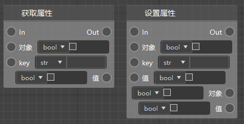 

For example, you can use this node to get the value corresponding to a key in the dictionary 

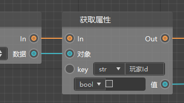 

You can also use this node to get an element of a list. As shown in the figure below, fill in 1 in the key to get the second element of the list (the sequence number of the elements in the list starts from 0). 

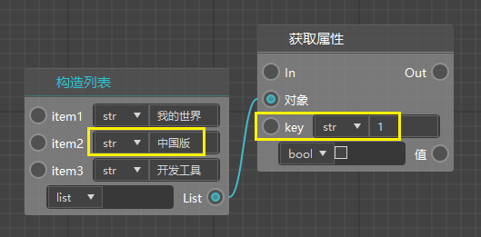 

## Calling the Part Interface 

Currently, we have supported almost all the part interfaces. If you still encounter the situation that the part interface is not correct, or the parameters/return values are missing, etc., then you can directly use "Calling the Part Interface" and set it in its property interface. 

- Input parameters: You can add input parameters. The name of the parameter is arbitrary, but the type needs to match the type in the official document as much as possible (if not, you can set it to any) 
- Output port: Similar to the input, the output of the corresponding document 
- Call interface: Fill in the name of the interface 

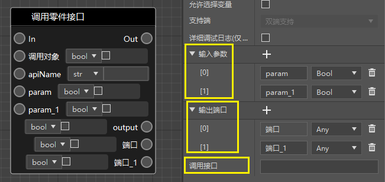 

Calling part interface can only be found in the interface of <a href="../../../../mcdocs/3-PresetAPI/Preset object/Part/PartBase.html" rel="noopenner"> PartBase </a>. 

As shown in the figure, you can use partbase and its inherited interfaces. 

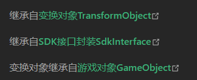 

For example, the following interface. 

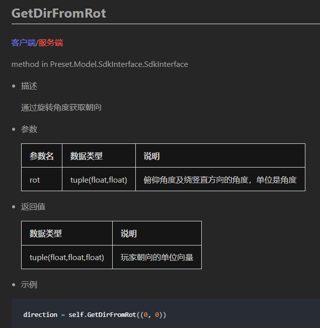 

You can use it directly after making the following simple settings. 

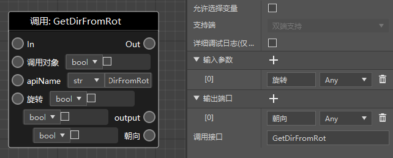 

## Calling the preset object interface 

It is very similar to calling the part interface. 

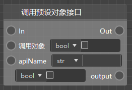

Applicable to all interfaces in the following categories. 

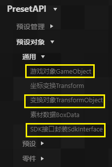 

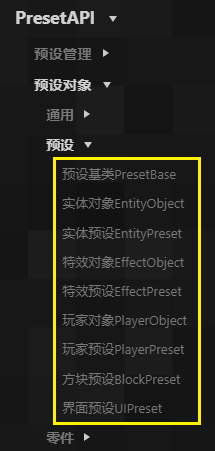 

Note that these interfaces are often not called by the parts themselves, and the calling object cannot be left blank, for example. 

This is the interface of the player object, which can only be called by the player preset (inherited from the player object). 

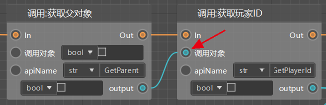 

## Calling the preset management interface 

Similar to the above node, it is suitable for direct calling of <a href="../../../../mcdocs/3-PresetAPI/Preset Management/PresetApi.html" rel="noopenner"> PresetApi (Preset Management Interface) </a>. 

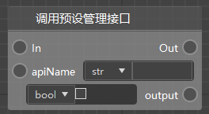 

## SDK component interface 

Similar to the above node, it is divided into two different interfaces: server-side and client-side. 

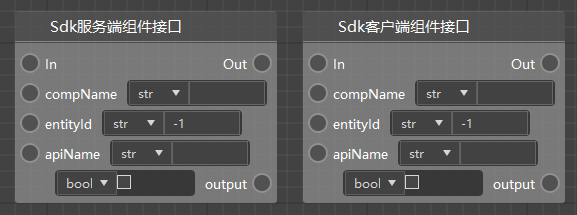 

Applicable to the call of the interface of Mod API. 

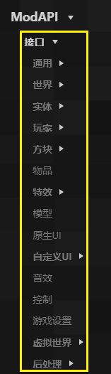 

