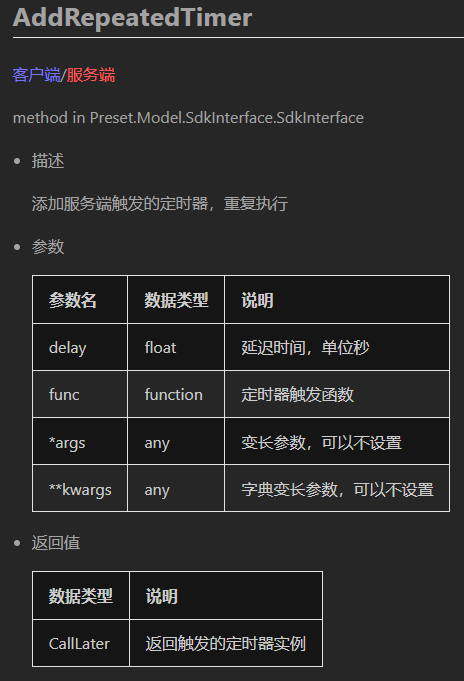
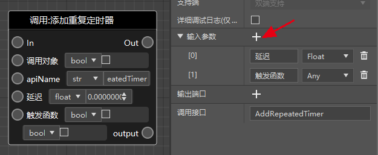
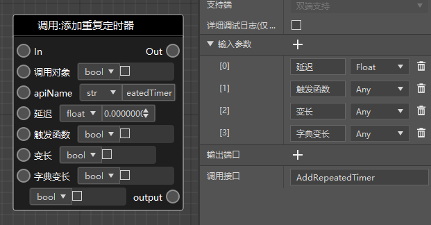

# Use variable-length parameters 

Variable-length parameters are a kind of function parameter usage in Python. The current logic editor does not automatically support them, but you can still add them when needed. 

The following are the built-in interfaces that involve variable-length parameters: 

- AddRepeatedTimer (add repeated timer) 
- AddTimer (add timer) 
- LogDebug (debug log) 
- LogInfo (message log) 
- LogError (error log) 

The functions of variable-length parameters of different nodes are different. Let's take "add repeated timer" as an example. The following figure is the <a href="../../../../mcdocs/3-PresetAPI/Preset Object/General/SDK Interface Encapsulation SdkInterface.html#addrepeatedtimer" rel="noopenner"> document </a> in the technical manual. 

In the parameter table of the document, you can see that this node finally includes a variable-length parameter and a dictionary variable-length parameter. 

 

Add this node in the logic editor, click the node, and you can see its input parameters in the node's property panel (generally, this does not need to be changed for built-in nodes). 

 

We manually add two parameters to this function according to the technical manual, and then we can use variable-length parameters, as shown below. For timers, you can pass the parameters required to trigger the function to the variable-length parameters, which is a common usage. 

