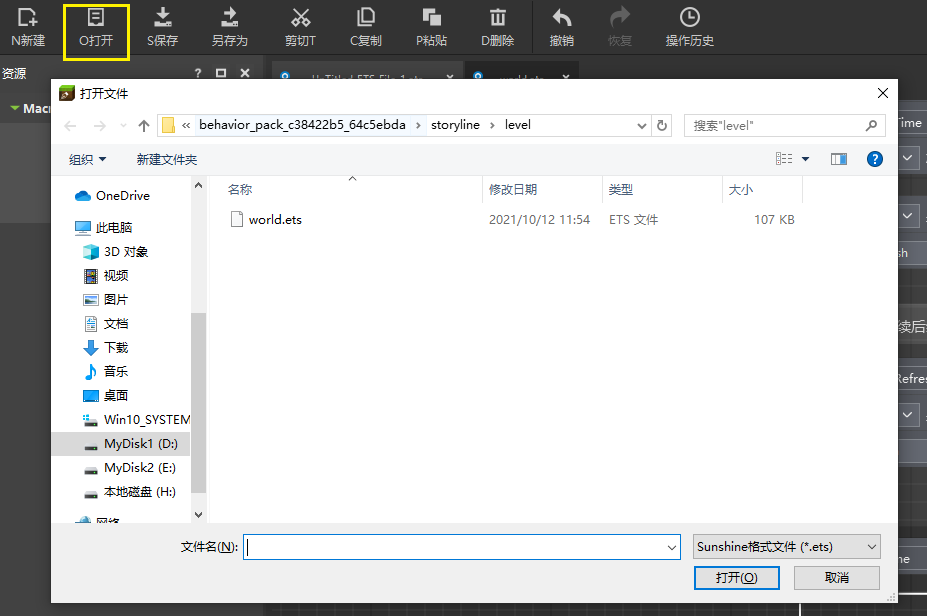
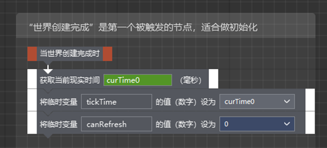
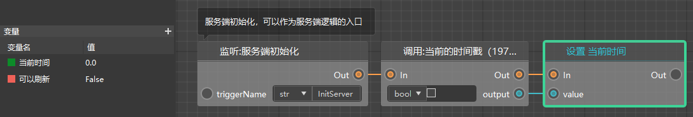
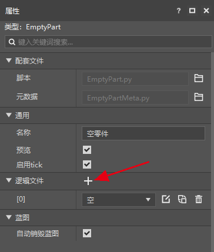

# Convert old version of logic editor to new version 

## Open ets file 

For the method of creating new version and upgrading old version, please see [Create new version](../../14-Preset gameplay programming/0-First preset mod/0-Create new version.md). 

For logic files, the old version editor uses .ets files, while the new version uses .bp files. 

The new version of logic editor has been changed a lot and cannot support ets files normally. You can only open it in the old version editor and connect it again in the new version editor. We apologize for the problems caused. 

Although the new version editor does not support opening ets, ets files are still effective, and Minecraft on mobile phones and computers will continue to support modules using ets. 

If you need to continue editing ets, you can open the old version editor, use the open function of the logic editor, and select the ets file you need to edit (this step can be any directory, not the directory of the work itself). 

 

## Comparison of old and new logic files 

The new and old logic editors are very different in form and function, but the underlying logic is actually similar. 

The following figure is the beginning of the parkour template, which we will now convert to the new version. 

 

Their correspondence can be referred to the table below. 

| Old Logic Editor | New Logic Editor | 
| ------------------------------------------ | ------------------------------------------------- | 
| Statement | Node | 
| Arrow pin (protrusion and depression of statement) | Node execution pin ("In" is equivalent to depression, "Out" is equivalent to protrusion) | 
| Event statement (orange), only protrusion (used to lead out arrow) | Event node, only "Out" pin | 
| Temporary variable | Variable | 
| Macro | Custom interface (functionality is somewhat different) | 

For variables, the variables of the old logic editor only appear between statements, while the new version has formal variables and removes the temporary variables of the old version. 

You can see that there is a variable management interface on the left side of the new logic editor, where you can create/delete/rename variables and set the variable type and default value. For example, the last statement in the above figure (setting the default value of a temporary variable) no longer requires a separate node in the new version of the structure. 

 

The new version of the logic editor introduces almost all nodes that are useful for Chinese version module development, and deletes a large number of previous statements. For example, you can see that the statement "When the world is created" is replaced by "Server Initialization" and "Get the current time" is replaced by "Current timestamp". 

## Use of old logic files 

Whether you use the old version of the logic file (ets) or the new version of the logic file (bp), you need to use parts. 

In addition to adding ets to the familiar world parts, you can find the logic file in the property panel of any part. Click "+" to add a logic file selection drop-down box, and select the ets file here. 

Just putting ets here will not make it effective in the game. You need to attach the part to the preset and make the preset instantiated in the game. Related documents can be viewed here: [Instantiate in the scene](../../14-Preset gameplay programming/0-The first preset Mod/2-Instantiate in the scene.md). 

