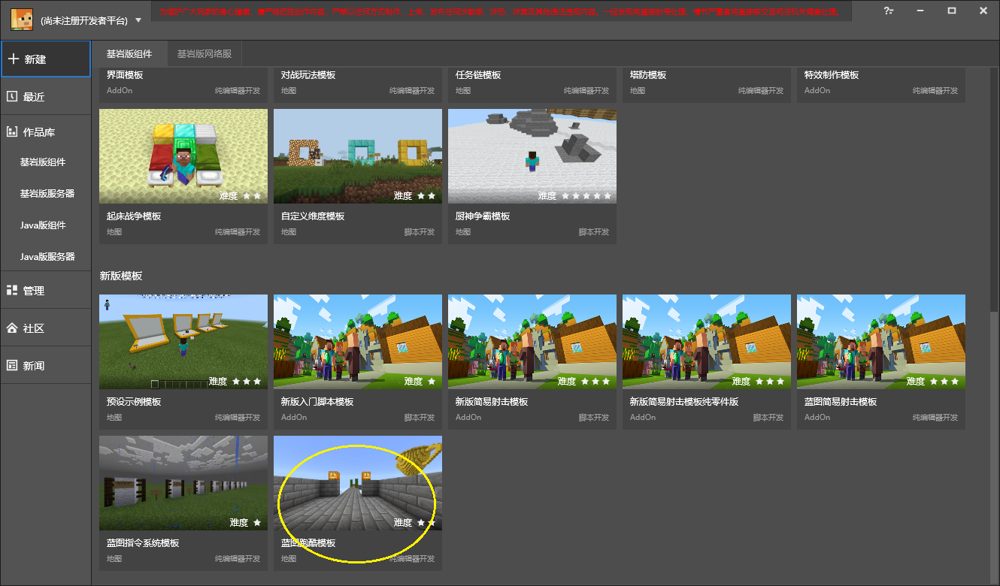

# Make a parkour map (video) 

<iframe src="https://cc.163.com/act/m/daily/iframeplayer/?id=618a44ab75882ab495541f7f" height="600" width="800" allow="fullscreen" /> 

You can create a new blueprint parkour template and view it through the launcher of the development workbench. 

The video content is not exactly the same as the parkour template. 

 
