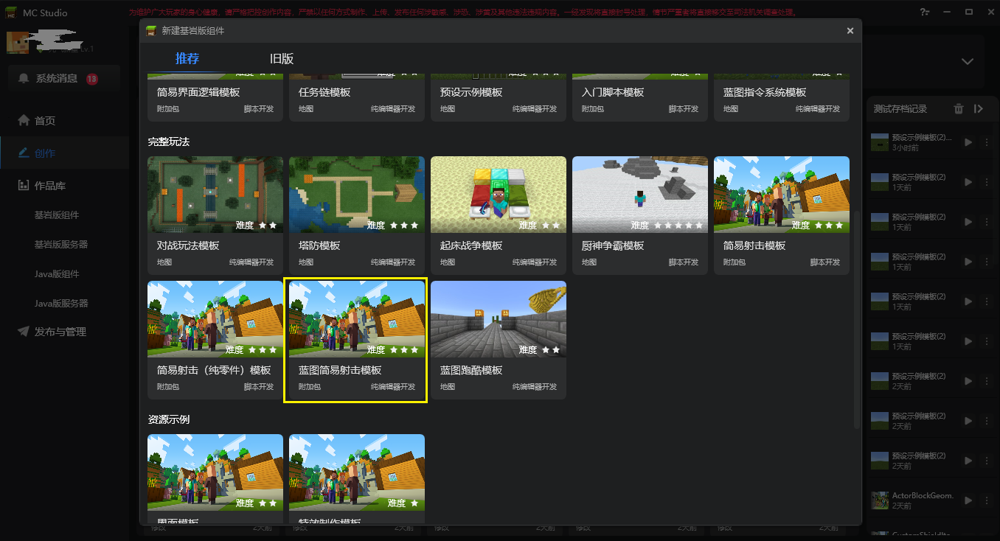
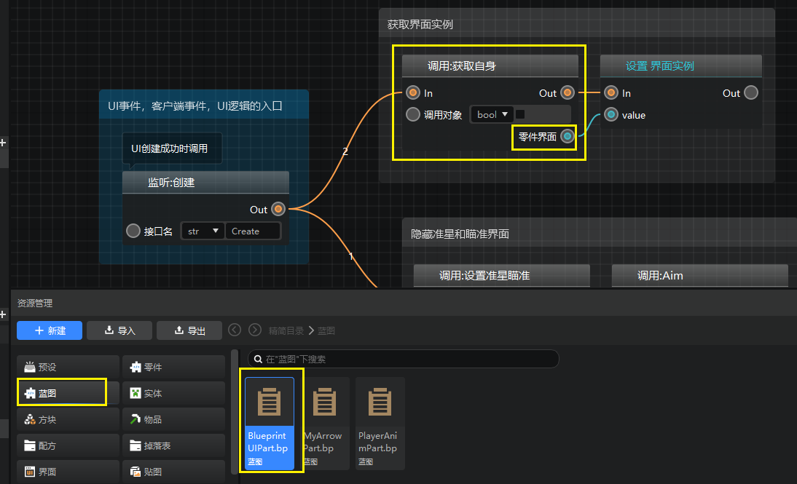
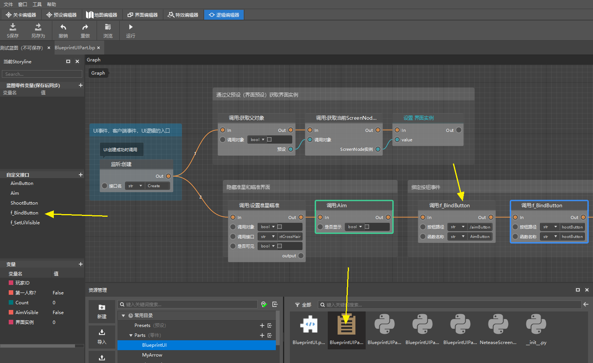
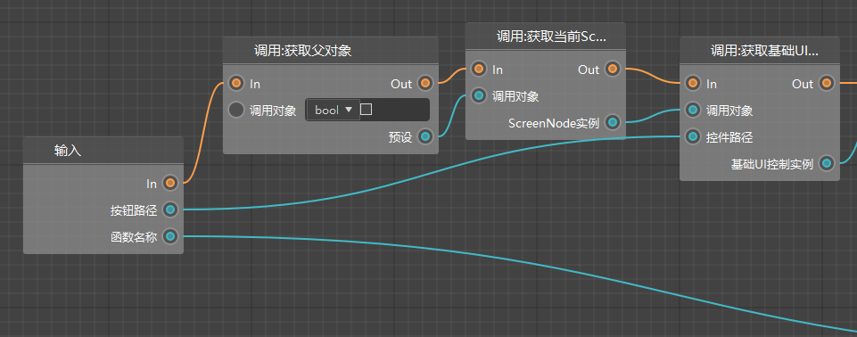
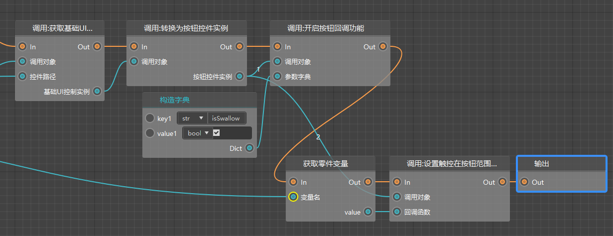
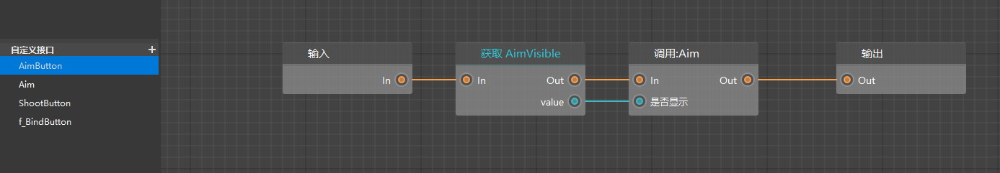
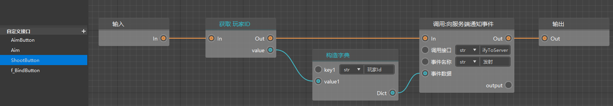
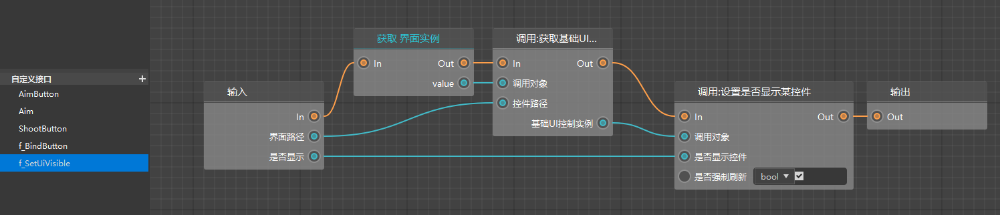
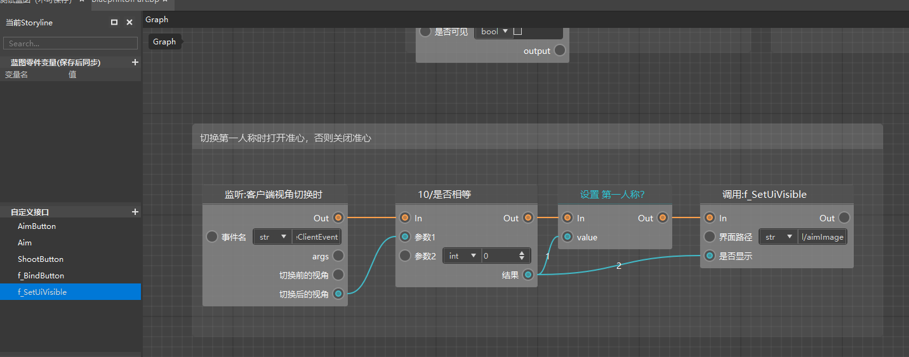

# Update (errata) 

1. Some interfaces in the video about the interface are outdated. If you encounter problems, please refer to the latest template of the workbench 

 

2. The method of obtaining the interface instance in the blueprint interface part has been modified. 

 

3. BlueprintUIPart, added a new custom interface: f_BindButton, which is used to bind the button lift event to the custom interface. 

 

4. Open the custom interface f_BindButton, you can see that the current writing method uses the latest UI object-oriented nodes. 

 

 

5. For the two bound custom interfaces, there is no need to judge whether it is a press event, because we have already made it clear that it is a lift event when calling the interface above. The following is a new chart of these two custom interfaces. 

 

 

6. In addition, a new f_SetUiVisible interface is added to replace the previously abandoned node for controlling the visibility of controls 

 

This custom interface is used in the following figure and the Aim interface. 

