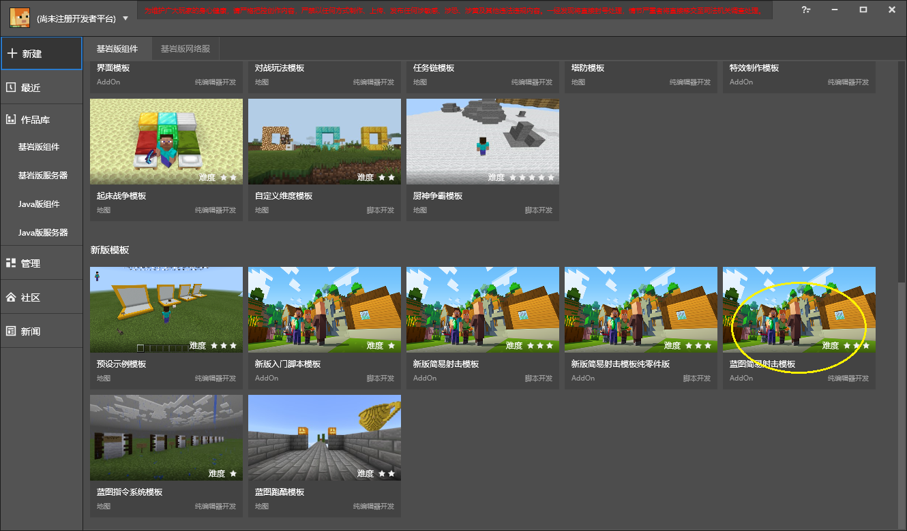

# Change model and add interface 

<iframe src="https://cc.163.com/act/m/daily/iframeplayer/?id=618a333448e27490892041fa" height="600" width="800" allow="fullscreen" /> 

You can create a simple shooting template and view it through the launcher of the development workbench. 

The video content is not exactly the same as the template. 

 
