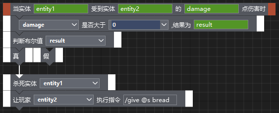

--- 
front: https://mc.res.netease.com/pc/zt/20201109161633/mc-dev/assets/img/logic_image045.eea7526d.jpg 
hard: Advanced 
time: 40 minutes 
--- 
# Instructions for using the old version of the logic editor 

> **【Please note】** 
> This content is only applicable to the old version of the logic editor. We have launched a new version of the logic editor with more powerful functions. You can [click here to jump to the new version of the logic editor document](../10-Instructions for using the new version of the logic editor/01-Getting to know the new version of the logic editor.md). 
> The old version of the logic editor will no longer be updated with functions. We recommend that developers use the new version of the logic editor for development. 

## Basic introduction 

The logic editor is used to write the level flow of the mod, the effects of item use, the skills of players and creatures, and the AI of creatures. When modifying JSON and editor configuration items cannot achieve the desired goal, you can consider using the logic editor to implement the game functions you want. It should be noted that the logic editor does not require programming skills and is suitable for entry-level developers and components with not particularly complex logic. 

**However, if you have coding skills or strong learning ability, we still recommend learning Python and using code to create logic, which is a more flexible and higher-limit method. ** 

It is recommended to follow the video below to learn the logic editor. 

<video id="video" controls="" preload="none" width=800 height=450> 
<source id="mp4" src="https://mc.v.netease.com/2020/0316/45b4a2ee4c776e48cf778e482abf84c3qt.mp4" type="video/mp4"> 
</video> 

How to enter the logic editor: 

- After entering the editor, if the map editor is currently displayed, click the icon in the upper left corner to display a list of other editors, and select "Level Editor", as shown below: 

 

- Select the "Logic Editor" tab to enter the logic editor, as shown below: 

 

The interface of the logic editor is as follows: 

 

The following is a brief introduction to the functions of each interface: 

- **Menu bar**: The logic we edit is saved as a file with the suffix .ets (**Note: the file name can only be composed of English letters and numbers**). The "File" menu can perform general file operations; "Window" can set the visibility of different editor windows; examples can be viewed in "Help". 

- **Quick operation bar**: Some common file operations and node operation options are placed here. 

- **Node editing area**: Place and connect logic nodes here, which is our main operation area. 

- **Node attributes**: When you click to select a node in the node editing area, the attributes of the node will be displayed here (editable), and some nodes have no editing items. 

- **Find nodes**: When the node graph is very large, if you want to quickly locate a certain node, you can enter the node name to search, and click the search result to quickly locate the target node. We will not be using this function in the early stages.

- **Macro**: Macros can be used to encapsulate some reusable node graphs. This function is not needed in the initial stage. Macros will be introduced in detail in the advanced knowledge later. 

The most basic unit in the logic editor is "node". Each node will implement a function. By combining these nodes, complex functions can be implemented. 

Right-click in the node editing area, and you can select different nodes in the pop-up menu. As shown in the figure below: 

 

After placing the node in the editing area, there are two ways to connect the nodes: 

- Directly drag the node to another node, and they will automatically snap together (not applicable to the case where the previous node has two output ports). As shown in the following figure: 

 

- Place the mouse on the output port of the previous node, then hold it down and drag it to the input port of the next node. When the connection turns green, release the mouse. As shown in the following two figures: 

- Hold the mouse on the output port of the previous node: 

 

- Drag to the input port of the next node, and release the mouse after the connection turns green: 

 

The game logic will be executed in the order of node connection. Let's make a simplest logic node diagram. 

## Quick Start 

Here we create a one-hit kill feature for players, which allows players to kill creatures by attacking them once. 

We break this feature down into this process: when the player attacks a creature->kill the creature. The following is a step-by-step introduction according to this process. 

In the editing area, select Event Node->Creature Event->Creature Injury in the right-click menu. 

 

This node means that when an entity is damaged by other entities (the player is also an entity), this node will be triggered and the subsequent logic will be executed. 

The green background box indicates that this place will output variables, which can be used in the next node. Fill in the variable name in the box. The variable name can be filled in at will, but it cannot be repeated in the same ets file. It is a good habit to choose a meaningful name. After filling in the variable name, the node becomes as follows: 

 

Next, select Behavior Node->Organism->Kill Specified Organism in the right-click menu, and connect this node to the previous node. 

 

This gray box with a drop-down arrow indicates that a variable needs to be specified here: 

 

Click the drop-down button: 

 

The drop-down list will show the current entity variable names. Select "entity1" and the node diagram will become as follows: 

 

This completes our first simple logic. 

Since the two variable names "entity2" and "damage" are not used, they can also be undefined in the first event node. 

Next, attach this logic to the game. 

First, save this logic file and name it "test1.ets". The default path can be used for the save path. Since this logic is closely related to the player, we attach this logic under the player. In the component window of the level editor, right-click on "Player" and add the "Basic Properties" component: 
 

Click the "Basic Properties" component in the component list, and the configurable content will be displayed in the property window. In the "Logic File" configuration item, click the Replace Logic File button (the button pointed by the red arrow in the figure below), and click the button "Select File" in the pop-up window to select the "test1.ets" we just saved. 
 
 

In this way, the logic we made will take effect when the game is running. Click the "Run" button in the upper right corner of the level editor to test it in the game. 

Next, let's make this logic a little more complicated. The creature will be killed only when the attack damage is greater than 0. When the creature is killed, give the player a piece of bread. 

Add the other three nodes to the node graph: 

- Logic Node->Relational Operation->Is it greater than; 

- Logic Node->Control Node->Condition Node; 

- Behavior Node->Instruction->Input Instruction; 

Then connect as follows: 

 

The special thing about this connection is the 0 with indigo blue background. Enter 0 directly in the input box, and you will get the result shown in the screenshot. The indigo blue background indicates that this is a constant, and the value of the constant is the input value (0 in the screenshot). However, it should be noted that this input is valid only for numeric and text input boxes. 

 

Another special input box is the one below: 

 

The input box with a gray background and no drop-down button means that a constant is required here. You can enter the constant in the property panel on the right.

 

The problem with the above logic is that if the player is injured, he will also be killed, because the player is also an entity, and this event will be triggered when the player is injured. This problem can be avoided by using the player attack event node, which will only be triggered when the player causes damage to the entity. 

 

So far, the basic concepts and operations of the logic editor have been introduced. The following chapters will introduce the concepts and details in the logic editor in more depth. 

## Detailed description 

### Node and connection mode 

Nodes are divided into 5 categories: 

- Event node: When an event occurs, the corresponding event node will be activated, and the nodes connected to the event node will be executed sequentially. 

- Behavior node: This type of node is the most common, and each behavior node will perform certain operations on entities, blocks, items, interfaces, etc. 

- Logical nodes: nodes related to relational judgment, logical operation, and process control are all placed under this category. 

- Operation nodes: currently support simple operations and trigonometric functions. 

- Parameter nodes: nodes related to constants and variables are all placed under this category. 

After you are familiar with the nodes, you can quickly obtain nodes through the search in the right-click menu. 

 

The connection mode of the node is: the starting node must be an event node, and a series of other nodes are connected after the event node. The event node has no input port, and the two sides of the node are brown-red blocks, and the two sides of other types of nodes are white blocks. 

 

There can be multiple event nodes in an ets, and they are independent of each other. 

A special event node is "World Timed Refresh". This event node is triggered evenly several times per second. The logic that needs to be executed regularly can be hung under this event node. **It should be noted that if it is not necessary, try to use this node as little as possible to avoid game lag. ** 

### Data type 

In the previous example, it has been mentioned that there are three types of node input boxes: output variables, input variables, and constants. The variables or constants in these input boxes have a variety of data types. In addition to common types such as numbers, strings, and Boolean values, they also include types unique to "Minecraft". The following introduces these data types: 

- Boolean value 

Boolean values have only two value conditions: "true" and "false". The values generated after relational judgment and logical operation are all Boolean values. 

- Integer 

For example, -2, 0, 100, etc. are all integers. 

- Floating point number

Non-integers are all represented by floating-point numbers (this is a popular way of understanding). Most of the time, developers do not need to care whether the numbers in the game are integers or floating-point numbers. 

- Strings 

The speeches and text prompts of players in the chat channel in the game are all strings. 

- Two-dimensional coordinates 

The form of two-dimensional coordinates is (x, y), where x/y are both numbers. The two nodes "Split 2D Coordinates" and "Merge 2D Coordinates" in the editor can operate two-dimensional coordinates. 

- Three-dimensional coordinates 

The form of three-dimensional coordinates is (x, y, z), where x/y/z are all numbers. The two nodes "Split 3D Coordinates" and "Merge 3D Coordinates" in the editor can operate three-dimensional coordinates. In the game, the player's position is a three-dimensional coordinate, so the variables involving the position in the node are all three-dimensional coordinates. 

- Entity ID 

Entity is a concept unique to "Minecraft", including all dynamic and moving objects in "Minecraft". Players, creatures, ships, experience balls, etc. are all entities. Each entity has a unique ID. In the node, variables related to players, creatures, and entities are all entity ID types. 

- Block type 

The block type consists of two parts: block ID and data value. For example, the white wool block has a block ID of 35 and a data value of 0; the red wool block has a block ID of 35 and a data value of 14. The two nodes "Split Block Type Data" and "Merge Block Type Data" in the editor can operate the block type data. In most cases, developers can directly select the block type through the pop-up window without worrying about the specific ID and data value. 

- Item type 

The item type is relatively complex, including three values: item ID, data value, and data version. The data version of the native item in "Minecraft" is 0; for the first version of the custom item in the Mod SDK, its data value is the custom extension value and the data version is 1; for the second version of the custom item, its data value is the component name (ModID) and the data version is 2. The two nodes "Split Item Type Data" and "Merge Item Type Data" in the editor can operate item type data. In most cases, developers can directly select item types through pop-up windows without worrying about specific IDs, data values, and data versions. 

- Any data 

Some input boxes do not limit data types, and any of the above data types can be used. 

For the input variable box, only variables that meet the data type requirements will be displayed; for the constant box, if the input variable does not meet the required data type, it will automatically be converted to a data type that meets the requirements. In most cases, developers can know the data type according to the node prompt. 

### Logic file attachment 

After the ets file is edited, it needs to be attached to the game through a certain path. The attachment path mainly affects the runtime. For example, the world-related logic requirements should be started after the world is created, and should not be attached to creatures. In addition, even if the runtime of different attachment paths is the same, it is recommended to attach them separately according to the content for easy management and subsequent maintenance. 

Currently, the editor supports the following ets file attachment methods: 

- World attachment ets file 

The logic attached to the world will start running after the world is loaded. The logic related to the world is suitable for attachment here. Attachment entry: Level Editor->Component Window->World->Basic Attribute Component->Attribute Window->Logic File. 
 

- Player attachment ets file 

The logic attached to the player will start running after the world is loaded. The logic related to the player is suitable for attachment here. Attachment entry: Level Editor->Component Window->Player->Basic Attribute Component->Attribute Window->Logic File. 

- Biological attachment ets file 

The logic attached to the creature will start running after the creature is created. The logic related to the creature is suitable for attachment here. Attachment entry: Level Editor->Component Window->Creature->Property Window->Logic File. 

It should be noted that each creature of this type will execute the attached logic. For ets attached to the creature, you can use the "Get Current Entity ID" node to get the entity ID of the currently attached creature. 

 

### Debugging 

After attaching the node graph, if you find that the operation has no response or the effect is different from the expected effect, you can use the "Print Information" node to locate the problem. 

After adding the "Print Information" node near each node, the corresponding information will be displayed in the script log window (at runtime). 

 

## Advanced knowledge 

### Temporary variables and permanent variables 

If you want to save and transfer data, you need to use temporary variables and permanent variables. The difference between temporary variables and permanent variables is that after restarting the game, temporary variables will be cleared, and temporary variables cannot transfer data across ets, while permanent variables will not be cleared after restarting the game and can be used across ets. Therefore, temporary variables are suitable for transferring data within a single ets, while permanent variables are suitable for saving data such as the number of wins of a player. In addition to these two differences, the use of temporary variables and permanent variables is very similar. The following takes temporary variables as an example to illustrate. 

Temporary variables exist in the form of key-value pairs. The key (key) is generally a string. The corresponding value (value) can be read and set through the key (key). Temporary variables have three related nodes: "Add temporary variables", "Read temporary variables", and "Set temporary variables". Before using "Read temporary variables" and "Set temporary variables", you need to use "Add temporary variables" to add key-value pairs. You can do this at the beginning of ets. 

### Macro 

When there are many repetitive functions in the node graph, you can make these functions into macros for easy reuse and modification. In addition, if it is a more complex node graph, you can also make each function block into a macro, so that the logical structure of the main node graph can be seen at a glance. "Create monsters", "Level progress judgment", and "Give player rewards" in the screenshot below are all macros. 

 

The following describes how to create a macro to achieve the function of subtracting two coordinates to get a new coordinate. 

Click "+" on the macro interface to create a new macro. The macro initially has two nodes "input" and "output". 

  

The "Input" node is the execution start point of the macro node graph, and the connection must start from the "Input" node. In the property panel of the input node, click the blue plus sign to configure the input parameters required by the macro. Here we set the two coordinate points that need to be subtracted as input parameters. 

 

The "Output" node is the execution end point of the macro, and the connection must end at the "Output" node. Click the blue plus sign to set the output parameters of the macro. Here we set the coordinate points after subtraction as output parameters. 

 

The connected node diagram is as follows: 

 

In other ets, we can directly press and hold "Coordinate Subtraction" in the macro list and drag it to the editing area to generate a macro node. 

 

### Node execution order 

When nodes are connected sequentially, the execution order is the connection order. However, when the node connection is bifurcated and converged, the execution order is different from the intuitive judgment. 

Take the following connection method as an example: 

 

The actual execution order of this connection method is: 

A->B->D->E->A->C->D->E or A->C->D->E->A->B->D->E. 

It is very different from the intuitive order of A->B\C parallel execution->D->E. This is because the node graph determines the execution order by depth traversal. In order to avoid the situation that the expected execution order is inconsistent, it is recommended to connect the node graph in a sequential way, or only have line bifurcations and no line convergences. The above example can be modified as follows: 

 

## References 

The following methods can help you use the logic editor better: 

- "View Logic Examples" under the "Help" menu of the logic editor can view examples of some small functions. 

 

- When you click to select a node (the background color of the node will turn blue), the description of the node will be displayed at the bottom. 

 

- If you want to know the specific information of the input box or output box, you can click the input box or output box, and the corresponding prompt information will be displayed at the bottom. 

 

- [Official wiki of Minecraft](https://minecraft-zh.gamepedia.com/Minecraft_Wiki) 

Here you can query the data of various game elements in Minecraft, such as item ID, entity type, etc.