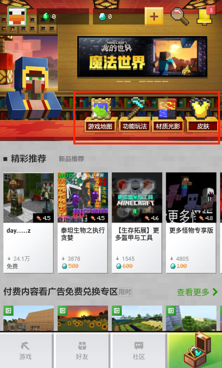
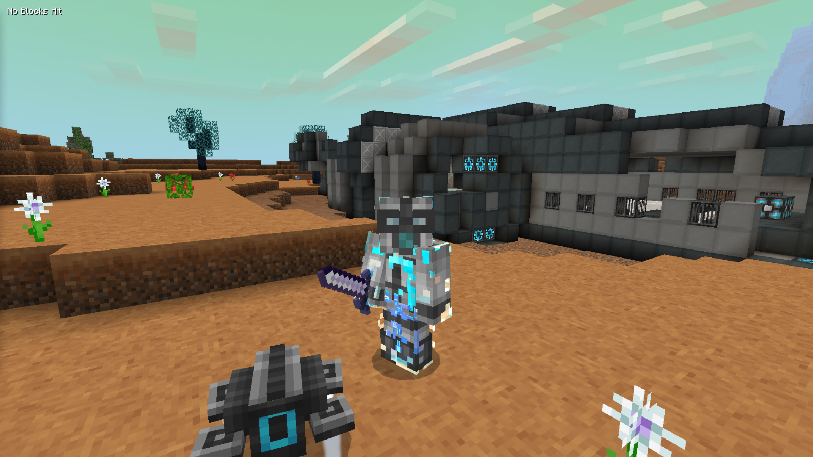

--- 
front: 
hard: Getting Started 
time: minutes 
--- 

# Mod Introduction 

## Components 

Open the resource center of the Chinese version of Minecraft, and you can see that we divide the components into game maps, functional gameplay, material lighting and skin. 

 

The skin component is actually a png texture. You can find many tutorials shared by masters by searching "Minecraft Skin Production" in the search engine. 

Functional gameplay and material lighting are all made through "add-on packages", which is also the main content of the document "MODSDK Module Development". 

The game map is generally a built game archive, but you can also add additional packages to achieve richer gameplay. 

## Add-ons 

### What are add-ons 

Add-ons can customize the game content in the Bedrock Edition of Minecraft, and are a way for the Bedrock Edition to support modules (Mod). 

In subsequent documents, we will use "Mod" to refer to the Bedrock Edition AddOn 

### What can add-ons do 

- Modify the original game content, such as modifying the texture of the original block items, which is represented by various material packs 

- Add new game content, such as adding new custom creatures, items, blocks, etc. 

The "Alien Survival" gameplay is one of the works that integrates various MODSDK functions, including custom dimensions, rich custom items, blocks and equipment, and python scripts to develop and produce a different world survival gameplay. 

 

