--- 
front: 
hard: Getting Started 
time: minutes 
--- 

# Make your first add-on pack 

## Download and install MC Studio 

Download MC Studio from the Minecraft Development Tools website (http://mc.163.com/mcstudio/index.html) 

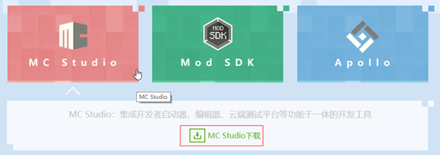 

## Register a developer account 

After installation, log in with your NetEase Pass account, then register as a Minecraft Chinese version developer on the "Publish" page. After the review is passed, you can use all the features of MC Studio. 

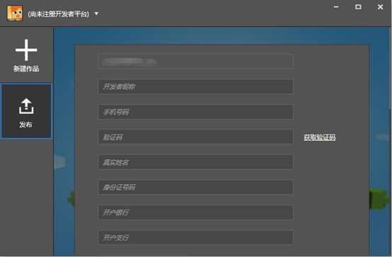 

## Create a blank AddOn 

Create a new work → Bedrock Edition component → Blank AddOn, click New 

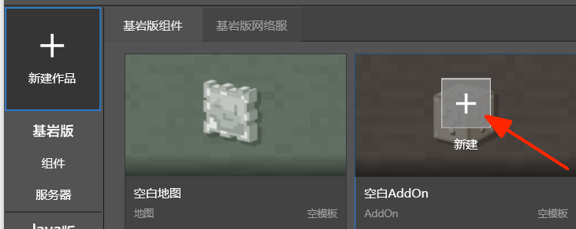 

After filling in the map name, click Start Editing. Then the studio will automatically download the latest mod development package 

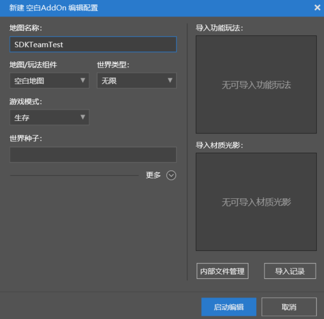 

## Add a custom block 

1. Right-click the block in the level editor → Add → Custom Block 

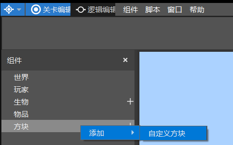 

2. Select the newly added custom block 1, and then configure the block's texture in the property panel on the right 

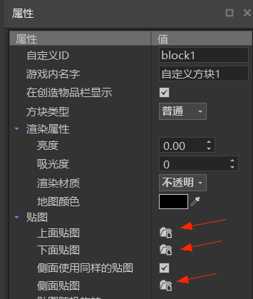 

3. Click the button of the texture above, and a file selection interface will pop up. The path at this time is generally in 

`The drive letter where you installed the studio:\MCStudioDownload\MCEditor` 

Based on this, we locate `Game\data\resource_packs\vanilla\textures\blocks` 

Here we can find the texture of the original block, we select barrel_bottom.png 

Then select this texture for the texture below and the side texture 

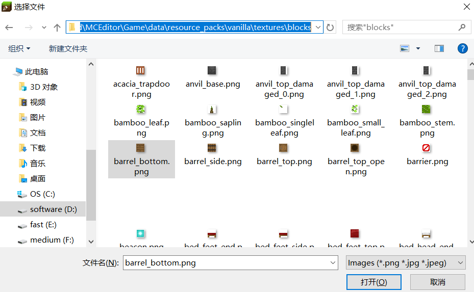 

4. Then we find the "Ray Collision Box" and set the value of the "Upper Right Corner" to 1 

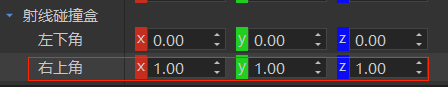 

5. Click Save and Exit in the upper right corner 

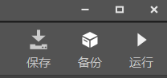 

## Test my work 

1. In the developer launcher, select Bedrock Edition Components → AddOn → the AddOn you just added → Development and Testing 

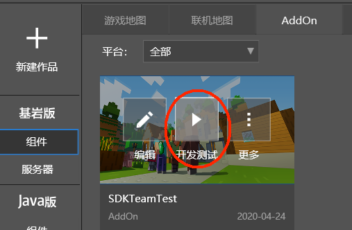 

​ Select Creative Mode and Cheat Mode, then click Start. At this time, the launcher will download the "Mod PC Development Kit" 

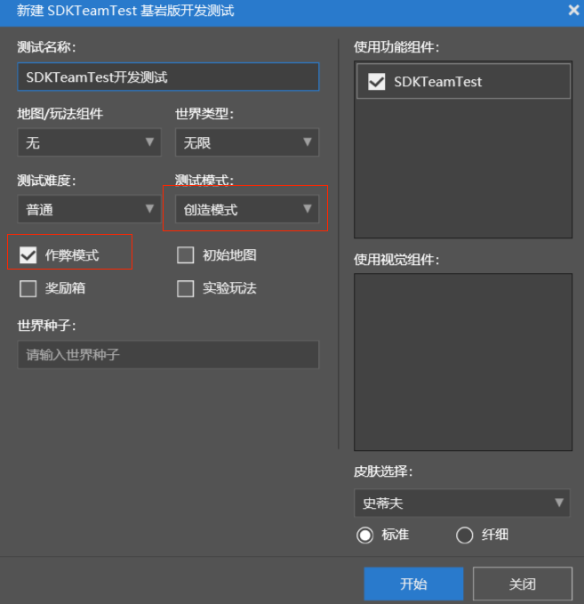 

2. After the download is complete and you enter the game, open the inventory and you can see the newly added custom blocks. You can take them out and place them. 

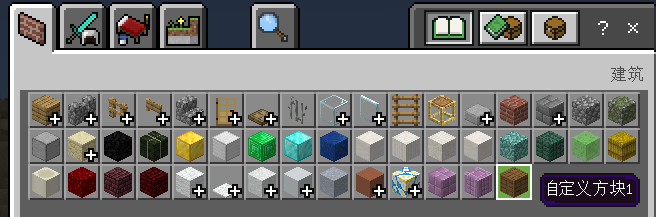 

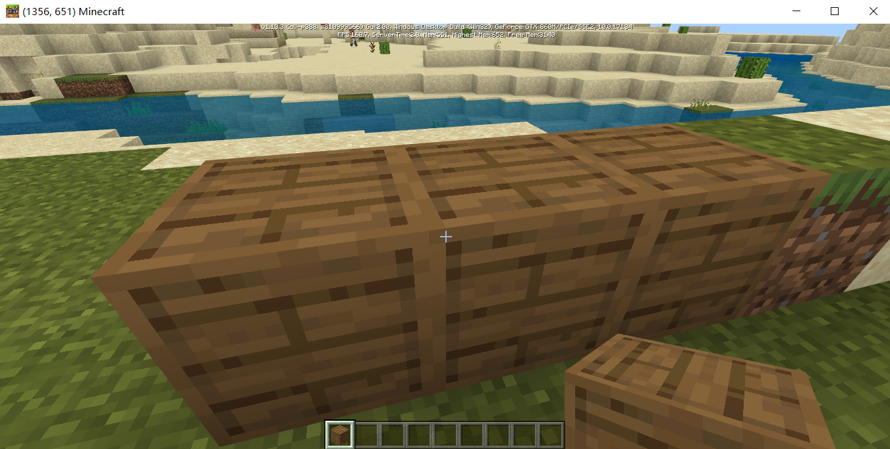 

## Advanced 

We have made a very simple mod above, but we will find some problems during the actual test, such as blocks can pass through.

This is because we only configured the texture of the block, but not the collision box of the block. How to make a complete custom block requires us to read the documentation of the relevant module. 

In addition, just adding a block cannot constitute an interesting gameplay. An interesting gameplay usually allows players to interact with blocks, or collect blocks to synthesize other interesting items. This requires us to learn other custom game content and python scripts. 

## Export and publish 

Suppose we have made a great gameplay mod. After testing, we need to upload our mod to the developer platform so that other players can play our mod. 

Go back to the developer launcher, select More → Export in our AddOn, and then select a location. The launcher will export the AddOn as a zip file. 

Then select the "Publish" page, upload the zip file you just exported, and follow the instructions and guidelines to fill it out step by step. 

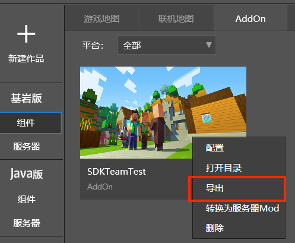 

## Test my work on mobile 

In order to test and experience the effect of Mod on mobile phones and ensure that there are no problems after the final release, we need to test Mod on the mobile phone (currently only supports **Android phone** testing). Follow the steps below: 

- As described above, upload the components to be tested on the "Release" page and submit them for review, so that the components are in the "under review" state. 
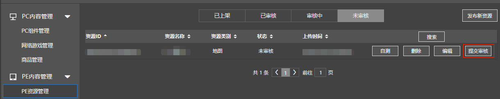

- Install the Minecraft Mobile Test APP: On the "Release" page, click "Download the Beta Launcher" in the lower left corner to download the Mobile Test APP and install it. 
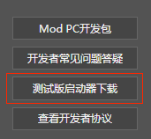 
- Log in to the Mobile Test APP using your developer account. 
- Search in the Resource Center, find the component you just reviewed, and then you can test it.