--- 
front: 
hard: Getting Started 
time: minutes 
--- 

# How Mods Work 

Although we have created a mod through the studio, which does not involve any code or file operations, it is necessary to understand how mods work specifically. It will help you better design the implementation of gameplay, how to collaborate and avoid conflicts between multiple mods, and use some functions that are not currently supported by editor configuration. 

## Behavior Packs and Resource Packs 

Add-on packs can be divided into behavior packs (behavior_pack) and resource packs (resource_pack). 

Before studying this, let's first understand what Client-Server architecture is. 

The Client-Server structure is divided into servers and clients. The server is responsible for data management and logical calculations, and the client is responsible for completing interactive tasks with users. 

In layman's terms, in MC, the server will be responsible for map generation and storage, creature AI behavior calculations, item usage logic, etc.; while the client is mainly responsible for drawing maps, creatures, etc. on the screen, and accepting player operations, such as moving and jumping, item usage operations, etc. 

When the server and client are started, there will be an initialization step, in which the game will read configurations and resources from some specific paths. Therefore, as long as we place our creations in a specific path according to the regulations, they can be recognized and loaded by the game to realize our custom gameplay. 

Generally speaking, we will put the things needed by the server in the behavior pack (such as map generation rules, block collision boxes, and creature AI), and put the things needed by the client in the resource pack (such as block textures, creature models and actions). 

Take the custom block mod we made in the previous article as an example. 

In AddOn, click More → Open Directory. We will see a folder starting with behavior_pack and a folder starting with resource_pack. 

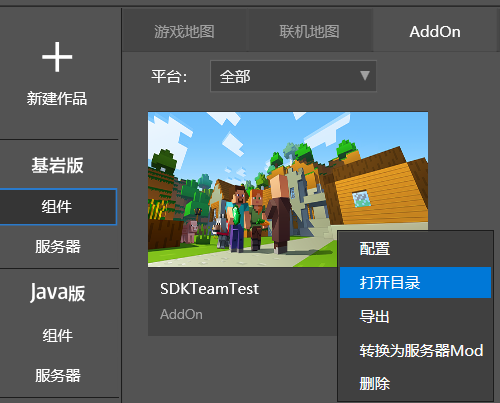 

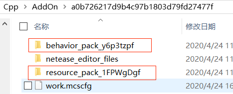 

### Behavior Pack 

Open behavior_pack, there is a netease_blocks directory, this directory is used to store the configuration of custom blocks. After opening netease_blocks, there is a json file. Use a text editor to open this json file, you can see that it records the definition of the custom block we added in the previous article, which corresponds to the property column in the level editor, for example, "netease:solid" corresponds to "whether solid". When the game starts, it will analyze this json file and add a custom block according to the definition in it.

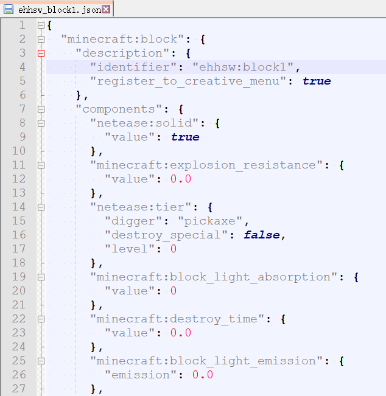 

Then we change the value of "minecraft:block_light_emission" to 1.0 (this attribute corresponds to the rendering attribute-brightness in the level editor) 

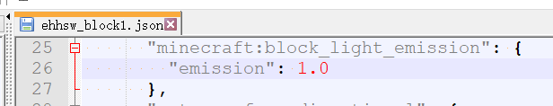 

Then enter the test archive again 

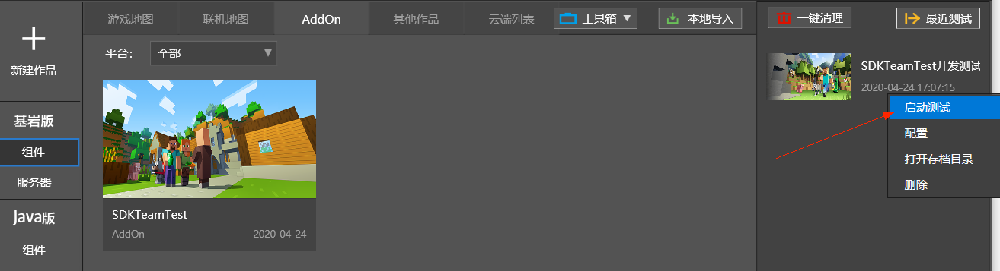 

Set the time to night, and you will find that our custom block is different from before. It can now glow like fluorescent stone. You can also edit other fields in the json file to modify other properties of the block. Of course, this requires studying the documentation of the custom block module. 

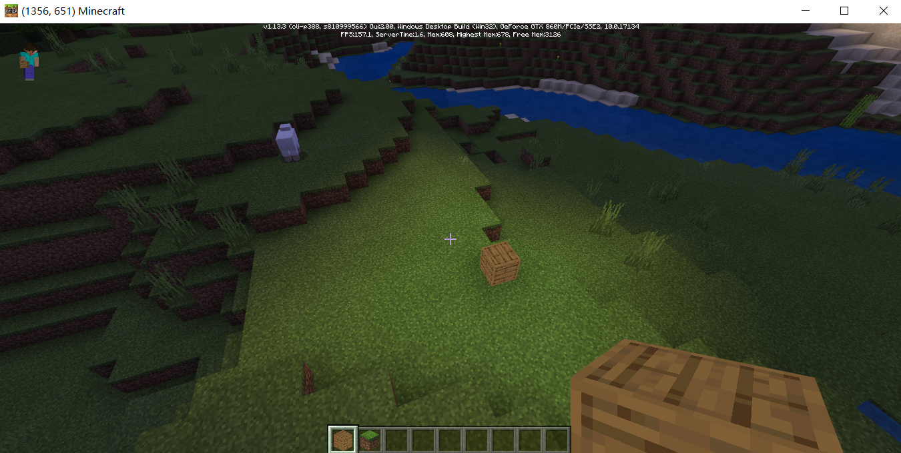 

### Resource Pack 

Then we go to the resource_pack directory. Here you will see a blocks.json and a `terrain_texture.json` in the textures folder. When the game starts, these two files will be read to load the block textures. 

We don't need to understand the specific meaning of these two files yet, but we can generally see that these two files together define the top, bottom and side textures of the custom block in our previous article, and finally point to the path `textures/blocks/barrel_bottom` 

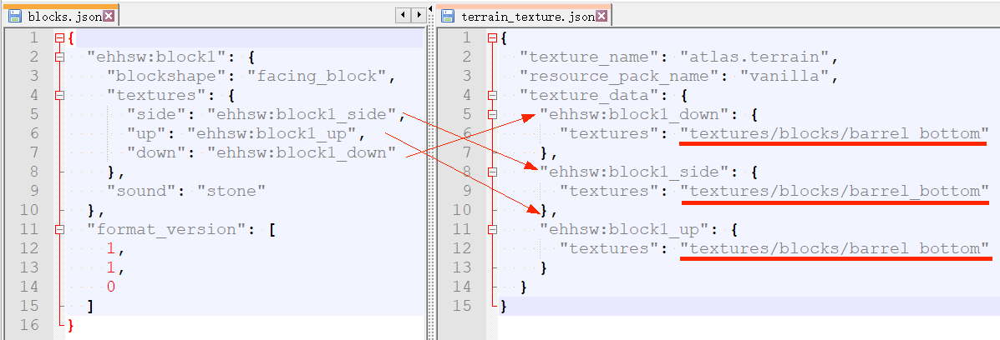 

Then we come to the path `textures/blocks` and find that `barrel_bottom.png` here is indeed the custom block texture we selected before. 

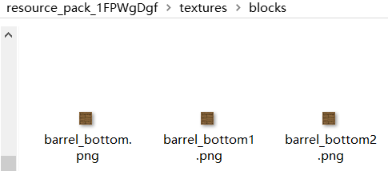 

## Original data pack 

Some original game content (such as biomes, creatures, light and shadow materials, etc.) are also placed in a specific location of the game installation package in the same format as the add-on package, and loaded at startup. By studying these original data packs, it will help us modify the original game content and get inspiration on how to make custom content. 

### How to find the original data pack 

We open the directory `The drive letter where you installed mcstudio\MCStudioDownload\game\MinecraftPE_Netease`, here is our "Mod PC Development Kit". In the "Mod PC Development Kit", you can find the configuration files of the original biomes, creatures, etc. to provide a reference for development, which will be mentioned in the documents of many modules later. 

Open the latest version folder, and the `data\behavior_packs\vanilla` in it is the original behavior pack of the game. 

And `data\resource_packs\vanilla` is the original resource pack of the game 

### How to modify the original data pack 

For the original game content, like the add-on pack, the configuration and resources of the specified path are read during the startup loading phase. At this stage, the add-on pack has the same status as the original data pack, and has a higher priority. Therefore, as long as a file with the same name is placed in the same path in the add-on pack, the game will use our file instead of the original file. 

Under the original resource pack, you will find that there is also a dirt.png under `textures/blocks`, which is the texture of the dirt block we usually see. 

We open the resource_pack directory of the AddOn in the previous article, go to `textures/blocks`, then copy `barrel_bottom.png` and rename it to `dirt.png` 

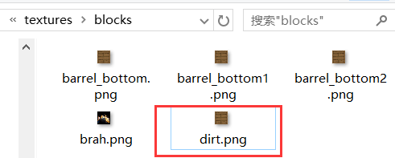 

Then we start the test archive again, and you will find that the texture of the original dirt block has changed. 

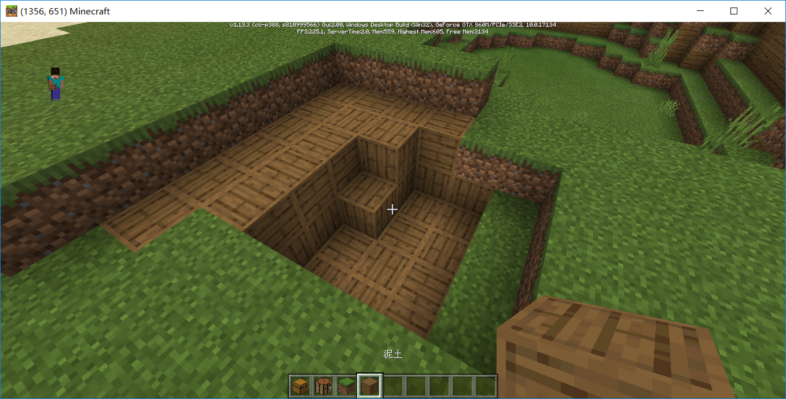 

## File structure of the data package 

In the data package, there is generally a description file of the data package, as well as some folders divided by function. Let's take the original data package as an example. 

### Behavior Pack 

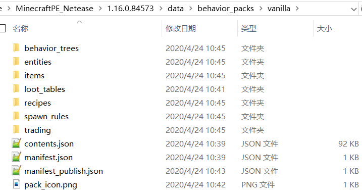 

| File/Folder | Explanation | 
| ------------- | ------------------------------------------------------------ | 
| entities | The definition of creatures.  In the Chinese version of Minecraft, this folder must be in the behavior pack | 
| ... | | 
| manifest.json | The description file of the resource pack, including the identifier of the resource pack, author information, etc.  For more information, please refer to the [official wiki](https://minecraft-zh.gamepedia.com/Bedrock Edition Add-on Pack Documentation#manifest.json), as well as the "Production Specifications" below | 

### Resource Pack 

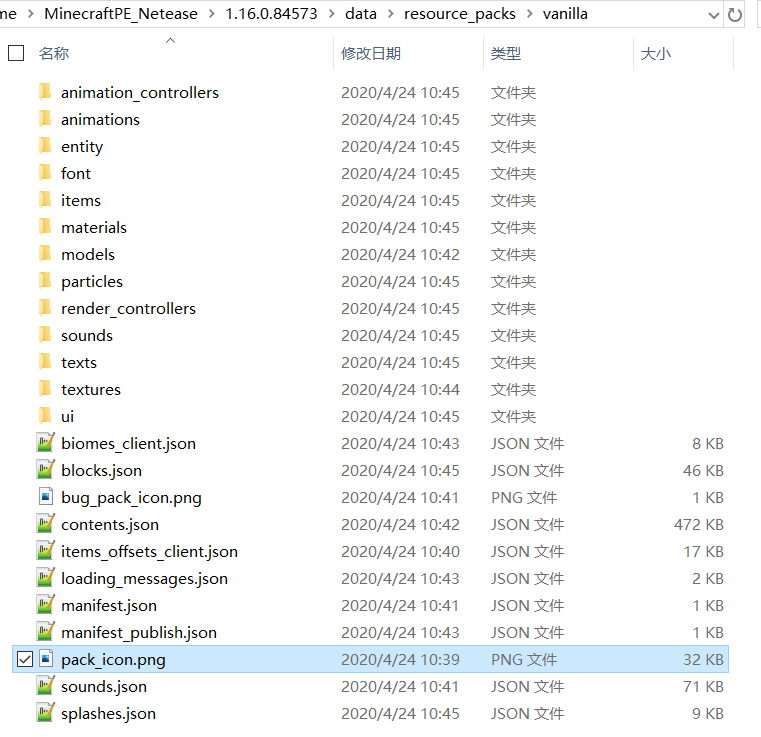 

| File/Folder | Explanation | 
| ------------- | ------------------------------------------------------------ | 
| entity | Definition of creature | 
| textures | Texture resources In the Chinese version of Minecraft, this folder must be in the resource pack | 
| ... | | 
| manifest.json | The description file of the resource pack, including the identifier of the resource pack, author information, etc.  For more information, please refer to the [official wiki](https://minecraft-zh.gamepedia.com/Bedrock Edition Add-on Pack Documentation#manifest.json) and the "Production Specifications" below | 

## Get Started 

If you want to learn more about how to manually configure addons, you can read [Making Resource Add-ons](https://minecraft-zh.gamepedia.com/Tutorials/Making Resource Add-ons) and [Making Behavior Packs](https://minecraft-zh.gamepedia.com/%E6%95%99%E7%A8%8B/%E5%88%B6%E4%BD%9C%E8%A1%8C%E4%B8%BA%E5%8C%85). 

If you want to learn more about custom game content, you can refer to the documents in "Custom Game Content" 

If you want to learn about script development, you can refer to the "Python Script Development" document 

