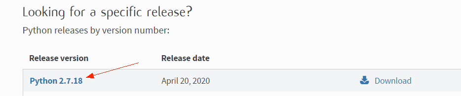
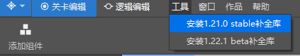
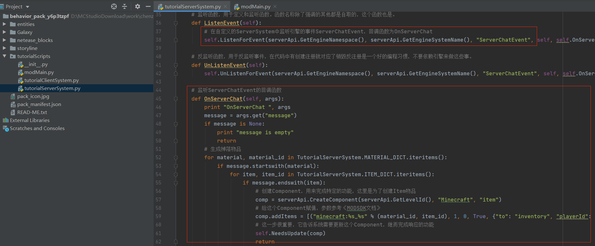
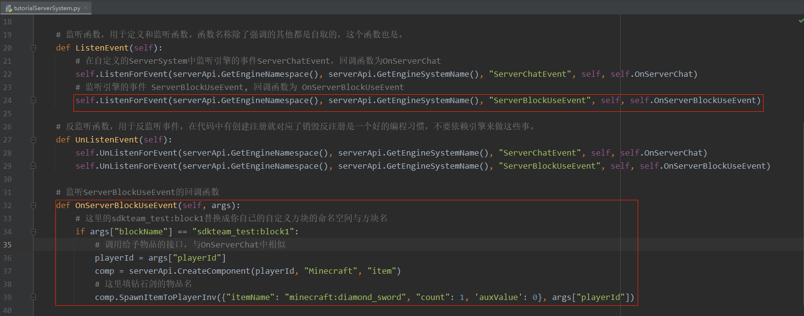

--- 
front: https://nie.res.netease.com/r/pic/20220408/080f488a-4975-4f9e-a9c6-d1d404bed919.png 
hard: Getting Started 
time: 30 minutes 
selection: true 
--- 
# Getting Started with Script Development 
## What is Python Script Development 

The native AddOn method can change a lot of original game content and add custom game content, but it generally cannot implement some more complex logic, such as giving items when right-clicking a custom block. This requires the use of scripts. 

In the Chinese version of Minecraft, we use python to write mod scripts. 

We encapsulate a lot of game events and components. Game events refer to the triggering of an operation or reaching a certain condition in the game (for example, the player right-clicks a custom block), which can notify our code and implement our logic. Components are our encapsulated game engine interfaces, which can be used to set or obtain certain data (such as operating the player's backpack) or perform some special functions. 

Script development is a process of listening to events and calling components, and using your own logic to achieve cool gameplay. 

## The first script mod 

In the studio's new work → Bedrock Edition component → Getting Started Script Template, click New, and an AddOn of "Getting Started Script Template" will be automatically created. 

 

Then we directly select this AddOn to enter the development test. After entering the game, we enter "diamond sword" in the chat bar, and we will find that there is an extra diamond sword in the backpack. This is an effect that cannot be achieved using the original AddOn. 

Let's try to modify the entry template to understand how to develop Python scripts. 

 

## Development environment setup 

### Python installation 

**The Python version used for our Python script development is Python 2, not Python 3** 

We go to the [Python official website download page](https://www.python.org/downloads/), drag to the "Looking for a specific release" below, and then click on the latest Python 2 version. 

 

 

During installation, you need to choose to add python to the environment variables, and click next as prompted. 

 


### IDE installation 

Integrated development environment (*IDE*) can help us write code very well. For Python, pycharm and vscode are both very good IDEs. Here we take pycharm as an example 

Enter pycharm's [official website download page](https://www.jetbrains.com/pycharm/download), select the Community version to download, and then click Next to install according to the prompts. 

 

### Install Mod SDK Completion Library 

#### Install using mcstudio 

Open the studio editor and click Tools: 

If only the stable version exists, developers can click the stable version to download the completion library. 

If the beta version and the stable version coexist, developers can select the required version to complete the library according to their needs. 

Click Check for completion library updates to update the latest version of the completion library to the menu list. 

 

#### Manually install the completion library 

For advanced developers, you can use pip to install the completion library. 

* Installation 

Enter the following command in the command line to install the latest version of the completion library 

``` 
python -m pip install mc-netease-sdk 
``` 

* Upgrade 

When there is a new version of the completion library, you can use the following command to upgrade to the latest version (if there is a new version of the beta completion library, this method will update the local completion library to the latest beta version) 

``` 
python -m pip install --upgrade mc-netease-sdk 
``` 

* Install to the specified python 

When there are multiple pythons in the system, you can specify the python path to install to the corresponding python: 

``` 
C:\xxx\python.exe -m pip install mc-netease-sdk 
```


* Install a specific version of the completion library 

Query the optional versions on [pypi](https://pypi.org/project/mc-netease-sdk), and then use: 

``` 
python -m pip install mc-netease-sdk==version number to be installed 
``` 


## Getting started with Python 

Python is a very easy-to-learn programming language. Developers who have not been exposed to Python can first browse the following pages of [this website](https://www.liaoxuefeng.com/wiki/897692888725344) and follow the sample code above to learn about Python: 

* The first Python program 
* Using a text editor 
* Python basics 
* Data types and variables 
* Conditional judgment and loops 
* Using dict 
* Functions 
* Calling functions 
* Defining functions 
* Function parameters 
* Modules 
* Using modules 
* Object-oriented programming 
* Classes and Examples 

## Add scripts to custom block mod 

1. Open the directory of "Starter Script Template", open the "tutorialBehaviorPack_xxx" folder, and copy the "tutorialScripts" in it to the behavior package of the custom block AddOn we created in "Making the First Mod". 

 

2. Use IDE to open the behavior package of the custom block AddOn and configure the python environment. 

Take pycharm as an example, click open, then copy the path of the behavior package and open it. 

 

Then select File→Settings→Project: behavior_pack_xxx→Python Interpreter, click the Settings button, and then Add. Then select System Interpreter, and then select the Python path we just installed. Then we can use the auto-completion function of pycharm 

 

 

3. Get a diamond sword when you right-click a custom block 


Open tutorialScripts/tutorialServerSystem.py, and we see the code for monitoring chat messages and generating items. 

We listen to ServerChatEvent, and then use the item component in the response function to add items to the player's backpack. 

 

Let's refer to these codes to implement the logic of right-clicking custom blocks. 

First, we listen to the ServerBlockUseEvent event in the ListenEvent function, and then add an OnServerBlockUseEvent function to handle this event. According to the documentation, we can know that this event will tell us the information of the player who performed this operation and the block that was right-clicked. Based on this information, we use the same method as the OnServerChat function to add a diamond sword to the player's backpack. 

```python 
def ListenEvent(self): 
# Listen for the engine event ServerChatEvent in the custom ServerSystem, the callback function is OnServerChat 
self.ListenForEvent(serverApi.GetEngineNamespace(), serverApi.GetEngineSystemName(), "ServerChatEvent", self, self.OnServerChat) 
# Listen for the engine event ServerBlockUseEvent, the callback function is ServerBlockUseEvent 
self.ListenForEvent(serverApi.GetEngineNamespace(), serverApi.GetEngineSystemName(), "ServerBlockUseEvent", 
self, self.OnServerBlockUseEvent) 

... 

# Listen for the callback function of ServerBlockUseEvent 
def OnServerBlockUseEvent(self, args): 
# Replace sdkteam_test:block1 with the namespace and block name of your own custom block 
if args["blockName"] == "sdkteam_test:block1": 
# Call the interface for giving items, similar to OnServerChat 
comp = serverApi.CreateComponent(serverApi.GetLevelId(), "Minecraft", "item") 
# Fill in the item name of the diamond sword here 
comp.SpawnItemToPlayerInv({"itemName":"minecraft:diamond_sword", "count":1, 'auxValue': 0}, args["playerId"]) 
``` 

 

4. Enter the test archive again, right-click our custom block, and find that the backpack has added a diamond sword. 

If you keep clicking the right button, you will find that the backpack is filled with diamond swords all of a sudden. This is because the ServerBlockUseEvent event is triggered every frame (tick), and developers should also pay attention when reading the document. 

 

## Script structure 

We take tutorialScripts as an example to explain the directory structure of the python script. 

``` json 
| behavior_packs_xxx 
| entities 
| tutorialScripts 
| __init__.py 
| modMain.py 
| tutorialClientSystem.py 
| tutorialServerSystem.py

| ... 
| manifest.json 
``` 

| File/Folder | Explanation | 
| ----------------------- | ------------------------------------------------------------ | 
| tutorialScripts | The root directory of the python script. The scripts in this directory will be added to the python running environment. You can start importing script files from this path, such as from tutorilaScripts import modMain | 
| \_\_init\_\_.py | It is the identifier of the python module, indicating that this is a module that can be imported and can also perform some initialization operations. The content can be empty, but the file must exist. | 
| modMain.py | This file must exist to initialize our Mod | 
| tutorialClientSystem.py | System that executes client logic | 
| tutorialServerSystem.py | System that executes server logic | 

### Naming suggestions 

In order to distinguish it from scripts of other mods and avoid conflicts, the script directory should be sufficiently distinguishable. 

It is recommended to use the format of `[Team Name][Mod Name][Scripts]`, such as SDKTeamTestScripts. After renaming this folder, the corresponding places in the code also need to be modified. 

### What is modMain.py 

modMain is the entry file of Python logic, which needs to contain the initialization and exit processing functions of the mod. Among these initialization functions, InitClient and InitServer initialize the client and server respectively, which are usually used for system and component registration, and can also do some custom initialization operations. DestroyServer and DestroyClient are used to do some processing when exiting the game, such as saving data, restoring some settings or destroying some content. 

``` python 
# Mod is an internal class of SDK for binding 
from mod.common.mod import Mod 

# Bind the engine method to our own class HugoMod for identification 
@Mod.Binding(name = "HugoMod", version = "0.0.1") 
class HugoMod(object): 

def __init__(self): 
pass 

# Entry function for server script initialization 
@Mod.InitServer() 
def testServerInit(self): 
pass 

# Destructor executed by the server script when exiting 
@Mod.DestroyServer() 
def testServerDestroy(self): 
pass 

# Entry function for client script initialization 
@Mod.InitClient() 
def testClientInit(self): 
pass 

# Destructor executed by the client script when exiting 
@Mod.DestroyClient():

def testClientDestroy(self): 
pass 
``` 

| Code | Explanation | 
| ----------------------------------------------- | ------------------------------------------------------------ | 
| from mod.common.mod import Mod | Mod is a registered class that needs to be used to bind classes and functions | 
| @Mod.Binding(name = "HugoMod", version = "1.0") | HugoMod is our Mod class, name indicates the name of the Mod, and version indicates the version of the Mod | 
| @Mod.InitServer() | It is used to identify that this function is the initialization function of our Server side, which will be called when the game Server side starts | 
| @Mod.DestroyServer() | It is used to identify the function that executes some destruction content when our Server side is closed | 
| @Mod.InitClient() | It is used to identify the initialization function executed when our Client side starts, which will be called when the game Client side starts | 
| @Mod.DestroyClient() | @Mod.DestroyClient() is used to mark that some destruction operations will be performed when our client is closed. It will be called when the game client is closed. | 

### Server and Client 

Remember the Client-Server architecture we mentioned in [How Mod Works](../1-Mod Development Introduction/3-How Mod Works.md). Script development is also divided into server scripts and client scripts. This is why we need InitServer, InitClient, ServerSystem and ClientSystem. 

In the "ModAPI" series of documents, we can also see that events are divided into server events and client events, and components are divided into server components and client components. The server and client scripts need to be independent of each other. The two parts of the code should not be imported from each other, and using each other's events and components will not take effect. In general, we need to write the code related to the game logic on the server (such as giving items) and the code related to the performance on the client (such as UI and special effects). The communication between the server and the client will use "custom events", which will be learned when reading AwesomeMod later. 

## How to debug 

The Mod code currently does not support breakpoint debugging, so you can only debug the code by setting logs in different places. You can use print or logging modules to set logs (you will see it when reading AwesomeMod later). The log will be displayed in the "Script Test Log" window. It is best to add a special prefix to the script log for easy search. 

 

It is recommended to use the mod_log module to print logs 

```python 
from mod_log import logger 
logger.info("print log: %s", "OK") 
``` 

Currently, the Mod code supports hot update debugging. When running the game for development and testing, after adding, deleting, and modifying related local Python files, return to the Studio or editor interface, and Studio will automatically hot update the modified content and prompt "Reload related Python modules" in the "Script Test Log" window. 

As shown in the figure below, the log "test 1" will be printed when you click Start Game. After changing the print content to "test 2", when you click the "Script Test Log" window, it will output "Reloading script_StartLogic.StartLogicUI", and then click Start Game again, the print content becomes "test 2". 

 

Automatic hotfix has good support for **implementation within functions**, but it may not take effect when it involves **global variables, new classes/files**, etc. 

At this time, you can **save and exit to the menu interface**, and then **re-enter the archive** to completely load the modified MOD. 

## Let's get started 

First read [System Introduction](./4-System Introduction.html), [Event Introduction](../2-Python Script Development/9-Event Introduction.md), [Component Introduction](./8-Component Introduction.html), then start with modMain.py and read the code and comments of [TutorialMod](../60-Demo Example.md#TutorialMod). 

After mastering the usage of events and components, you can read the shooting gameplay example [AwesomeMod](../60-Demo Example.md#AwesomeMod) we provide to learn more MOD development skills (start with modMain.py). 


After you are familiar with the usage of modsdk, you can continue to read the "Advanced Features", "Object-Oriented Programming", and "Common Built-in Modules" on [this website](https://www.liaoxuefeng.com/wiki/897692888725344), which will help you write more complex gameplay logic using Python. 

When you encounter problems that you cannot solve yourself, communicate with the official in a timely manner (through the MC Studio embedded developer forum or [webpage](http://mc.netease.com/forum-111-1.html)). 

