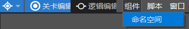
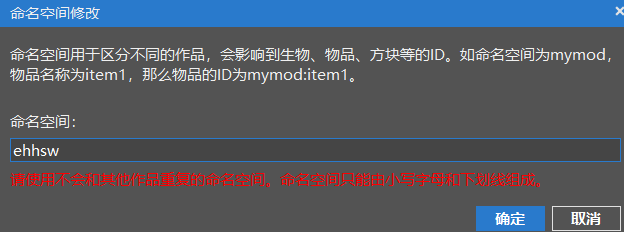
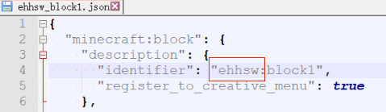
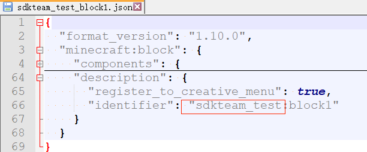
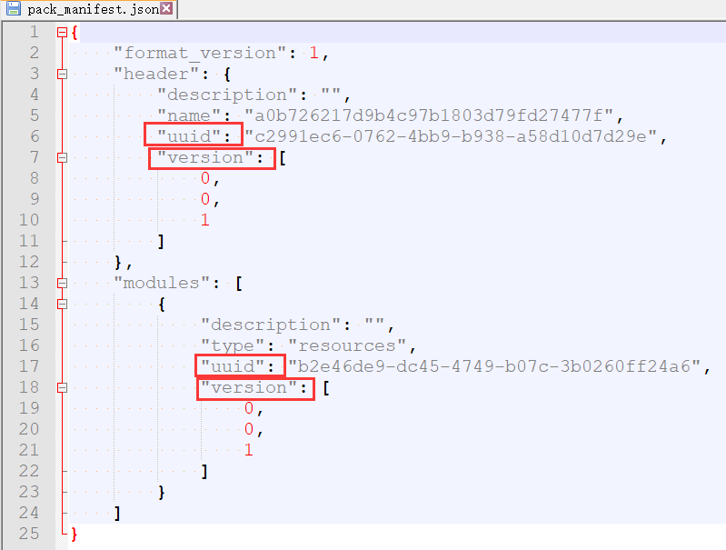
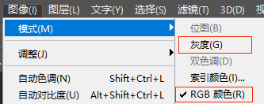

--- 
front: 
hard: Getting Started 
time: minutes 
--- 

# Production Specifications 

## Naming 

In order to distinguish from other mods developed by us and other developers, and to avoid conflicts when used at the same time, the naming of behavior packs and resource pack folders should be sufficiently distinguishable. 

AddOn created using studio adds a random string suffix. If the developer intends to manually construct the mod, or copy the official example to create the mod, here are some naming suggestions: 

Camel case naming is used here, and developers can also use underscore naming according to personal habits. 

1. Mod naming is recommended to use the format of `[Team Name][Mod Name](Mod)`, that is, it starts with the team name, and the mod's game content or a recognizable name in the middle. 

For example, the name of the custom block mod in the previous article is "SDKTeamTest" 

2. It is recommended to use the format of `[Team Name][Mod Name][BehaviorPack]` for behavior pack naming, and end with `BehaviorPack` to make the folder more recognizable. 

3. It is recommended to use the format of `[Team Name][Mod Name][Scripts]` for the python script folder in the behavior pack 

4. It is recommended to use the format of `[Team Name][Mod Name][ResourcePack]` for resource pack naming. 

In short, naming with the team name and game content can basically make the name of the mod unique. 

## Namespace 

### What is a namespace 

In the subsequent learning process, we will often see the concept of "namespace", such as in custom items, custom blocks, etc. 

Namespaces are also used to distinguish our mod from other mods to avoid conflicts. 

The namespace of the original data pack is minecraft, for example, the name of the dirt block is "minecraft:dirt". 

The recommended namespace is: `[Team Name][Underline][Mod Name]` 

### How to modify the namespace 

We select the newly created AddOn in the previous article, enter the level editor, and select Component → Namespace 

 

You will see that the studio has randomly generated a namespace for us, which is consistent with the json of our custom block. 

 

 

Then we change it to "sdkteam_test" and save it. Open the json of the custom block again and find that the namespace has been modified. 

 

## manifest.json 

In the AddOn created by studio, it is also called pack_manifest.json, which is actually the same thing. 

This file contains key information such as the mod identifier (uuid) and version number (version). AddOn created by studio will automatically generate this file. If developers want to manually create this file, they can refer to the [official wiki](https://minecraft-zh.gamepedia.com/教程/制作资源添加包#.E5.88.9B.E5.BB.BA.E4.B8.80.E4.B8.AA.E8.B5.84.E6.BA.90.E9.99.84.E5.8A.A0.E5.8C.85). 

There are usually two uuid fields in this file. Once these two fields are generated, do not modify them later. 

The two versions inside are the versions of the mod. When players connect online, they will check whether the local mod is the same as the host. Therefore, when releasing a new version, remember to increase these two version numbers (for example, add one to the last digit), otherwise it may cause players with new and old mods to connect to each other, resulting in bugs. 

**If developers create mods by copying official examples, remember to modify the uuid. ** 

 

## entities and textures folders 

Although it has been mentioned in the file structure above, I will say it again here. The Chinese version of Minecraft requires that there must be an entities folder in the behavior pack and a textures folder in the resource pack. AddOn created by studio will come with these two folders. If the developer creates the directory manually, this needs to be noted. 

## Image resources 

### Image mode 

MC currently does not support grayscale mode maps, please use RGB mode uniformly 

 

### Number of channels 

Skin maps are only allowed to use 32-bit four-channel maps, which must include an alpha channel. The textures used in the mod do not have this restriction. 

### Memory Specifications 

Image resources mainly include UI, model textures, and special effect textures. The total memory occupied by image resources after loading cannot exceed 100M. The calculation method of the memory occupied by image resources, taking a 32-bit png image with a resolution of (1024 x 1024) as an example: 1024 x 1024 x 32 / 8 = 4194304Bytes = 4M 

For reference: [The space occupied by the image in memory](https://blog.csdn.net/w1144054497/article/details/50903285)