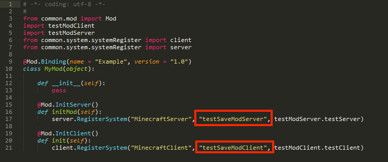
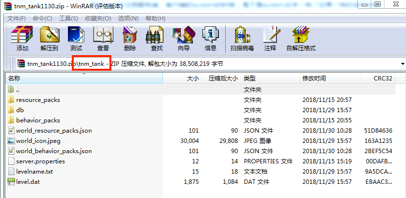
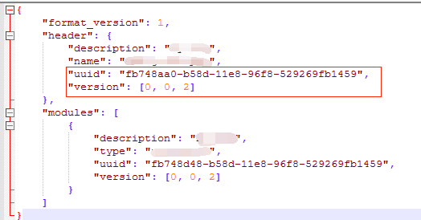
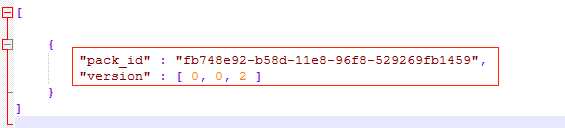
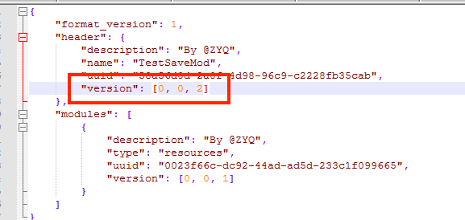
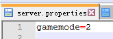
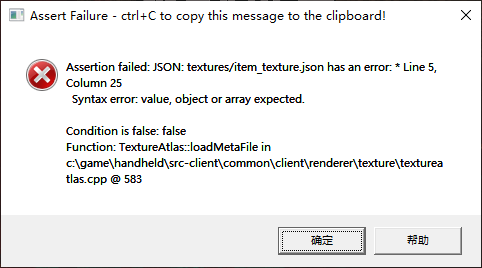
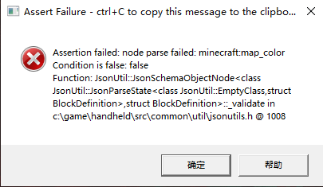

--- 
front: 
hard: Getting Started 
time: minutes 
--- 

# Mod Development BUG Solution 

## Development Packaging Issue 

### SDK package loading failed 

Possible reasons are as follows: 

- Check that the path of the SDK package and mod cannot be under the Chinese path 

- Check whether the current archive has loaded other mods, clean up or create a new archive 

- Check whether the mod's uuid is the same as other mods. The uuid in each mod must be unique 

How to generate uuid: 

```python 
import uuid 
uuid.uuid4() 
``` 

 

### Load multiple mods, only one mod is effective 

- When each mod registers the system of the server and client, does the system name have the same name? If they are the same, only the first successfully registered mod will take effect 

 

- Check whether the uuids of multiple mods are the same (in the manifest.json of the resource and behavior folders) 

- Check whether the IDs of items, props, blocks, equipment, etc. registered in multiple mods are the same 

### After the previous mod is uninstalled, the next mod does not load properly 

Please check whether the UnListenForEvent, UnDefineEvent and other interfaces for clearing registered events are called. If not, there may be residual data in the memory after the mod is uninstalled, which will affect the next installed mod. 

### The uploaded map containing mod gameplay is OK to play locally, but it is the original survival map when played in the online lobby


For the uploaded map mod, please strictly include only one first-level directory in the compressed package. 
For example, the following is correct (there is only one first-level directory, and under the first-level directory are resource and behavior folders) 

 

### The map mod that is put on the shelf is only effective in the map, but not in the mod 

- Please check whether the modAPI version number set when packaging the mod is correct, and whether the mod is not effective because the online APP version no longer supports this API version 

 

- Please check whether the contents of *world_behavior_packs.json* and *world_resource_packs.json* in the archive are consistent with the contents of *manifest.json* of behavior_packs and resource_packs. Only when they are consistent, the mod will be loaded successfully in the map 

 

 

### Updated mod resources, but the downloaded mod is still the old version 

Every time you update mod resources, you need to change the version number of *pack_manifest.json* under the behavior and resource folders of the mod. For example, if the version of the previous mod is [0, 0, 1], then the version of this mod should be [0, 0, 2]. If there is an update for the map mod and component mod, the version must be changed to trigger the update 

 


### Upload MOD, prompt packaging failure 

- The path is too deep. Currently, the longest path of mod resources can only be up to 150 characters. If the path depth exceeds 150 characters, the upload will fail 

- The directory format is incorrect. Generally, the uploaded mod file must have a unique first-level directory under the zip file, and then contain behavior and resource folders under this directory 
- The entities folder under the behavior folder of the mod must have a `__init__.py` file 
- There is a syntax error in the python file of the mod 
- There is no modMain.py in the mod 


### **When the mod is running in the online lobby\network game server, some logic of the mobile client cannot run normally** 

If a part of the client logic fails when the developed mod is running on the online lobby\network game server, it is very likely that the module containing the server thread content is imported into the client thread, causing the client thread to not work properly 


## Development package setting suggestions 

### 1. Map mod *server.properties* settings 

Please place a server.properties in the archive for the map mod, so that when playing this map mod in the online lobby, the player will enter the game mode set in the server.properties file every time 


 

 

Please use GetMinecraftEnum() and try to avoid hard coding 

### 2. Naming rules 

Namespaces, custom item names, etc. should be named uniquely to prevent conflicts with other mods 

### 3. Do not use Chinese file names 

The mod should not have files named with Chinese or garbled characters (behavior folders and resource folders), otherwise the mod will fail to load in the game 

### 4. Script encoding format 

Please specify the encoding format at the beginning of each python file: `# -*- coding: utf-8 -*- -`, otherwise it may cause import module exceptions 

## Development kit assertion error 

### Index 

| Error code | Category | Introduction | Related links | 
| ------------- | -------------- | ------------------------------------- | ------------------------------------------------------------ | 
| [1001](#1001) | UI | The UI control is missing the type field | [Control General Properties](../../18-Interface and Interaction/30-UI Description Document.md#Control General Properties) | 
| [1002](#1002) | UI | The UI control type attribute is wrong | [Control General Properties](../../18-Interface and Interaction/30-UI Description Document.md#Control General Properties) | 
| [1003](#1003) | UI | The UI control controls are missing a specific sub-control | [Button Control](../../18-Interface and Interaction/30-UI Description Document.md#Button) | 
| [2001](#2001) | Custom Ranged Weapons | The corresponding texture is not found in the custom ranged weapon sequence frame | [Custom Ranged Weapons](../15-Custom Game Content/6-Custom Ranged Weapons.md) | 
| [2002](#2002) | Custom Ranged Weapons | Custom Ranged Weapon Sequence Frame Configuration Error | [Custom Ranged Weapons](../15-Custom Game Content/6-Custom Ranged Weapons.md) | 
| [3001](#3001) | JSON | JSON file format error | 1.[JSON syntax](https://minecraft-zh.gamepedia.com/JSON) 2.[Use vscode to check JSON format](#Use vscode to check json file format) | 
| [3002](#3002) | JSON | JSON file content error | [MC Official WIKI](https://minecraft-zh.gamepedia.com/Bedrock Edition Entity Component Documentation) 
| [4001](#4001) | Custom Recipes | Configured Items Failed to Load | [Custom Items](../15-Custom Game Content/1-Custom Items/1-Custom Basic Items.md) | 
| [5001](#5001) | Customized items | Customized item ID error | [Customized items](../15-Customized game content/1-Customized items/1-Customized basic items.md) | 
| | | | | 

### <span id="1001"></span><span id="1001"></span>1001 

##### Error message 

 

Assertion failed: Type not specified (or @-base not found) for control: (***testPanel***) in namespace: (***limitedRespawnUI***) @ UIControlFactory::_createFromResolvedDef 
Function: UIControlFactory::_createFromResolvedDef in c:\editor\handheld\src-client\common\client\gui\controls\uicontrolfactory.cpp @ 346 

##### Parameter description 

| Serial number | Parameter | Description |

| ---- | -------------------------------------- | ------------------------ | 
| 1 | for control: (***testPanel***) | UI control name | 
| 2 | in namespace: (***limitedRespawnUI***) | UI control namespace namespce | 

##### Solution 

Check the ui file under the resource package, search for the corresponding namespace namespace to locate the file, and then determine the error control by the control name. For example, the error file content in this example is as follows: 

```json 
{ 
"namespace" : "limitedRespawnUI", # Namespace namespace, which can be used to search 
"main" : { 
"controls" : [ 
{ 
"testPanel@limitedRespawnUI.somePanel" : {} # Control name 
} 
], 
"type" : "screen", 
... 
}, 
"somePanel" : { # Because it is inherited, the name is overwritten, so it is not this name 
"layer" : 1, 
"offset" : [ 0, 0 ], 
"size" : [ 100, 100 ], 
"visible" : true 
# Error location, missing "type" field, should add "type": "panel" 
} 
} 
``` 

### <span id="1002"></span>1002 

##### Error message 

 

Assertion failed: Type (***wrong***) not recognized for control: (***testPanel***) in namespace: (***test***) @ UIControlFactory::\_createFromResolvedDef 
Function: UIControlFactory::\_createFromResolvedDef in c:\editor\handheld\src-client\common\client\gui\controls\uicontrolfactory.cpp @ 353 

##### Parameter description 

| Serial number | Parameter | Description | 
| ---- | ------------------------------ | ------------------------ | 
| 1 | Type (***wrong***) | Error type | 
| 2 | for control: (***testPanel***) | Name of UI control | 
| 3 | in namespace: (***test***) | Namespace of UI control | 

##### Solution 

Check the ui file under the resource package, search for the corresponding namespace namespace to locate the file, and then determine the wrong control by the control name. For example, the error file content in this example is as follows:


```json 
{ 
"namespace" : "test", # Namespace namespace, can be used for search 
"main" : { 
"controls" : [ 
{ 
"testPanel@test.somePanel" : {} # Control name 
} 
], 
"type" : "screen", 
... 
}, 
"somePanel" : { # Because it is inherited, the name is overwritten, so it is not this name 
"layer" : 1, 
"offset" : [ 0, 0 ], 
"size" : [ 100, 100 ], 
"type" : "wrong", # Error location, there is no "wrong" type basic control, here should be changed to "panel" 
"visible" : true 
} 
} 
``` 

Change ***wrong*** in the above file to ***panel***. 

Appendix: Supported basic control types are: button, custom, dropdown, edit_box, factory, grid, image, input_panel, label, panel, screen, scrollbar_box, scroll_track, scroll_view, slider, slider_box, stack_panel, toggle, selection_wheel, combox, layout, joystick, stack_grid, rich_text, mul_lines, sixteen_nine_layout, anim_porecess_bar. 

### <span id="1003"></span>1003 

##### Error message 

 

Assertion failed: Control name could not be resolved: (***hover***) in (***testButton***), with base type (***0***) @ UIControl::_resolveControlNames 
Function: UIControl::_resolveControlNames in c:\editor\handheld\src-client\common\client\gui\controls\uicontrol.cpp @ 1139 

##### Parameter description 

| Serial number | Parameter | Description | 
| ---- | ------------------------ | ----------------------------------- | 
| 1 | (***hover***) | Missing child control name | 
| 2 | in (***testButton***) | UI control name | 
| 3 | with base type (***0***) | [Basic types of UI controls](#Basic control type table) | 

##### Solution 

Check the ui file under the resource package, and search for the corresponding control name to determine the control with the error. For example, the error file content in this example is as follows: 

```json 
{

"namespace" : "test", 
"main@common.base_screen": { 
"controls": [ 
{ 
"testButton@test.someButton": {} # Control name, can be used for search 
} 
] 
}, 
"someButton@common.button" : { # Because it is inherited, the name is overwritten, so it is not this name 
"$default_texture" : "textures/ui/a", 
"$hover_texture" : "textures/ui/b", 
"anchor_from" : "top_left", 
"anchor_to" : "top_left", 
"controls" : [ 
{"default" : {"layer" : 2,"texture" : "$default_texture","type" : "image"}}, 
{"pressed" : {"layer" : 2,"texture" : "$hover_texture","type" : "image"}} 
# Error location, missing "hover" definition 
], 
"layer" : 1, 
"offset" : [ "0%+0px", "0%+0px" ], 
"size" : [ "100%+0px", "100%+0px" ], 
"visible" : true 
} 
} 
``` 

Add {"hover" : {"layer" : 2,"texture" : "$hover_texture","type" : "image"}} to the error location of the above file. 

<span id="Control Basic Type Table"></span>Appendix: The basic types of UI controls and the corresponding numerical serial numbers are as follows: 

| Serial number | Control Basic Type | Serial number | Control Basic Type | Serial number | Control Basic Type | 
| ---- | ------------ | ---- | --------------- | ---- | ------------------- | 
| 0 | button | 10 | screen | 20 | layout | 
| 1 | custom | 11 | scrollbar_box | 21 | stack_grid | 
| 2 | dropdown | 12 | scroll_track | 22 | joystick | 
| 3 | edit_box | 13 | scroll_view | 23 | rich_text | 
| 4 | factory | 14 | selection_wheel | 24 | sixteen_nine_layout | 
| 5 | grid | 15 | slider | 25 | mul_lines | 
| 6 | image | 16   | slider_box | 26 | anim_porecess_bar |
| 7 | input_panel | 17 | stack_panel | | |
| 8 | label | 18 | toggle | | |
| 9 | panel | 19 | combox | | |

### <span id="2001"></span>2001

##### error message


Assertion failed: Can not find texture (***customrangedweapon:bow_frame***) in (***item_texture.json***) for custom item (***customrangedweapon:bow***)

Condition is false: false 
Function: CustomRangedWeaponItem::initClient in c:\editor\handheld\src-plugins\common\world\item\customrangedweaponitem.cpp @ 72 

##### Parameter description 

| Serial number | Parameter | Description | 
| ---- | -------------------------------------------- | ---------------------------------- | 
| 1 | texture (***customrangedweapon:bow_frame***) | Custom ranged weapon texture_name configuration value | 
| 2 | (***item_texture.json***) | Image list file | 
| 3 | custom item (***customrangedweapon:bow***) | Custom ranged weapon identifier | 

##### Solution 

Check the ***texture_name*** field in the json file corresponding to the custom ranged weapon in the netease_items_res directory of the resource package. In this example, texture_name is customrangedweapon:bow_frame. The content of the json file is as follows: 

```json 
{ 
"format_version": "1.10", 
"minecraft:item": { 
"description": { 
"identifier": "customrangedweapon:bow", # identifier of custom ranged weapon 
"category": "Equipment" 
}, 
"components": { 
"minecraft:icon": "customrangedweapon:bow", 
"netease:frame_animation": { 
"frame_count": 4, 
"texture_name": "customrangedweapon:bow_frame", # corresponding to the name in item_texture.json 
"animate_in_toolbar": true 
} 
} 
} 
} 
``` 

Check if the texture definition of ***customrangedweapon:bow_frame*** exists in the item_texture.json file under the resource pack textures. The content of this example file is as follows. 

```json 
{ 
"resource_pack_name": "vanilla", 
"texture_name": "atlas.items", 
"texture_data": { 
"customrangedweapon:bow": { 
"textures": [ 
"textures/items/customitems_ranged_weapon_0" 
] 
}, 
# Wrong location, you need to add the texture definition of customrangedweapon:bow_frame here 
... 
}

} 
``` 

Add the following content to the wrong location in the above file. 

```json
"customrangedweapon:bow_frame": {
  "textures": [
    "textures/items/customitems_ranged_weapon_0",
    "textures/items/customitems_ranged_weapon_1",
    "textures/items/customitems_ranged_weapon_2",
    "textures/items/customitems_ranged_weapon_3"
  ]
}
```

### <span id="2002"></span>2002

##### error message


Assertion failed: The frame_count (***4***) of custom item (***customrangedweapon:bow***) should be (***2***) specific in (***item_texture.json***) by (***customrangedweapon:bow***) Condition is false: textureCount >= m_frameCount Function: CustomRangedWeaponItem::initClient in c:\editor\handheld\src\plugins\common\world\item\customrangedweaponitem.cpp @ 71 

##### Parameter description 

| Serial number | Parameter | Description | 
| ---- | ------------------------------------------ | ------------------------------------------------------- | 
| 1 | frame_count (***4***) | Custom ranged weapon frame_count configuration value | 
| 2 | custom item (***customrangedweapon:bow***) | Custom ranged weapon identifier | 
| 3 | should be (***2***) | The number of sequence frame images listed in the following item_texture.json | 
| 4 | specificed in (***item_texture.json***) | The file where the image list is located | 
| 5 | by (***customrangedweapon:bow***) | The sequence frame id assigned to this custom ranged weapon in the above item_texture.json | 

##### Solution 

Check the ***frame_count*** field in the json file corresponding to the custom ranged weapon in the netease_items_res directory of the resource package. In this example, frame_count is 3. The content of the json file is as follows: 

```json 
{ 
"format_version": "1.10", 
"minecraft:item": { 
"description": { 
"identifier": "customrangedweapon:bow", # Custom ranged weapon identifier 
"category": "Equipment" 
}, 
"components": { 
"minecraft:icon": "customrangedweapon:bow", 
"netease:frame_animation": { 
"frame_count": 4, # Custom ranged weapon frame_count configuration value

"texture_name": "customrangedweapon:bow_frame", # corresponds to the name in item_texture.json 
"animate_in_toolbar": true 
} 
} 
} 
} 
``` 

Check the number of ***textures*** corresponding to ***customrangedweapon:bow_frame*** in the item_texture.json file under the resource package textures. In this example, the number is 2. The file content is as follows. (***customrangedweapon:bow_frame*** corresponds to the ***texture_name*** field content in the json file of the above custom ranged weapon) 

```json 
{ 
"resource_pack_name": "vanilla", 
"texture_name": "atlas.items", 
"texture_data": { 
"customrangedweapon:bow_frame": { 
"textures": [ 
"textures/items/customitems_ranged_weapon_0", # Only 2 textures are configured here, which is inconsistent with the above frame_count=4, resulting in an error 
"textures/items/customitems_ranged_weapon_1" 
] 
} 
} 
} 
``` 

Modify the frame_count in the first file to 2 or add two textures in the second file to fix the error. 

### <span id="3001"></span>3001 

##### Error message 

 

Assertion failed: JSON: ***textures/item_texture.json*** has an error: * Line ***5***, Column ***25*** Syntax error: value, object or array expected.Condition is false: false 
Function: TextureAtlas::loadMetaFile in c:\game\handheld\src-client\common\client\renderer\texture\textureatlas.cpp @ 583 

##### Parameter description 

| Serial number | Parameter | Description | 
| ---- | -------------------------------- | ---------------------- | 
| 1 | ***textures/item_texture.json*** | There is a JSON file with incorrect format | 
| 2 | Line ***5*** | The line where the error is located in the file | 
| 3 | Column ***25*** | The column where the error is located in the file | 

##### Solution 

Search for the above-mentioned incorrectly formatted files in your mod directory and check whether their contents have format errors 

<span id="Use vscode to check the json file format"></span>Appendix: Use vscode to check the JSON file format 


Use vscode to open the corresponding json file, vscode will use red wavy lines to mark the error location. 

 

### <span id="3002"></span>3002 

##### Error message 

 

Assertion failed: node parse failed: ***minecraft:map_color*** Condition is false: ret Function: JsonUtil::JsonSchemaObjectNode<class JsonUtil::JsonParseState<class JsonUtil::EmptyClass,struct BlockDefinition>,struct BlockDefinition>::_validate in h:\\mceditor\\branches\\editor_1.21_20210121\\handheld\\src\\common\\util\\jsonutils.h @ 1008 

##### Parameter description 

| Serial number | Parameter | Description | 
| ---- | ------------------------- | -------------- | 
| 1 | ***minecraft:map_color*** | Field with incorrect content | 

##### Solution 

Search for the fields with incorrect content in your mod directory and check whether they match the corresponding fields in the native content. For example, ***minecraft:map_color***. It is recommended to search for this keyword on [MC Official WIKI](https://minecraft-zh.gamepedia.com/Bedrock Edition Entity Component Document) to obtain the corresponding description information. 

<span id="Use vscode to check the json file format"></span>Appendix: Reference to the native content in MC 

Use vscode to open the "data" folder in the game directory. Generally, when using MC Studio, a complete game terminal will exist in the following directory. 

``` 
C:\MCStudioDownload\game\MinecraftPE_Netease\1.21.0.119233 
``` 

Where "1.21.0.119233" is the version number, which may change. Therefore, we need to use vscode (or other tools that support global search) to open the "C:\MCStudioDownload\game\MinecraftPE_Netease\1.21.0.119233\data" directory and search globally for the fields you want to reference. **Note**: Some fields cannot be found here, but they can actually be used. Generally, the [MC official WIKI](https://minecraft-zh.gamepedia.com/Bedrock Edition Entity Component Document) shall prevail. 

### <span id="4001"></span>4001 

##### Error message 

 

Assertion failed: can not make the recipe, item missing: ***mymod:item1*** Condition is false: false Function: Recipes::_loadIngredientFromJson in h:\\mceditor\\branches\\editor_1.21_20210121\\handheld\\src\\common\\world\\item\\crafting\\recipes.cpp @ 984 

##### Parameter description 

| Serial number | Parameter | Description | 
| ---- | ----------------- | -------------- | 
| 1 | ***mymod:item1*** | Missing item definition | 

##### Solution 

This error is caused by not finding the corresponding item definition. There are usually two reasons: 1. The id filled in the recipe is wrong; 2. The json file content corresponding to the custom item is wrong, resulting in unsuccessful registration. In the first case, you can search for the name in your own mod to check whether it is correct; if the content of the custom item json file is incorrect, an error pop-up window related to the custom item will generally pop up, and then you can handle it according to the specific information. 


### <span id="5001"></span>5001 

##### Error message 

 

Assertion failed: [custom define item]JSON: ***netease_items_beh/caomei.json*** Item identifiers must have a namespace Condition is false: false Function: _loadModItemData::<lambda_acd29d58b6c79a1277582817d332e35f>::operator () in h:\\mceditor\\branches\\editor_1.21_20210121\\handheld\\src\\common\\world\\item\\itemregistry.cpp @ 387 

##### Parameter description 

| Serial number | Parameter | Description | 
| ---- | ----------------------------------- | ------------------ | 
| 1 | ***netease_items_beh/caomei.json*** | File with wrong content | 

##### Solution 

Find the above error file in the mod and check whether the identifier field is wrong. 

Example: 

```json 
{ 
"format_version": "1.10", 
"minecraft:item": { 
"description": { 
"category": "Construction", 
"identifier": "caomei", # Wrong position, missing namespace, should be changed to mymod:caomei 
"register_to_create_menu": true 
}, 
"components": { 
"minecraft:max_stack_size": 64 
} 
} 
} 
``` 

The "identifier" field of the above file lacks a namespace. The namespace is the first half separated by ":". You can add it yourself. (Namespace name can be customized) 

