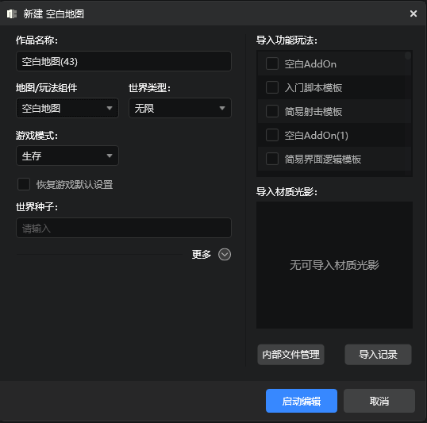
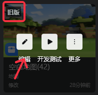
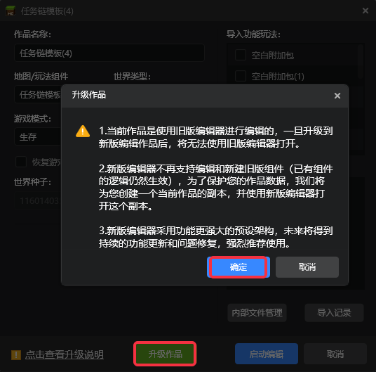

# Create a new version of the work 

We recommend that you follow this document to create the first preset mod step by step. You can download the completed <a href="https://g79.gdl.netease.com/FirstPresetDemo.zip" target="_blank" rel="noopener noreferrer">First preset mod</a> for reference. 

The new version of the editor provides a series of powerful tools for gameplay development, such as preset architecture. To use these tools, we need to create a work using the new version of the editor first. 
## Create a new version of the work 

We click the `New Bedrock Edition Component` button under the `Create` tab of the launcher, select the blank map under the `Recommended` tab in the new pop-up window and click it to create a new map gameplay component. 

 

> Works created under the `Recommended` tab will use the editor with a new preset architecture, which is powerful and will receive continuous function updates and problem fixes in the future. It is recommended that developers give priority to using it.

In the pop-up new work interface, set the work name, world type and other parameters, click `Start Editing`, and you can create and edit a new version of the work. 

 

## Upgrade the old version of the work to the new version 

When the mouse hovers over the work card, there will be a label prompt in the upper left corner of the old version of the work, as shown in the figure below 

 

Click the Edit button, and in the pop-up edit work panel, the developer can choose to upgrade the old version of the work to the new version of the work, as shown in the figure below. 

 

> **Note**: 
> 1. The current work is edited using the old version editor. Once upgraded to the new version of the work, it will not be able to be opened using the old version editor. 
> 2. The new version of the editor no longer supports editing and creating old version components (the logic of existing components is still valid). In order to protect your work data, we will create a copy of the current work for you and open this copy with the new version of the editor. 
> 3. The new version of the editor adopts a more powerful preset architecture, which will receive continuous functional updates and bug fixes in the future. It is highly recommended to use it. 

Only old version works can be upgraded to the new version. When editing the new version of the work, just click Start Editing to open it with the new version of the editor. 

 

