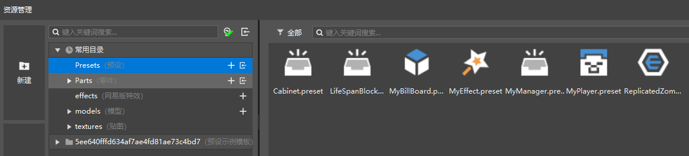

# Create a new preset and add materials 

## What is a preset? 

A preset means a pre-set. That is, developers can assemble blocks, materials, entities, special effects, and gameplay logic into a preset. 

Presets are saved as files in the Preset directory of the behavior pack. As shown in the figure below, you can find the Preset folder in the common directory of the resource manager. 

 

When used, a preset is placed in the game as a whole. The preset placed in the game is called an instance. 

The suffix of the preset is .preset. If you are interested in what a preset is, you can use a text editor to open the preset file and view its structure. 

## Create the first preset 

We use the new function of the resource manager. 

 

This will open the New File Wizard interface. In this interface, select Empty Preset and click Next. 

 

In the next step, name the file Cabinet, then click Create to create an empty preset named Cabinet. You can now find this preset in the Preset folder mentioned above. 

> Since the path of the preset file is fixed, there cannot be two presets with the same name in a work. 
> 
> Chinese characters cannot appear in the name of the preset file. 

 

## Add materials to the preset 

First, use the map editor to create a block building as shown below and save it as a material (or click <a href="https://g79.gdl.netease.com/cabinet.mdl" target="_blank" rel="noopener noreferrer">here</a> to download). 

 

Double-click the previously created Cabinet.preset in the Resource Manager to open the preset editor. 

Now let's add the material we just made to this preset. Click the Add Material button in the preset editor, open the folder for selecting materials, select the material you just made or downloaded, and click Open. 

 

The material will be imported into the BoxData directory of the work (see the directory in the figure below) and added to the preset. 

 

Now that you have a display stand preset with assets, you can click on the node in the hierarchy panel and modify its name in the properties panel. 

The following image shows what the display stand preset looks like now. 

 
