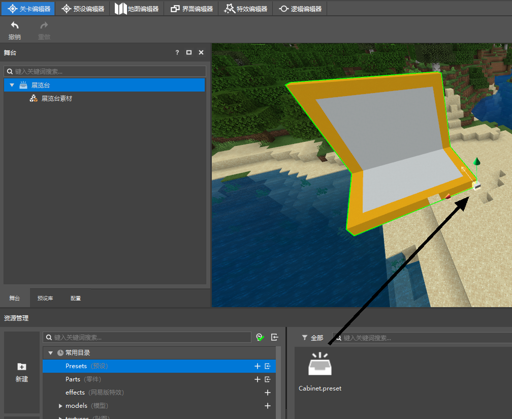
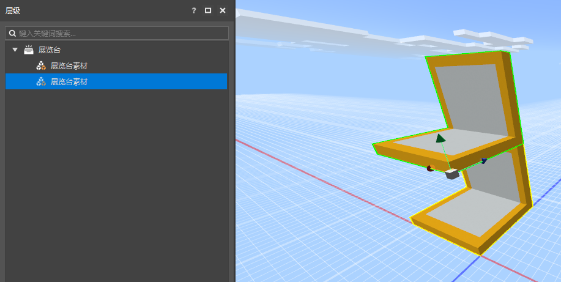
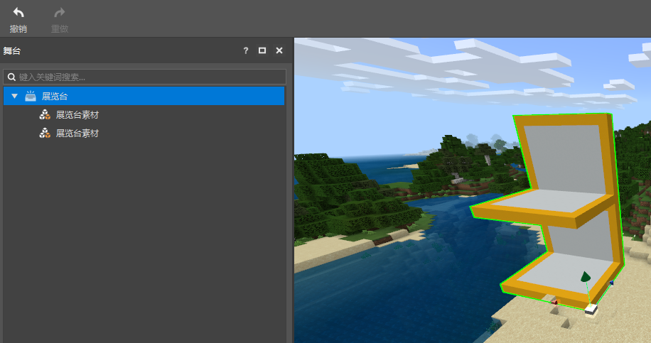
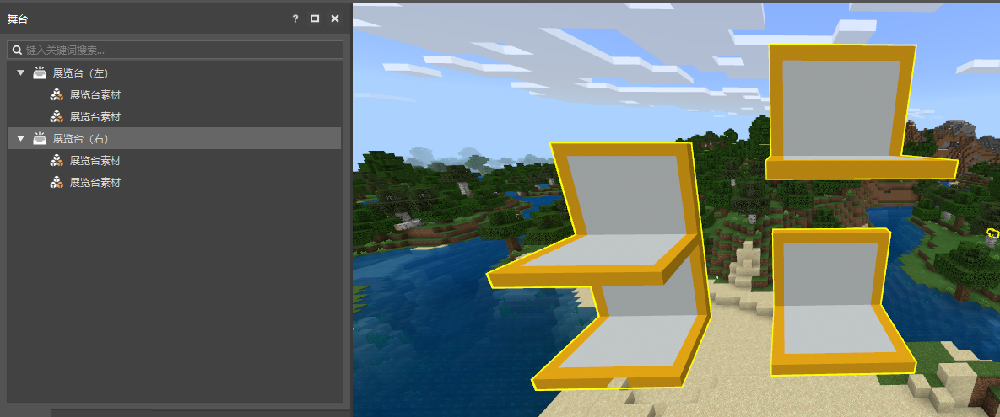
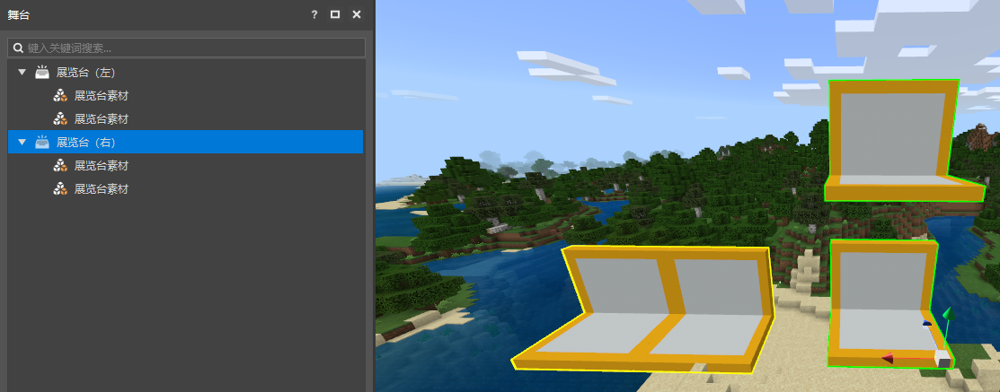

# Instantiate in the scene 

## Put the preset into the scene 

Open the level editor and open our preset folder in the resource manager. 

Find the Cabinet preset we just created here and drag it to the scene. After adjusting the position, release the mouse. In this way, you have successfully created an instance of the Cabinet preset in the scene, and you can see the structure of this instance in the stage of the level editor. 

Select the exhibition stand node on the stage, and then you can change its position in real time through the coordinate system handle in the preview window. 

 

## Modify the preset 

Now we double-click the Cabinet preset in the resource manager again to open it in the preset editor. 

Then select the exhibition stand material, use the Ctrl+D shortcut key, or the Create Copy function in the right-click menu, create a copy of the exhibition stand material, and adjust its position as follows. 

 

Then save and return to the level editor. 

You can see that the exhibition stand preset previously placed in the scene is also updated. 

In the editor, instances and presets are referenced. All instances in the scene are referenced data of a certain preset, so when the preset changes, the instance will also change. 

A preset can generate any number of instances in the scene. When you modify the preset, all instances in the scene will change accordingly. 

 

## Modify instance 

Next, we create a copy of the exhibition stand instance in the stage, drag it to one side, and rename the two instances as follows. 

Then, we raise one of the exhibition stand materials of the exhibition stand (right) instance a little higher, and finally get the following image. 

As you can see, we can modify a certain instance separately, and the modification of the instance will not affect other instances, nor will it affect the preset. Your preset will still look like the instance on the left. 

 

At this time, if we modify the preset, for example, put the material above the exhibition stand preset to the left side of the exhibition stand material below and align it with it. 

Then return to the level editor, you will find that only the unchanged instance has changed. 

That is, if a node of the instance is modified, the instance will record this modification and ignore the value of the preset it references. 

