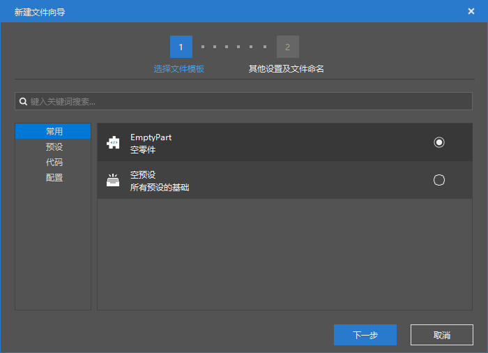
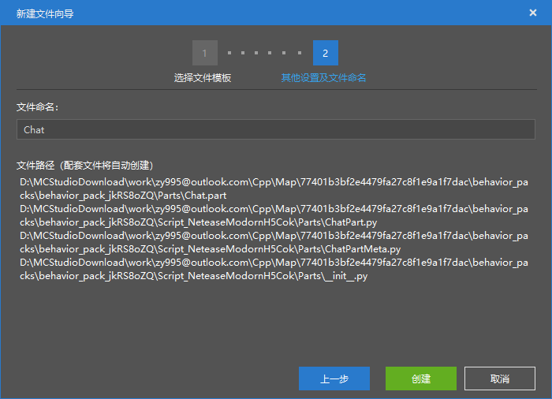
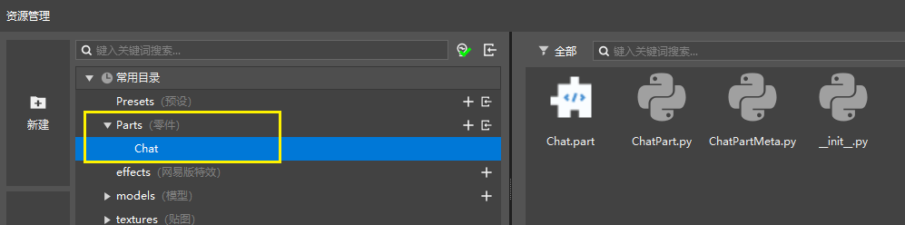

# Create a part 

A part is a gameplay logic object that can be attached to a preset under the preset architecture. 

First, we create a part through the New File Wizard. Open the New File Wizard through the "New" button on the left side of the Explorer, then select Empty Part in the Common tab and click Next. 

 

We named the part Chat. Here you will find that when we created the part, we created 4 files at the same time. 

- Chat.part: The body file of the part, similar to the preset of .preset 

- ChatPart.py: This is the python script file bound to the part. Our subsequent logic needs to be written in this file. 

- ChatPartMeta.py: This is the Meta file of ChatPart.py, which is mainly used to expose the properties of ChatPart.py to the property panel. 
- \_init\_.py: Fixed file structure 

 

Click Create to complete the creation of the Chat part, and the resource manager automatically jumps to the folder of the newly created part. 

 
