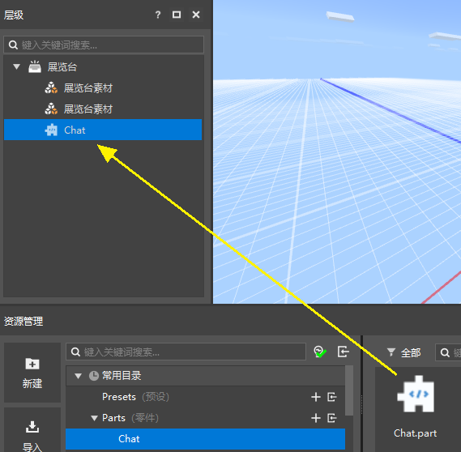
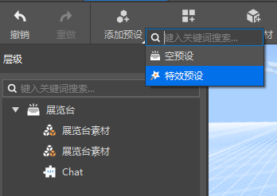
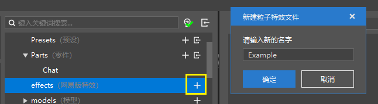
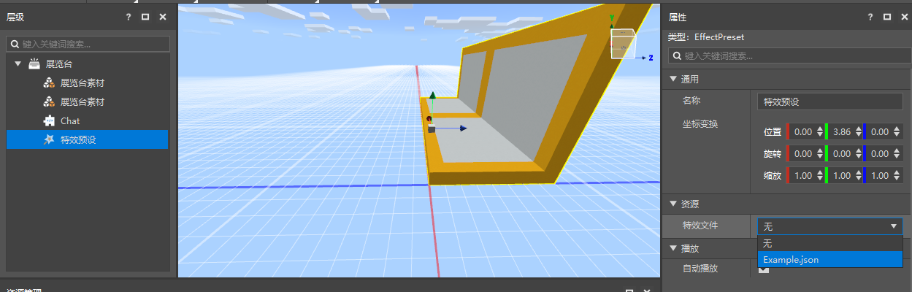
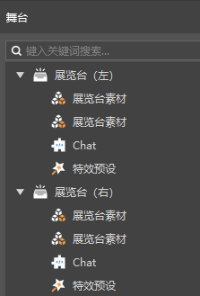

# Assemble presets and parts 

## Attach parts 

We don't rush to modify the ChatPart.py of the part. Double-click to open Cabinet.preset first, and drag the Chat part to the hierarchy panel of the exhibition stand preset in the preset editor, as shown in the figure below. 

Since the part logic we want to implement is independent of the position, there is no need to adjust the position of the part. 

 

## Attach sub-presets 

In addition to the parts, we add a sub-preset through the preset editor. Click Add Preset in the preset editor and select Special Effects Preset in the pop-up menu. 

 

Then find effects in the common directory of the resource manager and click "+" to create a particle effect. 

 

Select the special effect preset in the hierarchy panel, and in its properties panel, change the special effect file to the new special effect we just created. Now the special effect starts playing. 

You can adjust your particles to a suitable position in the preview window. 

 

Then, return to the level editor, we can see that the instances of the exhibition stand preset have been updated. 

 

It should be noted that under the preset architecture, all presets/parts can only take effect if they appear on the scene (stage) as instances. 

If you create a preset, or an instance, but don't place it in the scene, or otherwise create an instance in the scene, it will never take effect. 
