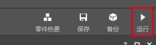
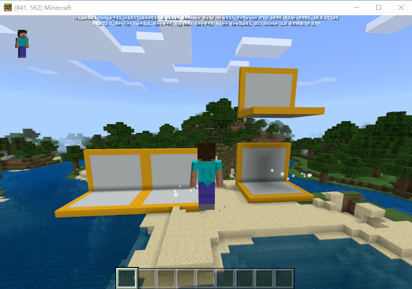
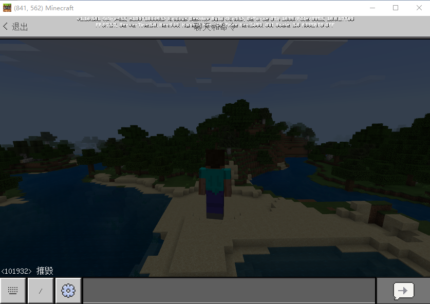
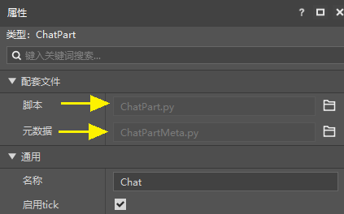
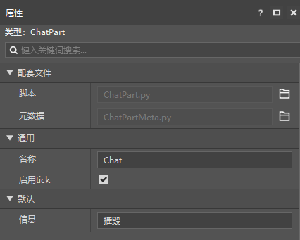
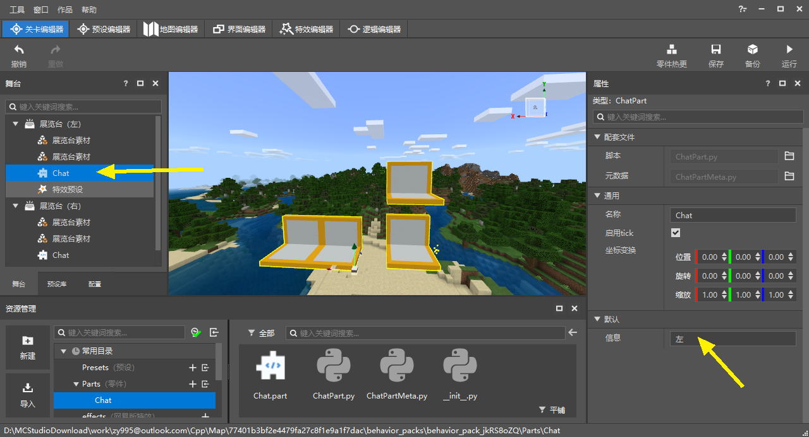
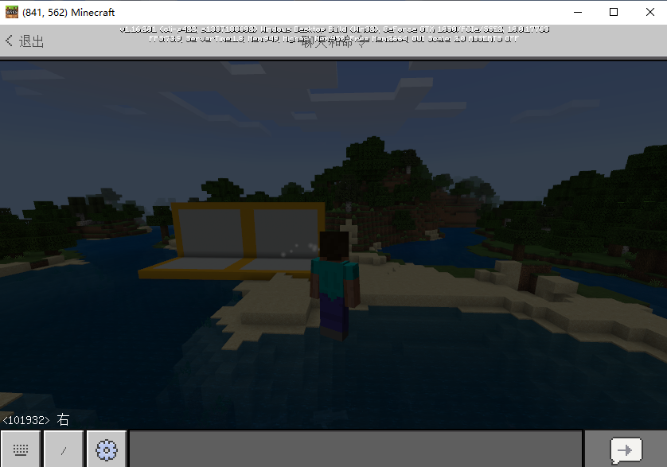

# Programming with Parts 

## Built-in Functions 

Now that we have instantiated the part in the scene by attaching it to the preset, we can now program the part. 

Of course, you can also program the part first, then attach and instantiate it. 

We find the folder of the part created in the previous step, then double-click to open ChatPart.py, and paste its code below. 

You can find that in the part code, we have generated a total of 6 built-in functions for you, which are the logical entry points of the part code. 

```python 
# -*- coding: utf-8 -*- 
from Preset.Model.PartBase import PartBase 
from Preset.Model.GameObject import registerGenericClass 

@registerGenericClass("ChatPart") 
class ChatPart(PartBase): 
def __init__(self): 
super(ChatPart, self).__init__() 
self.name = "Chat" 

def InitClient(self): 
pass 

def InitServer(self): 
pass 

def TickClient(self): 
pass 

def TickServer(self): 
pass 

def DestroyClient(self): 
pass 

def DestroyServer(self): 
pass 
``` 

They are the entry points of these logics respectively: 

- \_init\_: When the part is initialized, generally only variables are declared here 
- InitClient: When the client of the part instance is initialized 
- InitServer: When the server of the part instance is initialized
- TickClient: The client of the part instance calls it every frame
- TickServer: The server of the part instance calls it every frame

- DestroyClient: When the client of the part instance is destroyed 
- DestroyServer: When the server of the part instance is destroyed 

Rewrite these functions directly in the script to execute the corresponding logic at these times. 

## Python programming for parts 

Next, we use parts to implement a simple logic. When we enter "destroy" in the chat bar, the parent preset instance of this part is destroyed. 

When an instance is destroyed, all instances attached to it will also be destroyed. Therefore, in this case, the exhibition stand preset. 

The code is as follows. Since we only use the initialization and destruction of the server, we can delete other built-in functions. 

As you can see, we listen to the ServerChatEvent event in InitServer. When the player's chat box input occurs in the system (my world), the OnServerChat function of the part will be called. 

Then we judge in the OnServerChat function that if the player inputs "destroy", the parent preset will be destroyed. 

```python 
def InitServer(self): 
import mod.server.extraServerApi as serverApi 
self.ListenForEvent(serverApi.GetEngineNamespace(), serverApi.GetEngineSystemName(), "ServerChatEvent", self, self.OnServerChat) 

def DestroyServer(self): 
import mod.server.extraServerApi as serverApi 
self.UnListenForEvent(serverApi.GetEngineNamespace(), serverApi.GetEngineSystemName(), "ServerChatEvent", self, self.OnServerChat) 

def OnServerChat(self, args): 
# Generate dropped items 
# When the message we input is equal to destroy, destroy the parent node 
if args["message"] == "destroy": 
self.GetParent().Destroy() 
``` 

> Currently we already support importing most libraries/files in the file header. 
> 
> If an error occurs, you can import it when using it. 

## Test results using the Mod development package 

Click Run in the upper right corner of the editor to perform development tests on this work. 

 

> New works created using 0.16.12 (updated on July 15) or higher versions of MC Studio can only be developed and tested using development packages 1.23 or higher versions 

In the running development package, you can see 2 instances in the scene.


 

Press Enter to bring up the command window and enter: destroy. At this time, only one exhibition stand instance is destroyed, but both exhibition stands should be destroyed. 

The event mechanism of MC is that when the function of an event is executed, the next event will be sent. During the execution process, we performed anti-monitoring of the event, which caused this problem. 

So we modify the code to make the behavior of deleting the parent node execute in the next frame triggered by the event. 

Find the folder of Chat parts in the resource manager, then right-click the blank space and choose to open the current folder. We create a new python file in the Windows resource manager, named coroutineMgrGas.py, and then copy the following code into it (this part of the code involves a deeper knowledge point, you can follow the steps first): 

```python 
# -*- coding: utf-8 -*- 
import time 

# The function of this class is to delay the execution of a given function 
# Use reference to each specific use place, yield positive number is time, negative number is frame number 
class CoroutineMgr(object): 
coroutines = {} 
globalEnd = [] 
addCoroutines = {} 

@classmethod 
def StartCoroutine(cls, iter): 
cls.addCoroutines[iter] = 0 
return iter 

@classmethod 
def StopCoroutine(cls, iter): 
        cls.globalEnd.append(iter)

    @classmethod
    def Tick(cls):
        if cls.addCoroutines:
            for c,v in cls.addCoroutines.iteritems():
                cls.coroutines[c] = v
        cls.addCoroutines = {}
        if cls.globalEnd:
            for c in cls.globalEnd:
                if cls.coroutines.get(c):
                    del cls.coroutines[c]
            cls.globalEnd = []
        ended = []
        for c, v in cls.coroutines.iteritems():
            try:
                if v < 0:
                    v += 1
                    cls.coroutines[c] = v
                if v == 0 or (v > 0 and time.time() >= v):                    newv = c.next()

if newv > 0: 
newv = newv + time.time() 
cls.coroutines[c] = newv 
except StopIteration: 
ended.append(c) 
for c in ended: 
del cls.coroutines[c] 

``` 

Then modify the code of ChatPart.py as follows: 

```python 
from coroutineMgrGas import CoroutineMgr 

…… 

def TickServer(self): 
CoroutineMgr.Tick() 

def OnServerChat(self, args): 
# Generate dropped items 
# When the information we input is equal to destruction, destroy the parent node 
if args["message"] == "destroy": 
CoroutineMgr.StartCoroutine(self.DelayDestroy()) 

def DelayDestroy(self): 
yield -1 
self.GetParent().Destroy() 
``` 

Now we can develop and test again, and we can see that the phenomenon is normal! 

 

## Use the property panel to modify parts 

We click Chat.part in the resource manager, and we can find its two supporting files in its property panel. In addition to programming in ChatPart.py, we can also use ChatPartMeta.py to expose the variables in ChatPart.py to the editor's property panel. 

Click the small icon on the right side of the supporting file to open it directly. 

 

First, let's modify ChatPart.py and use "destroy" as a variable. 

```python 
def __init__(self): 
super(ChatPart, self).__init__()

self.name = "Chat" 
self.message = "destroy" 

def OnServerChat(self, args): 
if args["message"] == self.message: 
...... 
``` 

The modified parts are no different from the previous ones in terms of usage. Next, we open ChatPartMeta.py, which has automatically written some necessary codes for us. We type 1 line of code in this file, and the overall effect is as follows: 

```python 
@sunshine_class_meta 
class ChatPartMeta(PartBaseMeta): 
CLASS_NAME = "ChatPart" 
PROPERTIES = { 
"message": PStr(group="Default", text="Message"), 
} 
``` 

Then return to the editor, we can find that the "Message" variable defined by ourselves has been added to the property panel of Chat.part. 

 

Next, we find the Chat part on the stage, change the information of the Chat parts preset in the two exhibition stands to "left" and "right", then save and click run again for development testing. 

 

We open the chat window and enter: right. 

This time, only the exhibition stand instance on the right is deleted! 

 
