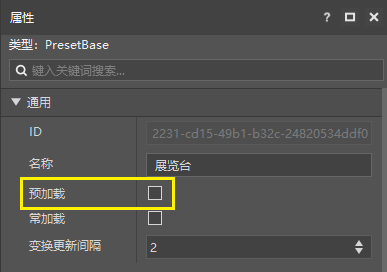
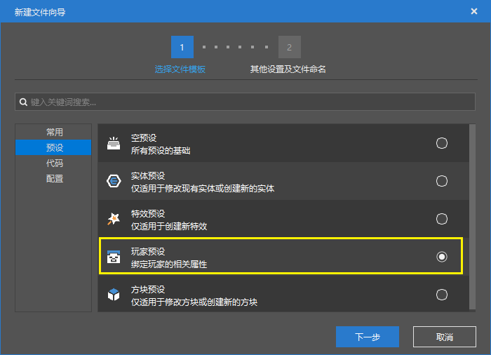

# Make AddOn with presets 

## Preload presets 

As we said, no matter presets or parts, they will only take effect if they are instantiated in the scene. 

For maps, we only need to drag the preset from the resource manager to the scene. But for AddOn (add-on package), since AddOn does not contain maps, it is impossible to make the logic of presets and parts take effect in this way. 

For empty presets, we provide a function called preloading. 

Select your empty preset in the resource manager, and you can enable this function in its property panel. 

After enabling preloading, presets will have the following features: 

1. The preset will be loaded at (0,100,0) before the chunk is loaded 

2. Subnodes that depend on chunks cannot be attached to this preset, such as materials, special effect presets, EntityBasePart, etc. 

3. Preloaded presets will automatically appear on the stage without manual placement 

4. Modifying the preset with the suffix (preload) on the stage will directly modify the preset file 

 

## Using Player Presets 

The built-in presets we provide include player presets. 

Player presets will automatically instantiate and bind MC player entities when the game starts. 

If the logic you want to write is related to player presets, you can attach the corresponding parts and presets to the player preset. In this way, the player preset will be loaded normally even in AddOn. 

> If you are playing a multiplayer game, each player entity will be bound to a player preset, so unless your logic is really player-related, it is recommended to use preload. 

 
