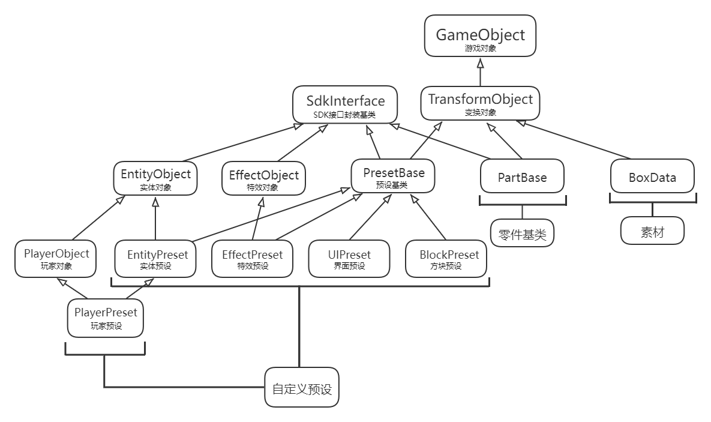

# Infrastructure 

In the last course, we have learned some simple uses of presets and parts, and easily made a cool functional gameplay. 

This course will gradually introduce you to some more in-depth knowledge, including the composition of the preset system, various built-in presets, and how to use the preset editor to assemble various cool presets. 

## Composition 

The basic data structure system of the preset system is as follows: 

 

The first two layers are basic data types. Starting from the third layer, we will focus on the introduction. PresetBase, PartBase, and BoxData are the basic structures for assembling custom presets/parts. 

EntityObject, PlayerObject, and EffectObject are another layer of encapsulation of SdkInterface (SDK interface encapsulation base class), which builds an abstraction of different types of preset objects and directly provides component operations to the outside in the form of interfaces; 

XXXPreset is related to some built-in presets, which is a combination of the preset system and the game elements of Minecraft. 

The goal of the preset system is to further lower the threshold for developers to use Minecraft. Through simple assembly and modification of custom presets, it is more convenient to build your own new world. 

## Basic data types 

- **GameObject** 

GameObject (game object) is the base class of all preset objects, which implements serialization, archiving, reading and other functions. 

- **SdkInterface** 

SdkInterface (SDK interface encapsulation base class) is the base class for SDK interface encapsulation, exposing the operation of components in the form of methods, and can be directly called by the outside world, without having to create the corresponding component first and then call the component-related methods. 

- **TransformObject** 

TransformObject (transformation object) is the base class of game objects with coordinate transformation properties, including position transformation, rotation transformation, scaling transformation, etc. It is a type of object with determined position information data. 

- **PresetBase** 

PresetBase (preset base class) is the base class of all presets. A preset is a type of TransformObject that can be directly placed in the scene, and other TransformObjects can be attached to the preset, which can be used to simply encapsulate the game logic. 

When a preset is placed in the editor, a virtual instance of the preset will be generated, and when a preset is generated in the game, a real instance will be generated. 

It can also be directly understood as an empty preset, which implements functions such as attaching child nodes, modifying attributes, instantiating, loading and unloading, and driving custom part logic. 

- **PartBase** 

PartBase (part base class) is the base class for all custom parts. By attaching parts to a preset, you can give the preset specific logic and functions. 

The original intention of designing parts is to provide some plug-and-play code-based functional components for presets. 

Through good design, most of the functions of the preset system can be implemented through custom parts. 

The part itself will not take effect when placed in the MOD. It must be attached to a preset and the preset must be instantiated in the game to take effect. 

- **BoxData** 

BoxData (material data) is similar to materials and can be attached to presets for use. 

Materials are not actually generated in the editor, but are virtually instantiated and can be placed overlapping. 

In the virtual instantiation state, the transformation of the material can be adjusted and previewed at will. 

As long as it is run once, the material will be truly instantiated and become part of the map permanently. 

After real instantiation, the material will not change due to preset uninstallation or calling coordinate transformation related APIs, nor will it be reloaded due to restarting the map until it is destroyed. 

When destroying materials, it will try to replace the unchanged blocks in the material data with air. Some special blocks may not be cleared. 

- **EntityObject** 

EntityObject (entity object) is an encapsulation of the entity public SDK component. It provides an entity object-oriented component operation method for the outer entity preset, and encapsulates the underlying SDK interface in another layer to provide developers with a more convenient SDK component calling method; 

Developers no longer need to go through the process of creating the corresponding component first and then calling the component method. They can directly call the component method provided to the outside, which improves the development efficiency of developers. 

- **PlayerObject** 

PlayerObject (player object) is an encapsulation of the player-related SDK component. It provides a player object-related component operation method for the outer player entity preset. The difference from the entity object is that it only encapsulates the sdk method related to the player object. 

- **EffectObject** 

EffectPreset is a type of preset that binds special effect resources. The design concept is consistent with the above-mentioned (entity object) design concept, and provides component operation methods related to special effect objects for the outer special effect entity preset.