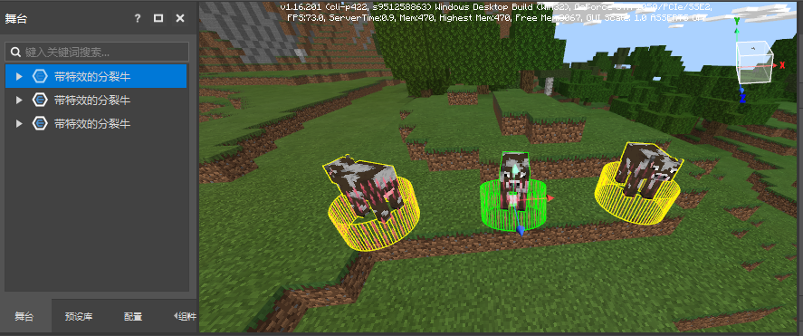

# Preset Assembly 

We have systematically studied the basic data types and various built-in presets of the preset system, but the functional effects they can achieve are still very limited. 

This section will introduce how to use the preset editor to assemble your own custom presets, and use the transformation animation special effects and advanced split cow as examples to illustrate the production process. 

## **Hooking rules** 

In the previous course, we know that it is very convenient to hook presets, parts, and materials under another preset, and assemble them together to achieve specific functions. 

But it does not mean that everything can be hooked. Before assembling a custom preset, we need to clarify the hooking rules of various game objects such as presets, parts, and materials. 

The following table is a table of attachment relationships. The first column indicates the parent node, the first row indicates the child node, √ indicates that it can be attached, and no content indicates that it cannot be attached. 

| | Empty preset | All built-in presets | Parts | Materials | Entity presets | Special effect presets | Player presets | Block presets | Interface presets | Text panel presets | 
| ------------ | ------ | ------------ | ---- | -------- | -------- | -------- | -------- | -------- | -------- | -------- | ------------ | 
| Empty preset | √ | √ | √ | √ | | √ | | √ | √ | √ | 
| All built-in presets | | | | | | | | | | | | 
| Parts | | | | | | | | | | | | 
| Materials | | | | | | | | | | | | 
| Entity presets | | √ | √ | | | | √ | | | √ | √ | 
| Special effect presets | | √ | √ | | | √ | | | √ | | √ | 
| Player presets | | √ | √ | | | √ | | | √ | | √ | 
| Block presets | | √ | √ | | | √ | | | √ | | √ | 
| Interface presets | √ | √ | √ | | | √ | | | √ | | √ | 
| Text panel presets | | √ | √ | | | | √ | | | √ | | √ | 

- Entity presets and player presets cannot be attached to other presets 

- Parts and materials cannot exist alone 

- Nothing can be attached below 
- Parts can be attached to any preset (except built-in presets) 
- Materials can be attached to empty presets 

- Nothing can be attached to all built-in presets (including built-in empty presets, built-in special effects presets, and built-in text panel presets) 

- This is because the attachment relationship of sub-presets is not currently supported 

- Cannot attach a preset to itself or any preset referenced by itself (cannot attach in a loop) 

- The principle of built-in presets is different, there is no problem of attaching in a loop 

## Template presets 

Under the Create Preset menu, we provide some template presets that have been made. By learning these template presets, you can understand the assembly process of the presets well. 

- **Transformation Animation Special Effect** 

A special effect preset, with a transformation animation part attached 

The special effect will play in a loop and move up and down in a loop 

The part customizes the duration, loop, keyframe and other properties. By modifying these properties, a variety of transformation animations can be achieved 

- **Split Pig** 

A creature preset, with an injured split part attached 

When it is injured, it will split into a creature of the same kind, but not including death 

The injured split part customizes a loop split property. If this property is checked, the split creature will also have the injured split property 

## Assemble Transformation Animation Special Effect 

We have used this cool special effect before. Its production process is very simple. In essence, it is just a functional part attached to the special effect preset. 

- First, we create a new special effect preset in the preset editor through the menu bar => Create Preset => Special Effect Preset. 

 

- Set the effect file of the effect preset to sfxFromEditor.json, and you can preview the effect at this time. 

If you don't see the sfxFromEditor effect, you can create it first by creating a preset => Template preset => Transform animation effect. This process will copy the effects and other resources it depends on to your component. You can also choose any of your existing effects for subsequent production. 

- Through the menu bar => Create part => Template part, we can easily add some ready-made template parts, which can help us learn the development of parts. 

 

- Select TransformAnimationPart from the template part to create it. After the creation is completed, the resource manager will automatically jump to the directory of the part. 

- Then attach TransformAnimationPart (transformation animation part) to our special effect preset, and it will become a transformation animation effect. 

## Assemble advanced split cow 

We have used the split pig preset before. Now we try to make a split cow and combine it with the transformation animation effect just made. 

- First, create a new creature through the menu bar => Create preset => Template preset => Split pig 

 

- On the Properties panel, change its name to **Split Cow with Special Effects**, set the overall template to Cow, and click the **Apply** and **Refresh All Properties** buttons in turn to make it effective 

 

- Attach the Transform Animation Effect to this Split Cow preset, and change the keyframe 1 in its properties to the following figure 

 

- Switch to the level editor, place several split cows in the scene, and control the character to move near the split cows 

 

- Click Save, then Run. Now you can see the split cow with special effects. Try to attack it. 

