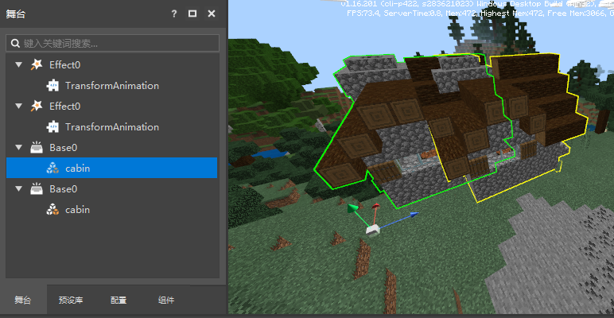
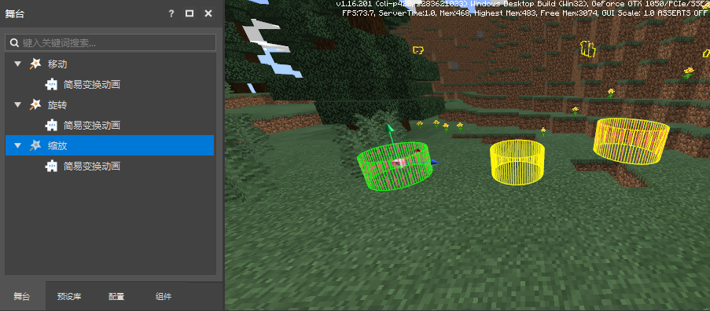
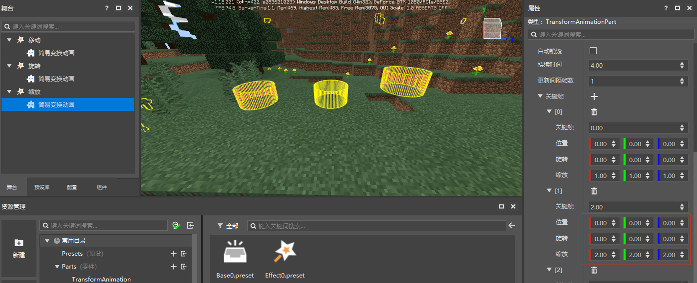
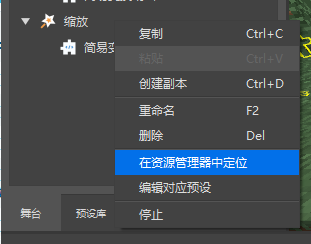
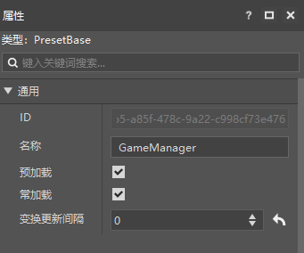

# Instances and properties 

Previously, we have learned how to assemble our own custom presets to achieve some cool functional gameplay. 

In this section, we will introduce how to modify the custom preset/part properties in the stage to give these instances different functional effects, which will help guide us in subsequent part development. 

## Preset Archive 

When we drag a preset into the level editor, a virtual instance of the preset will be generated and displayed on the stage. 

The new version of the level editor saves only the preset archive by default, that is, all preset instances displayed on the stage, not the entire map. 

The preset archive file is located in the presets.json in the archive directory. 

 

Entity presets need to be saved in the map to take effect. When you add/delete entity presets, saving the new version of the level editor will trigger the map to be saved. 

**Special note**: 

If you copy a preset archive to another map, the entity preset in this archive will not be loaded, and you need to open the map again with the editor and save it again. 

## Preset instance 

The instantiation of presets is divided into virtual instantiation and real instantiation. The presets placed in the editor are virtual instances, and the presets will be truly instantiated during development and testing. 

Virtual instances can be placed in overlapping positions without losing data due to overlapping blocks. You can adjust its position, rotation and scaling at will through the coordinate transformation properties/coordinate axis handles. 

 

**Special note**: 

Once the material is truly instantiated, it will be stored in the map archive, and **the relevant APIs for coordinate transformation will no longer take effect**. 

## Modify instance properties 

After placing the preset on the stage, we can edit the properties of the preset and its child nodes to allow different instances of the same preset to show different effects. 

Earlier, we created a transformation animation effect. The default property of its parts is set to move up and down in a 4s loop. Next, we will modify the properties to create some different types of transformation effects. 

Place 3 transformation animation effects in the scene, named Move, Rotate, and Scale. 

 


Modify the properties of the rotating simple transformation animation part as shown below: 

 

Modify the properties of the scaling simple transformation animation part as shown below: 

 

Click Save and then Run, you can see that the three special effects are playing different transformation animations. 

 

## Modify the main body properties 

The modification of the preset instance will only affect a single instance. If you want to apply the modification to all instances at the same time, you need to modify the preset main body. 

Right-click on the preset instance to locate the resource manager path where the main body of the instance is located.

 

Double-click the preset body to open it for editing. 

Modifications to the preset body will be applied to all instances first, and then the instances will apply the modifications on the instances. 

Here we have modified the name of the part and changed the scale of keyframe 1 to (3.0, 3.0, 3.0) 

 

After returning to the level editor, it was found that the names of the child nodes of the three animations were all modified, and the keyframe 1 of the "Move" preset, which had not been modified in keyframe 1, had applied the scale modification of the body. 

 

## Constant Loading 

The **constant loading** property indicates that after the preset is loaded, it will not be unloaded even if the block it is in is unloaded. 

It can only be applied to presets assembled based on empty presets, not applicable to entity presets, special effect presets, etc. 

Its main purpose is to remove the characteristics of loading and unloading with chunks from some global presets to avoid logical problems after it is unloaded. 

It is often used together with preloading. 

**Special Note**: 

The fact that the constant loading preset is not unloaded does not mean that the blocks or map elements associated with it will not be unloaded, but it only ensures that its logic will continue to be driven. 


## Preload 

The **preload** property indicates that the preset will create an instance of the preset at the map spawn point when the map is initialized. 

It can only be applied to presets assembled based on empty presets, not to entity presets, special effect presets, etc. 

Its main purpose is to make **global management function presets** similar to the GameManager function, helping us to make **AddOn function gameplay that does not depend on the stage**. 

Both new templates use the preload property to create presets for function initialization. 

 

- Before using the preload property, you need to set the spawn point first, which can be set through the map editor => menu bar => spawn point function. 

 

- Create an empty preset and rename it to GameManager. Preloading is usually used together with regular loading. It will not generate coordinate updates. Set the transformation update interval to 0 

 

- Create an empty part, attach it to the GameManager preset, and modify the part's InitServer initialization function to listen to chat events 

```python 
def InitServer(self): 
print(self.classType, "InitServer") 
import mod.server.extraServerApi as serverApi 
self.ListenForEvent(serverApi.GetEngineNamespace(), serverApi.GetEngineSystemName(), "ServerChatEvent", self, self.OnServerChatEvent) 

def OnServerChatEvent(self, args): 
playerId = args.get("playerId") 
print("OnServerChatEvent", playerId) 
import mod.server.extraServerApi as serverApi 
comp = serverApi.GetEngineCompFactory().CreateMsg(playerId) 
comp.NotifyOneMessage(playerId, "Hello, world", "§c") 
``` 

- Click Run, enter the chat command, and the parts just written have taken effect 

 

**Special Note**: 

- Preload presets can also work with presets in the stage scene. Preload presets are created earlier than stage presets. 
- When there are multiple preload presets, the loading order is the alphabetical order of the preset file name xxx.preset 
- There are a few events that occur before the preload preset is created, which will cause them to be unable to be monitored, such as the host's AddServerPlayerEvent