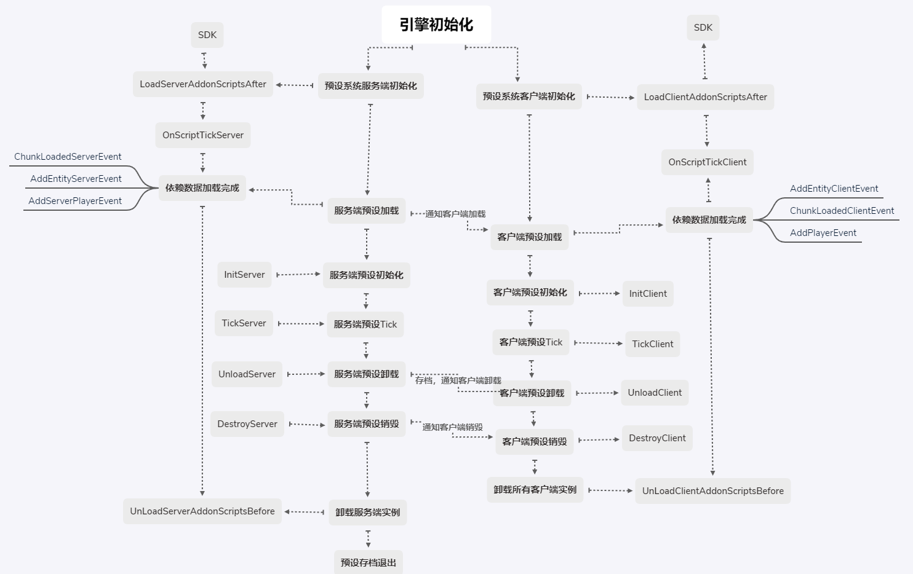

# Preset Lifecycle 

We have learned how to use the preset constant loading and preloading properties, but we don't know how to load and unload presets. 

In this section, we will introduce the lifecycle of presets and parts, how we should manage various presets and parts in MOD, which will help guide us in the subsequent part development. 

## **Server** and Client Instance 

In the previous MOD development process, we have learned that the server and the client belong to two different containers. Similarly, the instances of presets and parts are also divided into server instances and client instances. 

We hope that the part is a lightweight functional unit. If each part needs to write a client system class and a server system class separately like the system, it will be very bloated. 

Therefore, we support writing dual-end code in a part class. When using the dual-end API provided by the part, it will automatically return the corresponding content according to whether it is the client or the server, such as GetLevelId(). 

If you need to import the server/client part of the SDK, you need to put the import code inside the function, and the function name needs to have Server/Client to distinguish it. 

The following takes the player's basic attribute parts as an example:

```python
def InitClient(self):
    logger.info("%s InitClient %s %s", self.classType, self.GetParent().GetPlayerId(), self.showName)
    import mod.client.extraClientApi as api
    nameComp = self.CreateComponent(str(self.GetParent().GetPlayerId()), 'Minecraft', 'name')
    nameComp.SetShowName(self.showName)

    if self.GetParent().GetPlayerId() == api.GetLocalPlayerId():
        gameComp = self.CreateComponent(api.GetLevelId(), 'Minecraft', 'game')
        gameComp.SetNameDeeptest(not self.nameDeeptest)
        self.NotifyToServer("OnLoadSuccess", {'id': self.GetParent().GetPlayerId()})
```

```python
def InitServer(self):
    logger.info("%s InitServer %s", self.classType, self.GetParent().GetPlayerId())
    self.ListenSelfEvent('OnLoadSuccess', self, self.OnLoadSuccess)
```

```python
def OnLoadSuccess(self, data):
    logger.info("%s OnLoadSuccess %s", self.classType, self.GetParent().GetPlayerId())
    import mod.server.extraServerApi as api
    pComp = self.CreateComponent(data['id'], "Minecraft", "player")
    pComp.SetPlayerRespawnPos(tuple(self.spawnPos))
    ...
```

- The client side of the part is responsible for notifying the server side of the ID of the parent preset (i.e. the player) during initialization. 
- The server side of the part listens to client events during initialization, and upon receiving the ID of the logged-in player, it sets the relevant properties of the player.


For details about the development specifications of parts, please refer to [Part Development Specifications](../2-In-depth understanding of parts/6-Part Development Specifications.md). 

Regarding the communication and network synchronization of dual-end instances, we provide some built-in APIs, such as **NotifyToServer** and **ListenSelfEvent** used by the above part. For details, please refer to [Communication and Network Synchronization](../2-In-depth understanding of parts/3-Communication and Network Synchronization.md). 

## Life cycle 

The complete life cycle of the preset system is as follows: 

 

- Always load the server instance first, then load the client instance 
- Changes in the coordinate transformation of the server preset instance, adding or deleting materials, parts or sub-presets, uninstalling or destroying, will broadcast notifications to all client preset instances for data synchronization, and any changes on the client will not be actively synchronized to the server, and it is necessary to explicitly call the relevant API of the server 
- The InitServer/InitClient of the part is called once when the preset is initialized 
- The TickServer/TickClient of the part is called once per logical frame after the preset is loaded 
- The UnloadServer/UnloadClient of the part is called once when the preset is uninstalled 
- The DestroyServer/DestroyClient of the part is called once when the preset is destroyed 

### Loading Dependencies 

The prerequisite for loading a preset is that all the blocks that its transform objects (TransformObject) depend on have been loaded. 

**Special Note**: 

- It is not recommended to build a large preset that depends on a large number of blocks. Presets are not suitable for saving large materials such as terrain and castles. 
- It is not recommended to set multiple child nodes of a preset to locations far apart, which will also cause the preset to depend on all the blocks spanned between them. 

When loading, the entity preset will be bound to the corresponding entity, so it depends on the loading of the entity in addition to the block loading. 

Similarly, the loading of the player preset depends on the corresponding player login. 

The loading of the client preset also depends on the loading of the corresponding server preset. 

### Loading process 

The preset loading process is divided into four steps: 

- Get the preset file according to the preset file ID and parse the preset hierarchy body 

- Recursively analyze the materials, parts, and sub-presets that the preset depends on, instantiate and expand all game objects, and build the parent-child relationship of the game objects 
- Apply the instance modification part in the preset/part archive 
- Apply the coordinate transformation of the preset/part hierarchy 

### Unloading and destruction 

- When the preset loading dependency is not met and the preset does not have the constant loading attribute, the preset will be unloaded. 

- Actively destroy the parent preset in the part, the part code will not be stopped immediately, the parent preset will continue to complete the logic of all child nodes in the current frame, and complete the destruction at the end of the current frame 
